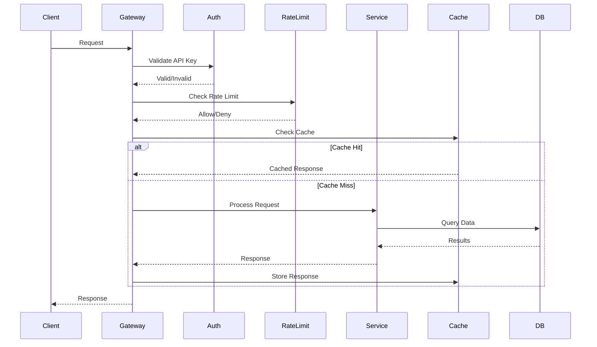
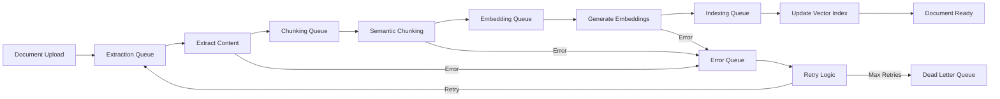

# ARCHITECTURE.md - QueryboxCore System Architecture

## Executive Summary

QueryboxCore implements a microservices-based architecture optimized for document processing, embedding generation, and semantic search. The system is designed for horizontal scaling, fault tolerance, and sub-200ms search latency at million-document scale.

## 🏗️ System Overview

### Architecture Principles
1. **Separation of Concerns**: Each service has a single responsibility
2. **Async-First**: Non-blocking I/O throughout the stack
3. **Event-Driven**: Loose coupling via message queues
4. **Cache-Heavy**: Multiple caching layers for performance
5. **Fail-Safe**: Graceful degradation and retry mechanisms
6. **Observable**: Comprehensive logging and metrics

### High-Level Architecture

```
┌─────────────────────────────────────────────────────────────────┐
│                         Load Balancer (nginx)                     │
└─────────────────────────────────────────────────────────────────┘
                                    │
        ┌───────────────────────────┼───────────────────────────┐
        │                           │                           │
    ┌───▼───┐                  ┌───▼───┐                  ┌───▼───┐
    │Web App│                  │API Gateway│                │Admin UI│
    │Next.js│                  │  FastAPI  │                │Next.js │
    └───────┘                  └───────────┘                └───────┘
                                    │
                ┌───────────────────┼───────────────────┐
                │                   │                   │
        ┌───────▼──────┐   ┌───────▼──────┐   ┌───────▼──────┐
        │Upload Service│   │Search Service│   │ Chat Service  │
        └──────────────┘   └──────────────┘   └──────────────┘
                │                   │                   │
                └───────────────────┼───────────────────┘
                                    │
                        ┌───────────▼───────────┐
                        │   Message Queue       │
                        │   (Redis/Celery)      │
                        └───────────────────────┘
                                    │
        ┌───────────────────────────┼───────────────────────────┐
        │                           │                           │
    ┌───▼────────┐         ┌───────▼──────┐         ┌─────────▼───┐
    │ Extractor  │         │   Chunker     │         │  Embedder   │
    │  Workers   │         │   Workers     │         │   Workers   │
    └────────────┘         └──────────────┘         └─────────────┘
        │                           │                           │
        └───────────────────────────┼───────────────────────────┘
                                    │
    ┌───────────────────────────────┼───────────────────────────┐
    │                               │                           │
┌───▼─────┐                 ┌──────▼──────┐           ┌────────▼──┐
│PostgreSQL│                 │    Redis    │           │  S3/MinIO │
│+pgvector │                 │    Cache    │           │  Storage  │
└──────────┘                 └─────────────┘           └───────────┘
```

## 🎯 Component Architecture

### 1. API Gateway Layer

```python
# FastAPI Application Structure
app/
├── main.py                 # Application entry point
├── api/
│   ├── __init__.py
│   ├── dependencies.py     # Shared dependencies
│   ├── middleware/
│   │   ├── auth.py        # API key validation
│   │   ├── cors.py        # CORS configuration
│   │   ├── rate_limit.py  # Rate limiting
│   │   └── logging.py     # Request/response logging
│   └── routes/
│       ├── upload.py      # Upload endpoints
│       ├── documents.py   # Document management
│       ├── search.py      # Search endpoints
│       ├── chat.py        # Chat endpoints
│       └── health.py      # Health/metrics
```

#### Request Flow


### 2. Service Layer Architecture

#### Upload Service
```python
class UploadService:
    """
    Handles file upload, validation, and storage
    """
    
    def __init__(self):
        self.storage = StorageManager()
        self.validator = FileValidator()
        self.queue = TaskQueue()
        
    async def upload_file(
        self,
        file: UploadFile,
        workspace_id: UUID
    ) -> UploadResponse:
        # 1. Validate file
        await self.validator.validate(file)
        
        # 2. Determine upload strategy
        if file.size > LARGE_FILE_THRESHOLD:
            # Direct upload to S3
            upload_url = await self.storage.get_presigned_url(
                file.filename,
                workspace_id
            )
            return UploadResponse(
                upload_url=upload_url,
                direct_upload=True
            )
        else:
            # Stream through server
            path = await self.storage.store_file(file, workspace_id)
            
            # 3. Create document record
            document = await self.create_document_record(
                file, path, workspace_id
            )
            
            # 4. Queue for processing
            await self.queue.enqueue(
                'process_document',
                document_id=document.id
            )
            
            return UploadResponse(
                document_id=document.id,
                status='queued'
            )
```

#### Search Service
```python
class SearchService:
    """
    Multi-stage search with caching and reranking
    """
    
    def __init__(self):
        self.vector_store = VectorStore()
        self.text_search = TextSearch()
        self.reranker = Reranker()
        self.cache = SearchCache()
        
    async def search(
        self,
        query: str,
        filters: Optional[Dict] = None,
        top_k: int = 10
    ) -> SearchResponse:
        # 1. Check cache
        cache_key = self.get_cache_key(query, filters)
        cached = await self.cache.get(cache_key)
        if cached:
            return cached
            
        # 2. Parallel search strategies
        vector_task = self.vector_store.search(
            query, limit=top_k * 3
        )
        text_task = self.text_search.search(
            query, limit=top_k * 2
        )
        
        vector_results, text_results = await asyncio.gather(
            vector_task, text_task
        )
        
        # 3. Merge and rerank
        merged = self.merge_results(vector_results, text_results)
        reranked = await self.reranker.rerank(query, merged)
        
        # 4. Extract citations
        final_results = reranked[:top_k]
        citations = await self.extract_citations(query, final_results)
        
        response = SearchResponse(
            results=final_results,
            citations=citations
        )
        
        # 5. Cache response
        await self.cache.set(cache_key, response, ttl=3600)
        
        return response
```

### 3. Processing Pipeline Architecture

#### Worker Pool Design
```python
# Celery Configuration
from celery import Celery

app = Celery('querybox')
app.config_from_object('app.config.celery_config')

# Worker pools
app.conf.task_routes = {
    'extract.*': {'queue': 'extraction'},
    'chunk.*': {'queue': 'chunking'},
    'embed.*': {'queue': 'embedding'},
    'index.*': {'queue': 'indexing'}
}

# Concurrency settings
app.conf.worker_concurrency = {
    'extraction': 4,   # CPU-bound
    'chunking': 8,     # Mixed
    'embedding': 2,    # API-bound
    'indexing': 6      # I/O-bound
}
```

#### Task Flow


### 4. Data Layer Architecture

#### Database Design
```sql
-- Optimized schema with partitioning
CREATE TABLE documents (
    id UUID PRIMARY KEY,
    workspace_id UUID NOT NULL,
    created_at TIMESTAMP NOT NULL,
    -- ... other fields
) PARTITION BY RANGE (created_at);

-- Monthly partitions
CREATE TABLE documents_2024_01 PARTITION OF documents
FOR VALUES FROM ('2024-01-01') TO ('2024-02-01');

-- Optimized indexes
CREATE INDEX CONCURRENTLY idx_docs_workspace_created 
ON documents(workspace_id, created_at DESC)
WHERE deleted_at IS NULL;
```

#### Vector Storage Strategy
```python
class VectorStore:
    """
    Optimized vector storage with multiple index types
    """
    
    def __init__(self):
        self.index_type = self.determine_index_type()
        
    def determine_index_type(self):
        """
        Choose index based on dataset size
        """
        doc_count = self.get_document_count()
        
        if doc_count < 100_000:
            return 'flat'  # Exact search
        elif doc_count < 1_000_000:
            return 'ivfflat'  # Approximate, fast
        else:
            return 'hnsw'  # Hierarchical, scalable
            
    async def create_index(self):
        if self.index_type == 'ivfflat':
            await self.db.execute("""
                CREATE INDEX chunks_embedding_idx 
                ON chunks 
                USING ivfflat (embedding vector_cosine_ops)
                WITH (lists = 100);
            """)
        elif self.index_type == 'hnsw':
            await self.db.execute("""
                CREATE INDEX chunks_embedding_idx 
                ON chunks 
                USING hnsw (embedding vector_cosine_ops)
                WITH (m = 16, ef_construction = 64);
            """)
```

#### Caching Architecture
```python
class CacheManager:
    """
    Multi-level caching strategy
    """
    
    def __init__(self):
        self.l1_cache = InMemoryCache(max_size=1000)  # Hot data
        self.l2_cache = RedisCache()  # Warm data
        self.l3_cache = DiskCache()   # Cold data
        
    async def get(self, key: str) -> Optional[Any]:
        # Check L1 (memory)
        value = self.l1_cache.get(key)
        if value:
            return value
            
        # Check L2 (Redis)
        value = await self.l2_cache.get(key)
        if value:
            # Promote to L1
            self.l1_cache.set(key, value)
            return value
            
        # Check L3 (disk)
        value = await self.l3_cache.get(key)
        if value:
            # Promote to L2 and L1
            await self.l2_cache.set(key, value)
            self.l1_cache.set(key, value)
            return value
            
        return None
```

## 🚀 Scaling Strategy

### Horizontal Scaling

```yaml
# Kubernetes deployment example
apiVersion: apps/v1
kind: Deployment
metadata:
  name: querybox-api
spec:
  replicas: 3
  selector:
    matchLabels:
      app: querybox-api
  template:
    spec:
      containers:
      - name: api
        image: querybox/api:latest
        resources:
          requests:
            memory: "512Mi"
            cpu: "500m"
          limits:
            memory: "1Gi"
            cpu: "1000m"
---
apiVersion: autoscaling/v2
kind: HorizontalPodAutoscaler
metadata:
  name: querybox-api-hpa
spec:
  scaleTargetRef:
    apiVersion: apps/v1
    kind: Deployment
    name: querybox-api
  minReplicas: 3
  maxReplicas: 20
  metrics:
  - type: Resource
    resource:
      name: cpu
      target:
        type: Utilization
        averageUtilization: 70
  - type: Resource
    resource:
      name: memory
      target:
        type: Utilization
        averageUtilization: 80
```

### Database Scaling

```python
# Read replica configuration
class DatabaseManager:
    def __init__(self):
        self.write_db = create_engine(WRITE_DB_URL)
        self.read_dbs = [
            create_engine(url) for url in READ_DB_URLS
        ]
        self.read_index = 0
        
    def get_read_db(self):
        """Round-robin read replica selection"""
        db = self.read_dbs[self.read_index]
        self.read_index = (self.read_index + 1) % len(self.read_dbs)
        return db
        
    async def execute_read(self, query):
        db = self.get_read_db()
        return await db.execute(query)
        
    async def execute_write(self, query):
        return await self.write_db.execute(query)
```

## 🔒 Security Architecture

### Defense in Depth

```
┌─────────────────────────────────────────────────────┐
│                   WAF (CloudFlare)                   │
│              DDoS Protection, Bot Detection          │
└─────────────────────────────────────────────────────┘
                            │
┌─────────────────────────────────────────────────────┐
│                    Load Balancer                     │
│                  SSL Termination                     │
└─────────────────────────────────────────────────────┘
                            │
┌─────────────────────────────────────────────────────┐
│                    API Gateway                       │
│          Rate Limiting, API Key Validation           │
└─────────────────────────────────────────────────────┘
                            │
┌─────────────────────────────────────────────────────┐
│                  Application Layer                   │
│        Input Validation, CORS, CSP Headers           │
└─────────────────────────────────────────────────────┘
                            │
┌─────────────────────────────────────────────────────┐
│                    Data Layer                        │
│     Encryption at Rest, Row-Level Security           │
└─────────────────────────────────────────────────────┘
```

### Security Implementation

```python
# Security middleware stack
class SecurityMiddleware:
    def __init__(self, app):
        self.app = app
        self.rate_limiter = RateLimiter(
            requests_per_minute=100,
            burst_size=10
        )
        self.api_key_validator = APIKeyValidator()
        self.input_sanitizer = InputSanitizer()
        
    async def __call__(self, scope, receive, send):
        # 1. API Key validation
        api_key = self.extract_api_key(scope)
        if not await self.api_key_validator.validate(api_key):
            await self.send_error(send, 401, "Invalid API key")
            return
            
        # 2. Rate limiting
        client_id = self.get_client_id(scope)
        if not await self.rate_limiter.allow(client_id):
            await self.send_error(send, 429, "Rate limit exceeded")
            return
            
        # 3. Input sanitization
        if scope["type"] == "http":
            body = await self.get_body(receive)
            sanitized = self.input_sanitizer.sanitize(body)
            scope["sanitized_body"] = sanitized
            
        # 4. Security headers
        async def send_wrapper(message):
            if message["type"] == "http.response.start":
                headers = message.setdefault("headers", [])
                headers.extend([
                    (b"x-content-type-options", b"nosniff"),
                    (b"x-frame-options", b"DENY"),
                    (b"x-xss-protection", b"1; mode=block"),
                    (b"strict-transport-security", 
                     b"max-age=31536000; includeSubDomains"),
                ])
            await send(message)
            
        await self.app(scope, receive, send_wrapper)
```

## 📊 Monitoring & Observability

### Metrics Collection

```python
# Prometheus metrics
from prometheus_client import Counter, Histogram, Gauge, Summary

# Business metrics
documents_processed = Counter(
    'querybox_documents_processed_total',
    'Total documents processed',
    ['status', 'file_type', 'workspace']
)

search_requests = Counter(
    'querybox_search_requests_total',
    'Total search requests',
    ['search_type', 'workspace']
)

# Performance metrics
processing_duration = Histogram(
    'querybox_processing_duration_seconds',
    'Document processing duration',
    ['stage', 'file_type'],
    buckets=[1, 5, 10, 30, 60, 120, 300, 600]
)

search_latency = Histogram(
    'querybox_search_latency_seconds',
    'Search request latency',
    ['search_type'],
    buckets=[0.01, 0.025, 0.05, 0.1, 0.25, 0.5, 1.0, 2.5]
)

# System metrics
active_connections = Gauge(
    'querybox_active_connections',
    'Number of active connections'
)

queue_depth = Gauge(
    'querybox_queue_depth',
    'Processing queue depth',
    ['queue_name']
)

# Cost metrics
embedding_tokens_used = Counter(
    'querybox_embedding_tokens_total',
    'Total embedding tokens consumed'
)

storage_bytes_used = Gauge(
    'querybox_storage_bytes',
    'Storage space used',
    ['storage_type']
)
```

### Distributed Tracing

```python
# OpenTelemetry integration
from opentelemetry import trace
from opentelemetry.exporter.otlp.proto.grpc.trace_exporter import OTLPSpanExporter
from opentelemetry.sdk.trace import TracerProvider
from opentelemetry.sdk.trace.export import BatchSpanProcessor

# Configure tracing
trace.set_tracer_provider(TracerProvider())
tracer = trace.get_tracer(__name__)

otlp_exporter = OTLPSpanExporter(
    endpoint="http://jaeger:4317",
    insecure=True
)

span_processor = BatchSpanProcessor(otlp_exporter)
trace.get_tracer_provider().add_span_processor(span_processor)

# Trace example
class TracedSearchService:
    @tracer.start_as_current_span("search_request")
    async def search(self, query: str) -> SearchResponse:
        span = trace.get_current_span()
        span.set_attribute("query.text", query)
        span.set_attribute("query.length", len(query))
        
        with tracer.start_as_current_span("embedding_generation"):
            embedding = await self.generate_embedding(query)
            
        with tracer.start_as_current_span("vector_search"):
            results = await self.vector_search(embedding)
            span.set_attribute("results.count", len(results))
            
        with tracer.start_as_current_span("reranking"):
            reranked = await self.rerank(query, results)
            
        return reranked
```

### Logging Architecture

```python
# Structured logging with correlation IDs
import structlog
from contextvars import ContextVar

request_id_var: ContextVar[str] = ContextVar('request_id')

# Configure structured logging
structlog.configure(
    processors=[
        structlog.stdlib.filter_by_level,
        structlog.stdlib.add_logger_name,
        structlog.stdlib.add_log_level,
        structlog.stdlib.PositionalArgumentsFormatter(),
        structlog.processors.TimeStamper(fmt="iso"),
        structlog.processors.StackInfoRenderer(),
        structlog.processors.format_exc_info,
        structlog.processors.UnicodeDecoder(),
        structlog.processors.CallsiteParameterAdder(
            parameters=[
                structlog.processors.CallsiteParameter.FILENAME,
                structlog.processors.CallsiteParameter.LINENO,
                structlog.processors.CallsiteParameter.FUNC_NAME,
            ]
        ),
        structlog.processors.dict_tracebacks,
        structlog.processors.JSONRenderer()
    ],
    context_class=dict,
    logger_factory=structlog.stdlib.LoggerFactory(),
    cache_logger_on_first_use=True,
)

logger = structlog.get_logger()

# Logging middleware
class LoggingMiddleware:
    async def __call__(self, request: Request, call_next):
        request_id = str(uuid.uuid4())
        request_id_var.set(request_id)
        
        # Log request
        logger.info(
            "request_started",
            request_id=request_id,
            method=request.method,
            path=request.url.path,
            client_ip=request.client.host
        )
        
        start_time = time.time()
        
        try:
            response = await call_next(request)
            duration = time.time() - start_time
            
            # Log response
            logger.info(
                "request_completed",
                request_id=request_id,
                status_code=response.status_code,
                duration_seconds=duration
            )
            
            response.headers["X-Request-ID"] = request_id
            return response
            
        except Exception as e:
            duration = time.time() - start_time
            
            # Log error
            logger.error(
                "request_failed",
                request_id=request_id,
                error=str(e),
                duration_seconds=duration,
                exc_info=True
            )
            raise
```

### Alerting Rules

```yaml
# Prometheus alerting rules
groups:
  - name: querybox_alerts
    interval: 30s
    rules:
      - alert: HighErrorRate
        expr: |
          rate(querybox_requests_total{status=~"5.."}[5m]) > 0.05
        for: 5m
        labels:
          severity: critical
        annotations:
          summary: High error rate detected
          description: "Error rate is {{ $value | humanizePercentage }}"
          
      - alert: SlowSearchLatency
        expr: |
          histogram_quantile(0.99, rate(querybox_search_latency_seconds_bucket[5m])) > 0.5
        for: 10m
        labels:
          severity: warning
        annotations:
          summary: Search latency is high
          description: "p99 latency is {{ $value }}s"
          
      - alert: ProcessingQueueBacklog
        expr: |
          querybox_queue_depth > 1000
        for: 15m
        labels:
          severity: warning
        annotations:
          summary: Processing queue backlog
          description: "Queue depth is {{ $value }}"
          
      - alert: LowDiskSpace
        expr: |
          node_filesystem_avail_bytes{mountpoint="/"} / 
          node_filesystem_size_bytes{mountpoint="/"} < 0.1
        for: 5m
        labels:
          severity: critical
        annotations:
          summary: Low disk space
          description: "Only {{ $value | humanizePercentage }} disk space remaining"
```

## 🔄 Deployment Architecture

### Container Strategy

```dockerfile
# Multi-stage Dockerfile for backend
FROM python:3.11-slim as builder

WORKDIR /app
COPY requirements.txt .
RUN pip wheel --no-cache-dir --no-deps --wheel-dir /app/wheels -r requirements.txt

FROM python:3.11-slim

# Install system dependencies
RUN apt-get update && apt-get install -y \
    tesseract-ocr \
    poppler-utils \
    && rm -rf /var/lib/apt/lists/*

WORKDIR /app

# Copy wheels and install
COPY --from=builder /app/wheels /wheels
RUN pip install --no-cache /wheels/*

# Copy application
COPY . .

# Non-root user
RUN useradd -m -u 1000 querybox && chown -R querybox:querybox /app
USER querybox

# Health check
HEALTHCHECK --interval=30s --timeout=3s --start-period=5s --retries=3 \
    CMD python -c "import requests; requests.get('http://localhost:8000/health')"

EXPOSE 8000
CMD ["uvicorn", "app.main:app", "--host", "0.0.0.0", "--port", "8000"]
```

### Orchestration

```yaml
# docker-compose.prod.yml
version: '3.8'

services:
  nginx:
    image: nginx:alpine
    ports:
      - "80:80"
      - "443:443"
    volumes:
      - ./nginx/nginx.conf:/etc/nginx/nginx.conf:ro
      - ./nginx/ssl:/etc/nginx/ssl:ro
    depends_on:
      - api
      - frontend
    restart: unless-stopped
    
  api:
    image: querybox/api:${VERSION:-latest}
    deploy:
      replicas: 3
      resources:
        limits:
          cpus: '2'
          memory: 2G
        reservations:
          cpus: '1'
          memory: 1G
    environment:
      - DATABASE_URL=${DATABASE_URL}
      - REDIS_URL=${REDIS_URL}
      - S3_ENDPOINT_URL=${S3_ENDPOINT_URL}
    depends_on:
      postgres:
        condition: service_healthy
      redis:
        condition: service_healthy
    restart: unless-stopped
    
  worker:
    image: querybox/worker:${VERSION:-latest}
    deploy:
      replicas: 5
    command: celery -A app.worker worker --concurrency=4
    environment:
      - DATABASE_URL=${DATABASE_URL}
      - REDIS_URL=${REDIS_URL}
    depends_on:
      - api
      - redis
    restart: unless-stopped
    
  postgres:
    image: ankane/pgvector:v0.5.1-pg15
    environment:
      - POSTGRES_USER=${DB_USER}
      - POSTGRES_PASSWORD=${DB_PASSWORD}
      - POSTGRES_DB=${DB_NAME}
      - POSTGRES_INITDB_ARGS=--encoding=UTF8 --lc-collate=en_US.utf8 --lc-ctype=en_US.utf8
    volumes:
      - postgres_data:/var/lib/postgresql/data
      - ./db/init:/docker-entrypoint-initdb.d:ro
    restart: unless-stopped
    healthcheck:
      test: ["CMD-SHELL", "pg_isready -U ${DB_USER}"]
      interval: 10s
      timeout: 5s
      retries: 5
      
  redis:
    image: redis:7-alpine
    command: >
      redis-server
      --maxmemory 2gb
      --maxmemory-policy allkeys-lru
      --save 900 1
      --save 300 10
      --save 60 10000
    volumes:
      - redis_data:/data
    restart: unless-stopped
    healthcheck:
      test: ["CMD", "redis-cli", "ping"]
      interval: 10s
      timeout: 5s
      retries: 5

volumes:
  postgres_data:
  redis_data:
```

## 🚦 Performance Optimization

### Query Optimization

```python
class OptimizedSearchQuery:
    """
    Performance-optimized search queries
    """
    
    def __init__(self):
        self.conn_pool = create_pool(min_size=10, max_size=30)
        
    async def vector_search_optimized(
        self,
        embedding: List[float],
        limit: int = 10,
        threshold: float = 0.7
    ):
        """
        Optimized vector search with early termination
        """
        query = """
        WITH candidates AS (
            SELECT 
                c.id,
                c.document_id,
                c.content,
                c.embedding <=> $1::vector as distance,
                d.filename,
                d.workspace_id
            FROM chunks c
            JOIN documents d ON c.document_id = d.id
            WHERE 
                c.embedding <=> $1::vector < $3
                AND d.deleted_at IS NULL
            ORDER BY c.embedding <=> $1::vector
            LIMIT $2 * 2  -- Over-fetch for quality
        )
        SELECT 
            id,
            document_id,
            content,
            1 - distance as similarity,
            filename
        FROM candidates
        WHERE 1 - distance > $3
        ORDER BY distance
        LIMIT $2;
        """
        
        async with self.conn_pool.acquire() as conn:
            # Use prepared statement for better performance
            stmt = await conn.prepare(query)
            results = await stmt.fetch(
                embedding,
                limit,
                1 - threshold  # Convert similarity to distance
            )
            
        return results
```

### Caching Strategy

```python
class SmartCache:
    """
    Intelligent caching with TTL and invalidation
    """
    
    def __init__(self):
        self.redis = aioredis.from_url(REDIS_URL)
        self.local_cache = TTLCache(maxsize=1000, ttl=60)
        
    async def get_or_compute(
        self,
        key: str,
        compute_func: Callable,
        ttl: int = 3600,
        cache_control: Optional[str] = None
    ):
        # Check if caching is disabled
        if cache_control == "no-cache":
            return await compute_func()
            
        # Check local cache first
        if key in self.local_cache:
            return self.local_cache[key]
            
        # Check Redis
        cached = await self.redis.get(key)
        if cached:
            value = json.loads(cached)
            self.local_cache[key] = value
            return value
            
        # Compute and cache
        value = await compute_func()
        
        # Store in both caches
        self.local_cache[key] = value
        await self.redis.setex(
            key,
            ttl,
            json.dumps(value)
        )
        
        return value
        
    async def invalidate_pattern(self, pattern: str):
        """
        Invalidate all keys matching pattern
        """
        cursor = 0
        while True:
            cursor, keys = await self.redis.scan(
                cursor, match=pattern, count=100
            )
            if keys:
                await self.redis.delete(*keys)
            if cursor == 0:
                break
```

### Connection Pooling

```python
class ConnectionManager:
    """
    Efficient connection pooling for all services
    """
    
    def __init__(self):
        # Database pools
        self.db_write_pool = create_pool(
            DATABASE_URL,
            min_size=5,
            max_size=20,
            timeout=10,
            command_timeout=5,
            max_queries=50000,
            max_inactive_connection_lifetime=300
        )
        
        self.db_read_pool = create_pool(
            READ_DATABASE_URL,
            min_size=10,
            max_size=50,
            timeout=10,
            max_inactive_connection_lifetime=300
        )
        
        # Redis pool
        self.redis_pool = aioredis.ConnectionPool.from_url(
            REDIS_URL,
            max_connections=50,
            decode_responses=True
        )
        
        # HTTP client pool
        self.http_client = httpx.AsyncClient(
            limits=httpx.Limits(
                max_keepalive_connections=20,
                max_connections=100,
                keepalive_expiry=30
            ),
            timeout=httpx.Timeout(10.0)
        )
        
    async def close_all(self):
        """Cleanup all connections"""
        await self.db_write_pool.close()
        await self.db_read_pool.close()
        await self.redis_pool.disconnect()
        await self.http_client.aclose()
```

## 🎯 Disaster Recovery

### Backup Strategy

```python
# Automated backup script
class BackupManager:
    """
    Comprehensive backup management
    """
    
    async def backup_database(self):
        """Daily database backup with point-in-time recovery"""
        timestamp = datetime.now().strftime("%Y%m%d_%H%M%S")
        backup_file = f"backup_{timestamp}.sql"
        
        # Perform backup
        await self.execute_command(
            f"pg_dump {DATABASE_URL} --format=custom --file={backup_file}"
        )
        
        # Upload to S3
        await self.upload_to_s3(
            backup_file,
            f"backups/postgres/{backup_file}"
        )
        
        # Maintain retention policy (30 days)
        await self.cleanup_old_backups(days=30)
        
    async def backup_vectors(self):
        """Incremental vector backup"""
        # Export vectors modified since last backup
        last_backup = await self.get_last_backup_time()
        
        vectors = await self.db.fetch("""
            SELECT * FROM chunks 
            WHERE updated_at > $1
        """, last_backup)
        
        # Store in efficient format
        await self.store_vector_backup(vectors)
        
    async def restore_system(self, backup_date: str):
        """Complete system restoration"""
        # 1. Restore database
        await self.restore_database(backup_date)
        
        # 2. Restore vectors
        await self.restore_vectors(backup_date)
        
        # 3. Rebuild indexes
        await self.rebuild_indexes()
        
        # 4. Clear caches
        await self.clear_all_caches()
        
        # 5. Verify integrity
        await self.verify_restoration()
```

### High Availability

```yaml
# Multi-region deployment
regions:
  primary:
    location: us-east-1
    components:
      - api: 3 replicas
      - workers: 5 replicas
      - database: primary + 2 replicas
      - redis: cluster mode
      
  secondary:
    location: eu-west-1
    components:
      - api: 2 replicas
      - workers: 3 replicas
      - database: 2 read replicas
      - redis: replica of primary
      
  failover:
    strategy: automatic
    rto: 5 minutes
    rpo: 1 minute
    health_check_interval: 10 seconds
```

## 📋 Development Guidelines

### Code Organization

```
backend/
├── app/
│   ├── api/           # API endpoints
│   ├── core/          # Core configuration
│   ├── db/            # Database models & queries
│   ├── services/      # Business logic
│   ├── workers/       # Background tasks
│   ├── utils/         # Utilities
│   └── main.py        # Application entry
├── tests/
│   ├── unit/          # Unit tests
│   ├── integration/   # Integration tests
│   ├── e2e/          # End-to-end tests
│   └── performance/   # Performance tests
├── scripts/           # Utility scripts
├── migrations/        # Database migrations
└── docs/             # Documentation
```

### Best Practices

1. **Always use async/await** for I/O operations
2. **Implement circuit breakers** for external services
3. **Use connection pooling** for all network resources
4. **Add comprehensive logging** with correlation IDs
5. **Write tests first** (TDD approach)
6. **Document API changes** in OpenAPI spec
7. **Profile before optimizing** performance
8. **Review security checklist** before deployment

---
*Version: 1.0.0*
*Last Updated: [Current Date]*
*Architecture Review: Weekly*
*Next Review: [Next Week]*