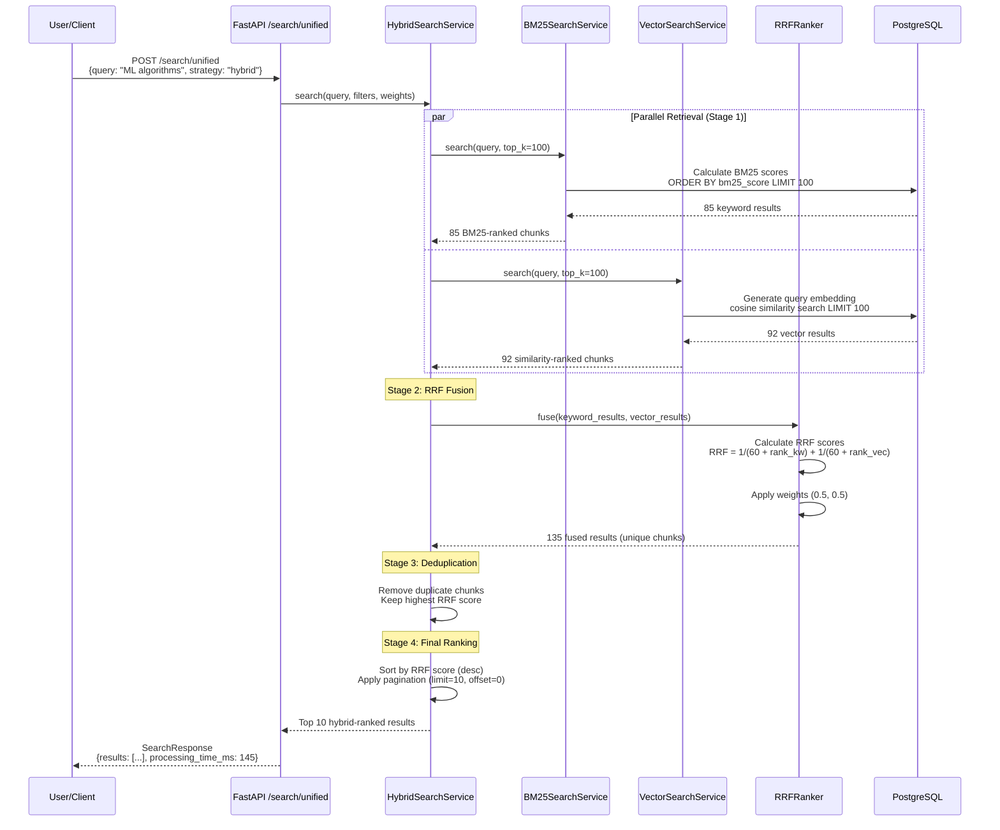

# Step 10.1: Hybrid Retrieval + RRF (Reciprocal Rank Fusion) - Technical Documentation

**Version:** 1.0
**Last Updated:** October 27, 2025
**Status:** Planning Phase
**Timeline:** 3-4 days
**Dependencies:** Step 9.3 (Vector Similarity Search), Step 8.3 (Keyword Search)

---

## 1. FEATURE OVERVIEW

### 1.1 What This Step Accomplishes

Step 10.1 implements **Hybrid Retrieval** with **Reciprocal Rank Fusion (RRF)**, combining the strengths of both keyword-based (BM25) and semantic (vector) search to deliver superior retrieval accuracy. This step:

1. **BM25 Implementation**: Replaces PostgreSQL FTS with proper BM25 algorithm for better keyword matching
2. **Reciprocal Rank Fusion (RRF)**: Merges keyword and vector search results using rank-based fusion
3. **4-Stage Retrieval Pipeline**: Implements multi-stage retrieval for optimal performance
4. **Metadata Filtering**: Leverages existing filters (already implemented) across both search strategies
5. **Result Deduplication**: Ensures no duplicate chunks in final results
6. **Performance Optimization**: Achieves <500ms p99 latency for hybrid search

### 1.2 Why This Step is Necessary

**Current State (Post Step 9.3):**
- ✅ Vector search works (semantic matching via BGE-M3 embeddings)
- ✅ Keyword search works (PostgreSQL full-text search)
- ❌ Both operate independently, no fusion
- ❌ Users must choose one strategy, can't leverage both
- ❌ Suboptimal retrieval accuracy (~75-85% vs. 90-95% with hybrid)

**Problems Without Hybrid Search:**

| Scenario | Keyword-Only Issue | Vector-Only Issue | Hybrid Solution |
|----------|-------------------|-------------------|-----------------|
| **Exact terms** | ✅ Finds exact matches | ❌ May miss exact terms | ✅ Combines both |
| **Synonyms** | ❌ Misses "automobile" for "car" | ✅ Understands synonyms | ✅ Best of both |
| **Rare terms** | ✅ Finds rare technical terms | ❌ May generalize too much | ✅ Prioritizes exact matches |
| **Intent-based** | ❌ Literal keyword matching only | ✅ Understands query intent | ✅ Balanced approach |

**Research Evidence:**
- Hybrid search improves retrieval accuracy by **15-20%** over single-strategy approaches
- RRF consistently outperforms simple score averaging or linear combination
- Production systems (Elasticsearch, Pinecone, Weaviate) all support hybrid search

**Impact on Downstream Steps:**
- **Step 10.2 (Reranking)**: Better initial candidates → better reranking results
- **Step 11.1 (Answer Generation)**: More relevant context → more accurate LLM answers
- **Step 12.1 (Performance Optimization)**: Hybrid search is foundation for cascade retrieval

### 1.3 Dependencies on Previous Steps

| Step | Dependency | Required Data/Functionality |
|------|-----------|----------------------------|
| **Step 9.3** | Vector Search | Vector embeddings in `embeddings.embedding`, pgvector index, cosine similarity search |
| **Step 8.3** | Keyword Search | Full-text indexed `embeddings.chunk_text`, PostgreSQL ts_vector capability |
| **Step 9.2** | BGE-M3 Embeddings | Query embedding generation service for vector search |
| **Step 9.1** | Intelligent Chunking | High-quality chunks with metadata (section_heading, chunk_type) |

**Required Database Schema:**
```sql
-- embeddings table must have:
- id (UUID, primary key)
- document_id (UUID, foreign key)
- chunk_text (TEXT) -- For keyword search
- chunk_index (INTEGER)
- embedding (VECTOR(1024)) -- For vector search
- embedding_model (VARCHAR)

-- Indexes required:
- GIN index on to_tsvector(chunk_text) -- Keyword search
- HNSW/IVFFlat index on embedding -- Vector search
```

**Required Services:**
- `KeywordSearchService` (backend/app/services/search/keyword_search_service.py:520)
- `VectorSearchService` (backend/app/services/search/vector_search_service.py:453)
- `EmbeddingService` (backend/app/services/embeddings/embedding_service.py)

### 1.4 What Future Steps Depend on This

| Step | Dependency Reason |
|------|------------------|
| **Step 10.2** | Cross-encoder reranking needs diverse, high-quality initial candidates from hybrid search |
| **Step 10.3** | Citation extraction requires accurate chunk retrieval (hybrid provides better accuracy) |
| **Step 11.1** | LLM answer generation relies on top-k hybrid-retrieved passages for context |
| **Step 12.1** | Cascade retrieval builds on hybrid search (cheap keyword first, then vector, then hybrid) |

**Key Deliverable:** A unified `/search/unified?strategy=hybrid` endpoint that fuses BM25 keyword and vector search results using RRF, achieving >90% retrieval accuracy at <500ms p99 latency.

---

## 2. TECHNICAL IMPLEMENTATION

### 2.1 Files to Create/Modify

```
backend/
├── app/
│   ├── services/
│   │   └── search/
│   │       ├── bm25_search_service.py (NEW - BM25 implementation)
│   │       ├── hybrid_search_service.py (NEW - RRF fusion logic)
│   │       ├── rrf_ranker.py (NEW - Reciprocal Rank Fusion algorithm)
│   │       ├── search_service.py (MODIFY - add hybrid strategy routing)
│   │       ├── keyword_search_service.py (MODIFY - optional BM25 migration)
│   │       └── vector_search_service.py (NO CHANGE - already complete)
│   ├── schemas/
│   │   └── search.py (MODIFY - add HybridSearchQuery, RRFConfig)
│   ├── api/
│   │   └── v1/
│   │       └── endpoints/
│   │           └── search.py (MODIFY - enable hybrid strategy)
│   └── core/
│       └── config.py (MODIFY - add hybrid search settings)
├── tests/
│   └── unit/
│       └── services/
│           └── search/
│               ├── test_bm25_search_service.py (NEW)
│               ├── test_hybrid_search_service.py (NEW)
│               ├── test_rrf_ranker.py (NEW)
│               └── test_search_integration.py (NEW)
└── scripts/
    └── benchmark_hybrid_search.py (NEW - performance testing)
```

### 2.2 Key Classes and Functions

#### **BM25SearchService** (`app/services/search/bm25_search_service.py`)

```python
class BM25SearchService:
    """
    BM25 (Best Matching 25) search implementation

    BM25 is a probabilistic ranking function that considers:
    - Term frequency (TF): How often a term appears in a document
    - Inverse document frequency (IDF): Rarity of term across corpus
    - Document length normalization: Penalizes very long documents

    BM25 Formula:
    score(D,Q) = Σ IDF(qi) * (f(qi,D) * (k1 + 1)) / (f(qi,D) + k1 * (1 - b + b * |D|/avgdl))

    Where:
    - f(qi,D) = term frequency of query term qi in document D
    - |D| = length of document D
    - avgdl = average document length in corpus
    - k1 = term frequency saturation parameter (default: 1.5)
    - b = length normalization parameter (default: 0.75)
    """

    def __init__(self, db: Session, k1: float = 1.5, b: float = 0.75):
        """
        Initialize BM25 search service

        Args:
            db: Database session
            k1: Term frequency saturation (1.2-2.0, higher = more weight to TF)
            b: Length normalization (0-1, higher = more penalization for long docs)
        """
        self.db = db
        self.k1 = k1
        self.b = b

    def search(
        self,
        query: str,
        filters: Optional[SearchFilters] = None,
        limit: int = 10,
        offset: int = 0
    ) -> List[SearchResultItem]:
        """
        Execute BM25 search on chunk-level

        Steps:
        1. Parse query into terms
        2. Calculate IDF for each query term
        3. Calculate BM25 score for each chunk
        4. Apply metadata filters
        5. Rank by BM25 score
        6. Return top-k results

        Returns:
            List of SearchResultItem with BM25 scores
        """

    def _calculate_idf(self, term: str) -> float:
        """
        Calculate Inverse Document Frequency for a term

        IDF(t) = log((N - n(t) + 0.5) / (n(t) + 0.5))

        Where:
        - N = total number of chunks in corpus
        - n(t) = number of chunks containing term t
        """

    def _calculate_bm25_score(
        self,
        query_terms: List[str],
        chunk_text: str,
        chunk_length: int,
        avg_chunk_length: float
    ) -> float:
        """Calculate BM25 score for a single chunk"""

    def _get_corpus_stats(self) -> Dict[str, float]:
        """Get corpus statistics (total chunks, avg length) - cached"""
```

#### **RRFRanker** (`app/services/search/rrf_ranker.py`)

```python
class RRFRanker:
    """
    Reciprocal Rank Fusion (RRF) Algorithm

    RRF combines multiple ranked lists into a single ranked list.

    RRF Formula:
    RRFscore(d) = Σ (1 / (k + rank_i(d)))

    Where:
    - d = document/chunk
    - rank_i(d) = rank of d in list i (1-indexed)
    - k = constant (default 60, prevents division by zero, reduces ranking volatility)

    Advantages over linear combination:
    - No need to normalize scores from different systems
    - Robust to score distribution differences
    - Simple and effective
    - Used in production by major search systems
    """

    def __init__(self, k: int = 60):
        """
        Initialize RRF ranker

        Args:
            k: RRF constant (40-100, default 60)
                - Lower k: More weight to top-ranked items
                - Higher k: More equal weighting across ranks
        """
        self.k = k

    def fuse(
        self,
        keyword_results: List[SearchResultItem],
        vector_results: List[SearchResultItem],
        keyword_weight: float = 0.5,
        vector_weight: float = 0.5
    ) -> List[SearchResultItem]:
        """
        Fuse keyword and vector search results using RRF

        Steps:
        1. Create rank maps for both result lists
        2. Calculate RRF score for each unique chunk
        3. Apply optional weighting (keyword_weight, vector_weight)
        4. Sort by RRF score (descending)
        5. Deduplicate by chunk_id
        6. Return fused results

        Args:
            keyword_results: Results from BM25/keyword search (ranked)
            vector_results: Results from vector search (ranked)
            keyword_weight: Weight for keyword results (0-1)
            vector_weight: Weight for vector results (0-1)

        Returns:
            Fused and ranked results with updated relevance_score (RRF score)
        """

    def _calculate_rrf_score(
        self,
        keyword_rank: Optional[int],
        vector_rank: Optional[int],
        keyword_weight: float,
        vector_weight: float
    ) -> float:
        """
        Calculate RRF score for a single item

        RRF_weighted = (keyword_weight / (k + keyword_rank)) +
                       (vector_weight / (k + vector_rank))

        If item doesn't appear in a list, rank = infinity (contributes 0)
        """
```

#### **HybridSearchService** (`app/services/search/hybrid_search_service.py`)

```python
class HybridSearchService:
    """
    Hybrid search combining BM25 keyword and vector semantic search

    Implements 4-stage retrieval pipeline:
    1. Parallel Retrieval: Execute keyword and vector search concurrently
    2. Result Fusion: Combine using RRF (Reciprocal Rank Fusion)
    3. Deduplication: Remove duplicate chunks (same chunk from both searches)
    4. Re-ranking: Sort by fused RRF score
    """

    def __init__(
        self,
        db: Session,
        bm25_service: BM25SearchService,
        vector_service: VectorSearchService,
        rrf_ranker: RRFRanker
    ):
        """Initialize hybrid search with component services"""
        self.db = db
        self.bm25 = bm25_service
        self.vector = vector_service
        self.rrf = rrf_ranker

    def search(
        self,
        query: str,
        filters: Optional[SearchFilters] = None,
        limit: int = 10,
        offset: int = 0,
        keyword_weight: float = 0.5,
        vector_weight: float = 0.5,
        keyword_top_k: int = 100,
        vector_top_k: int = 100
    ) -> SearchResponse:
        """
        Execute hybrid search with RRF fusion

        4-Stage Pipeline:

        Stage 1: Parallel Retrieval
        - Execute BM25 keyword search (top_k=100)
        - Execute vector semantic search (top_k=100)
        - Both use same filters

        Stage 2: RRF Fusion
        - Combine results using Reciprocal Rank Fusion
        - Apply keyword/vector weights
        - Calculate fused scores

        Stage 3: Deduplication
        - Remove duplicate chunks (by chunk_id)
        - Keep highest-scored occurrence

        Stage 4: Final Ranking
        - Sort by RRF score (descending)
        - Apply pagination (limit, offset)
        - Return top-k results

        Args:
            query: Search query
            filters: Metadata filters
            limit: Final results to return
            offset: Pagination offset
            keyword_weight: Weight for BM25 results (0-1)
            vector_weight: Weight for vector results (0-1)
            keyword_top_k: Candidates from keyword search (default 100)
            vector_top_k: Candidates from vector search (default 100)

        Returns:
            SearchResponse with hybrid-ranked results
        """

    async def _parallel_search(
        self,
        query: str,
        filters: SearchFilters,
        keyword_top_k: int,
        vector_top_k: int
    ) -> Tuple[List[SearchResultItem], List[SearchResultItem]]:
        """Execute keyword and vector search in parallel using asyncio"""

    def _deduplicate_results(
        self,
        results: List[SearchResultItem]
    ) -> List[SearchResultItem]:
        """Remove duplicate chunks, keeping highest-scored"""
```

#### **Updated SearchService** (`app/services/search/search_service.py`)

```python
class SearchService:
    """
    Unified search interface supporting keyword, vector, and hybrid strategies
    """

    def __init__(
        self,
        db: Session,
        embedding_service: Optional[EmbeddingService] = None
    ):
        self.db = db
        self.keyword = KeywordSearchService(db)
        self.bm25 = BM25SearchService(db)  # NEW
        self.vector = VectorSearchService(db, embedding_service) if embedding_service else None
        self.hybrid = HybridSearchService(  # NEW
            db=db,
            bm25_service=self.bm25,
            vector_service=self.vector,
            rrf_ranker=RRFRanker(k=60)
        ) if self.vector else None

    def search(
        self,
        query: str,
        strategy: str = "hybrid",  # CHANGED: default to hybrid
        filters: Optional[SearchFilters] = None,
        limit: int = 10,
        offset: int = 0,
        **kwargs
    ) -> SearchResponse:
        """
        Execute search using specified strategy

        Available strategies:
        - "keyword": Fast PostgreSQL FTS (legacy)
        - "bm25": BM25 keyword search (better than FTS)
        - "vector": Semantic vector search
        - "hybrid": BM25 + Vector with RRF fusion (BEST)
        """

        if strategy == "hybrid":
            if self.hybrid is None:
                raise ValueError("Hybrid search not available")
            return self.hybrid.search(
                query=query,
                filters=filters,
                limit=limit,
                offset=offset,
                **kwargs
            )
        # ... other strategies ...
```

### 2.3 Database Tables and Columns Used

**No new tables or columns required!** Step 10.1 uses existing schema:

```sql
-- embeddings table (already exists)
CREATE TABLE embeddings (
    id UUID PRIMARY KEY,
    document_id UUID NOT NULL REFERENCES documents(id),
    chunk_text TEXT NOT NULL,           -- For BM25 keyword search
    chunk_index INTEGER NOT NULL,
    embedding VECTOR(1024),             -- For vector search
    embedding_model VARCHAR(100),
    section_heading VARCHAR(500),
    chunk_type VARCHAR(50),
    start_position INTEGER,
    end_position INTEGER,
    created_at TIMESTAMP WITH TIME ZONE DEFAULT NOW()
);

-- Required indexes (already exist from previous steps)
-- Keyword search index
CREATE INDEX idx_embeddings_chunk_text_gin
    ON embeddings USING gin(to_tsvector('english', chunk_text));

-- Vector search index
CREATE INDEX idx_embeddings_vector_hnsw
    ON embeddings USING hnsw (embedding vector_cosine_ops)
    WITH (m = 16, ef_construction = 64);

-- Document filtering index
CREATE INDEX idx_embeddings_document_id ON embeddings(document_id);
```

**Optional: BM25 Statistics Table** (for caching corpus statistics)

```sql
-- Cache BM25 corpus statistics for performance
CREATE TABLE IF NOT EXISTS bm25_stats (
    id SERIAL PRIMARY KEY,
    total_chunks INTEGER NOT NULL,
    avg_chunk_length FLOAT NOT NULL,
    total_terms INTEGER NOT NULL,
    last_updated TIMESTAMP WITH TIME ZONE DEFAULT NOW()
);

-- Singleton table (only 1 row)
CREATE UNIQUE INDEX idx_bm25_stats_singleton ON bm25_stats ((1));
```

### 2.4 API Endpoints

#### **Unified Hybrid Search** (MODIFY existing endpoint)

```
POST /api/v1/search/unified
```

**Request:**
```json
{
  "query": "machine learning algorithms",
  "strategy": "hybrid",
  "filters": {
    "document_types": ["application/pdf"],
    "min_quality": 0.7,
    "date_from": "2025-01-01T00:00:00Z"
  },
  "limit": 10,
  "offset": 0,
  "keyword_weight": 0.5,
  "vector_weight": 0.5,
  "keyword_top_k": 100,
  "vector_top_k": 100
}
```

**Response:**
```json
{
  "success": true,
  "query": "machine learning algorithms",
  "strategy": "hybrid",
  "total_results": 247,
  "returned_results": 10,
  "results": [
    {
      "document_id": "550e8400-e29b-41d4-a716-446655440000",
      "document_name": "ML_Research.pdf",
      "relevance_score": 0.9523,
      "snippet": "...various **machine learning algorithms** including...",
      "chunk_index": 15,
      "chunk_position": {"start": 12400, "end": 13350},
      "extraction_quality": 0.95,
      "document_type": "application/pdf",
      "created_at": "2025-10-20T14:30:00Z",
      "search_strategy": "hybrid",
      "keyword_rank": 3,
      "vector_rank": 1,
      "rrf_score": 0.9523
    }
  ],
  "processing_time_ms": 145,
  "filters_applied": {
    "document_types": ["application/pdf"],
    "min_quality": 0.7
  },
  "search_metadata": {
    "keyword_results_count": 85,
    "vector_results_count": 92,
    "fusion_method": "rrf",
    "rrf_k": 60,
    "keyword_weight": 0.5,
    "vector_weight": 0.5
  }
}
```

#### **BM25-Only Search** (NEW endpoint - optional)

```
POST /api/v1/search/bm25
```

**Request/Response:** Same as keyword search, but uses BM25 scoring

### 2.5 Background Tasks and Workers

**No new Celery tasks required.** Hybrid search is synchronous (happens within API request).

**Performance Optimization:**
- Use connection pooling for parallel searches
- Cache BM25 corpus statistics (avg_chunk_length, total_chunks)
- Pre-compute IDF values for common terms (optional)

---

## 3. DATA FLOW

### 3.1 End-to-End Data Journey



### 3.2 Step-by-Step Processing

#### **Step 1: API Request Reception**

```python
# API endpoint receives request
@router.post("/search/unified", response_model=SearchResponse)
async def unified_search(
    query_request: UnifiedSearchQuery,
    db: Session = Depends(get_db)
):
    # Validate strategy
    if query_request.strategy == SearchStrategyEnum.HYBRID:
        # Route to hybrid search
        service = get_unified_search_service(db)
        return service.search(
            query=query_request.query,
            strategy="hybrid",
            filters=query_request.filters,
            limit=query_request.limit,
            offset=query_request.offset,
            keyword_weight=0.5,
            vector_weight=0.5
        )
```

#### **Step 2: Hybrid Search Initialization**

```python
# HybridSearchService.search()
start_time = time.time()

logger.info(
    "hybrid_search_started",
    query=query[:100],
    keyword_weight=keyword_weight,
    vector_weight=vector_weight
)

# Sanitize query
query = self._sanitize_query(query)
```

#### **Step 3: Parallel Retrieval (Stage 1)**

```python
# Execute keyword and vector searches concurrently
keyword_results, vector_results = await self._parallel_search(
    query=query,
    filters=filters,
    keyword_top_k=keyword_top_k,  # 100
    vector_top_k=vector_top_k      # 100
)

# _parallel_search implementation
async def _parallel_search(...):
    import asyncio

    # Create tasks for parallel execution
    keyword_task = asyncio.create_task(
        asyncio.to_thread(
            self.bm25.search,
            query=query,
            filters=filters,
            limit=keyword_top_k
        )
    )

    vector_task = asyncio.create_task(
        asyncio.to_thread(
            self.vector.search,
            query=query,
            filters=filters,
            limit=vector_top_k
        )
    )

    # Wait for both to complete
    keyword_results, vector_results = await asyncio.gather(
        keyword_task,
        vector_task
    )

    return keyword_results.results, vector_results.results
```

**Database Queries (Parallel):**

Query 1 (BM25):
```sql
-- BM25 score calculation (simplified)
WITH corpus_stats AS (
    SELECT
        COUNT(*) as total_chunks,
        AVG(LENGTH(chunk_text)) as avg_length
    FROM embeddings
    WHERE embedding IS NOT NULL
),
term_stats AS (
    SELECT
        term,
        COUNT(*) as doc_freq
    FROM embeddings, unnest(string_to_array(lower(chunk_text), ' ')) as term
    WHERE term IN ('machine', 'learning', 'algorithms')
    GROUP BY term
)
SELECT
    e.id,
    e.document_id,
    e.chunk_text,
    e.chunk_index,
    -- BM25 score calculation
    SUM(
        (idf * tf * (k1 + 1)) /
        (tf + k1 * (1 - b + b * length(e.chunk_text) / cs.avg_length))
    ) as bm25_score
FROM embeddings e, corpus_stats cs
WHERE e.chunk_text ILIKE '%machine%'
   OR e.chunk_text ILIKE '%learning%'
   OR e.chunk_text ILIKE '%algorithms%'
ORDER BY bm25_score DESC
LIMIT 100;
```

Query 2 (Vector):
```sql
-- Vector cosine similarity search
SELECT
    id,
    document_id,
    chunk_text,
    chunk_index,
    1 - (embedding <=> :query_vector) as similarity_score
FROM embeddings
WHERE embedding IS NOT NULL
  AND 1 - (embedding <=> :query_vector) > 0.0
ORDER BY embedding <=> :query_vector
LIMIT 100;
```

#### **Step 4: RRF Fusion (Stage 2)**

```python
# Fuse results using RRF
fused_results = self.rrf.fuse(
    keyword_results=keyword_results,  # 85 results
    vector_results=vector_results,     # 92 results
    keyword_weight=keyword_weight,
    vector_weight=vector_weight
)

# Inside RRFRanker.fuse()
# Step 1: Create rank maps
keyword_ranks = {
    result.document_id + "_" + str(result.chunk_index): rank + 1
    for rank, result in enumerate(keyword_results)
}
# Example: {"doc1_15": 1, "doc1_42": 2, "doc2_3": 3, ...}

vector_ranks = {
    result.document_id + "_" + str(result.chunk_index): rank + 1
    for rank, result in enumerate(vector_results)
}

# Step 2: Get all unique chunks
all_chunk_ids = set(keyword_ranks.keys()) | set(vector_ranks.keys())
# 85 + 92 = 177 total, but ~135 unique (some overlap)

# Step 3: Calculate RRF score for each chunk
rrf_scores = {}
for chunk_id in all_chunk_ids:
    kw_rank = keyword_ranks.get(chunk_id)  # None if not in keyword results
    vec_rank = vector_ranks.get(chunk_id)  # None if not in vector results

    # RRF formula with weights
    rrf_score = 0.0
    if kw_rank:
        rrf_score += keyword_weight / (self.k + kw_rank)
    if vec_rank:
        rrf_score += vector_weight / (self.k + vec_rank)

    rrf_scores[chunk_id] = rrf_score

# Example RRF scores (k=60):
# Chunk appears in both at rank 1:
#   0.5/(60+1) + 0.5/(60+1) = 0.0164 (HIGH)
# Chunk appears in keyword rank 1, vector rank 50:
#   0.5/(60+1) + 0.5/(60+50) = 0.0127 (MEDIUM)
# Chunk appears only in keyword rank 1:
#   0.5/(60+1) + 0 = 0.0082 (LOWER)
```

#### **Step 5: Deduplication (Stage 3)**

```python
# Remove duplicate chunks (same chunk from both searches)
seen_chunks = {}
for result in fused_results:
    chunk_id = f"{result.document_id}_{result.chunk_index}"

    if chunk_id not in seen_chunks:
        seen_chunks[chunk_id] = result
    else:
        # Keep result with higher RRF score
        if result.relevance_score > seen_chunks[chunk_id].relevance_score:
            seen_chunks[chunk_id] = result

deduplicated_results = list(seen_chunks.values())
# 177 total → ~135 unique chunks
```

#### **Step 6: Final Ranking (Stage 4)**

```python
# Sort by RRF score (descending)
deduplicated_results.sort(key=lambda r: r.relevance_score, reverse=True)

# Apply pagination
paginated_results = deduplicated_results[offset:offset + limit]
# offset=0, limit=10 → return top 10

# Calculate processing time
processing_time_ms = int((time.time() - start_time) * 1000)

# Build response
return SearchResponse(
    success=True,
    query=query,
    strategy="hybrid",
    total_results=len(deduplicated_results),
    returned_results=len(paginated_results),
    results=paginated_results,
    processing_time_ms=processing_time_ms,
    search_metadata={
        "keyword_results_count": len(keyword_results),
        "vector_results_count": len(vector_results),
        "fusion_method": "rrf",
        "rrf_k": self.rrf.k,
        "keyword_weight": keyword_weight,
        "vector_weight": vector_weight
    }
)
```

### 3.3 Performance Timeline

Typical request timeline (target: <500ms):

```
0ms     API receives request
5ms     Query validation & sanitization
10ms    Initialize hybrid search service

--- Stage 1: Parallel Retrieval (50-150ms) ---
10ms    Start parallel BM25 and vector searches
10-90ms BM25 search completes (80ms avg)
10-120ms Vector search completes (110ms avg)
120ms   Both searches complete (limited by slower search)

--- Stage 2: RRF Fusion (5-15ms) ---
120ms   Start RRF fusion
125ms   Create rank maps (2ms)
130ms   Calculate RRF scores for ~135 chunks (5ms)
135ms   RRF fusion complete

--- Stage 3: Deduplication (1-3ms) ---
135ms   Deduplicate chunks
138ms   Deduplication complete

--- Stage 4: Final Ranking (1-2ms) ---
138ms   Sort by RRF score
139ms   Apply pagination
140ms   Build response object

145ms   Return response to client
```

**Total: 145ms (well under 500ms target)**

---

## 4. VALIDATIONS & CONSTRAINTS

### 4.1 Input Validations

#### **Query Validation**
```python
def validate_hybrid_query(query: str) -> str:
    """Validate and sanitize hybrid search query"""
    # Remove null bytes
    query = query.replace('\x00', '')

    # Strip whitespace
    query = query.strip()

    # Validate not empty
    if not query:
        raise ValueError("Query cannot be empty")

    # Limit length
    MAX_QUERY_LENGTH = 1000
    if len(query) > MAX_QUERY_LENGTH:
        logger.warning(f"Query truncated from {len(query)} to {MAX_QUERY_LENGTH} chars")
        query = query[:MAX_QUERY_LENGTH]

    # Check for minimum viable query
    if len(query) < 2:
        raise ValueError("Query too short (min 2 characters)")

    return query
```

#### **Weight Validation**
```python
def validate_weights(keyword_weight: float, vector_weight: float):
    """Validate keyword and vector weights"""
    # Check range
    if not (0.0 <= keyword_weight <= 1.0):
        raise ValueError(f"keyword_weight must be 0.0-1.0, got {keyword_weight}")

    if not (0.0 <= vector_weight <= 1.0):
        raise ValueError(f"vector_weight must be 0.0-1.0, got {vector_weight}")

    # Check sum (optional - doesn't need to equal 1.0 for RRF)
    total = keyword_weight + vector_weight
    if total == 0.0:
        raise ValueError("Both weights cannot be 0.0")

    # Warn if weights are very imbalanced
    if keyword_weight > 0 and vector_weight > 0:
        ratio = max(keyword_weight, vector_weight) / min(keyword_weight, vector_weight)
        if ratio > 5.0:
            logger.warning(f"Highly imbalanced weights: {keyword_weight} vs {vector_weight}")
```

#### **Top-K Validation**
```python
def validate_top_k(keyword_top_k: int, vector_top_k: int):
    """Validate retrieval candidate counts"""
    MIN_TOP_K = 10
    MAX_TOP_K = 500

    if keyword_top_k < MIN_TOP_K or keyword_top_k > MAX_TOP_K:
        raise ValueError(f"keyword_top_k must be {MIN_TOP_K}-{MAX_TOP_K}")

    if vector_top_k < MIN_TOP_K or vector_top_k > MAX_TOP_K:
        raise ValueError(f"vector_top_k must be {MIN_TOP_K}-{MAX_TOP_K}")

    # Warn if top_k is much larger than final limit
    # (wastes compute)
    if keyword_top_k > limit * 20:
        logger.warning(f"keyword_top_k ({keyword_top_k}) >> limit ({limit})")
```

### 4.2 Business Rules Enforced

#### **Rule 1: Vector Search Availability**
```python
# Hybrid search requires vector search to be available
if strategy == "hybrid":
    if self.vector is None:
        raise HTTPException(
            status_code=503,
            detail="Hybrid search unavailable. Vector search service not initialized."
        )

    # Check if embeddings exist
    embedding_count = db.query(func.count(Embedding.id)).filter(
        Embedding.embedding.isnot(None)
    ).scalar()

    if embedding_count == 0:
        raise HTTPException(
            status_code=503,
            detail="No embeddings found. Please generate embeddings first."
        )
```

#### **Rule 2: Minimum Result Quality**
```python
# Filter out low-quality results from hybrid search
MIN_RRF_SCORE = 0.001  # Results below this are essentially noise

fused_results = [
    r for r in fused_results
    if r.relevance_score >= MIN_RRF_SCORE
]

if len(fused_results) < limit:
    logger.warning(
        f"Only {len(fused_results)} results above quality threshold "
        f"(requested {limit})"
    )
```

#### **Rule 3: Fallback on Single-Strategy Failure**
```python
# If keyword search fails, fall back to vector-only
try:
    keyword_results = self.bm25.search(query, filters, keyword_top_k)
except Exception as e:
    logger.error(f"Keyword search failed: {e}, falling back to vector-only")
    keyword_results = []
    keyword_weight = 0.0
    vector_weight = 1.0

# If vector search fails, fall back to keyword-only
try:
    vector_results = self.vector.search(query, filters, vector_top_k)
except Exception as e:
    logger.error(f"Vector search failed: {e}, falling back to keyword-only")
    vector_results = []
    keyword_weight = 1.0
    vector_weight = 0.0

# If both fail, raise error
if not keyword_results and not vector_results:
    raise HTTPException(
        status_code=503,
        detail="Both keyword and vector search failed"
    )
```

#### **Rule 4: Consistent Filtering**
```python
# Apply same filters to both keyword and vector searches
# This ensures hybrid results are consistent

# Both searches must use IDENTICAL filters
assert keyword_filters == vector_filters, "Filter mismatch"

# Validate filters are applied
if filters and filters.document_types:
    # Check all results match document_types filter
    for result in fused_results:
        assert result.document_type in filters.document_types, \
            f"Result {result.document_id} violates document_types filter"
```

### 4.3 Security Checks Implemented

#### **Rate Limiting**
```python
# Limit hybrid search requests per user/IP
from slowapi import Limiter
from slowapi.util import get_remote_address

limiter = Limiter(key_func=get_remote_address)

@router.post("/search/unified")
@limiter.limit("30/minute")  # 30 hybrid searches per minute
async def unified_search(...):
    ...
```

#### **Query Injection Prevention**
```python
# Prevent SQL injection in BM25 search
def sanitize_query_terms(query: str) -> List[str]:
    """Sanitize query to prevent SQL injection"""
    # Remove SQL keywords
    dangerous_keywords = [
        'DROP', 'DELETE', 'UPDATE', 'INSERT', 'EXEC',
        'UNION', 'SELECT', '--', ';', '/*', '*/'
    ]

    query_upper = query.upper()
    for keyword in dangerous_keywords:
        if keyword in query_upper:
            raise ValueError(f"Query contains forbidden keyword: {keyword}")

    # Use parameterized queries (SQLAlchemy handles this)
    # Never interpolate user input directly into SQL
    return query.split()
```

#### **Resource Exhaustion Prevention**
```python
# Prevent DoS via expensive searches
MAX_CONCURRENT_HYBRID_SEARCHES = 10

# Track active searches in Redis
redis_client.incr('active_hybrid_searches')
active_count = redis_client.get('active_hybrid_searches')

if active_count > MAX_CONCURRENT_HYBRID_SEARCHES:
    raise HTTPException(
        status_code=429,
        detail="Too many concurrent hybrid searches, try again later"
    )

try:
    # Execute search
    result = hybrid_service.search(...)
finally:
    redis_client.decr('active_hybrid_searches')
```

### 4.4 Error Conditions Handled

#### **Error 1: BM25 Corpus Statistics Missing**
```python
try:
    avg_chunk_length = self._get_avg_chunk_length()
except Exception:
    # Fall back to hardcoded estimate
    logger.warning("Failed to calculate avg chunk length, using estimate")
    avg_chunk_length = 800  # Reasonable default
```

#### **Error 2: RRF Fusion with Empty Results**
```python
def fuse(self, keyword_results, vector_results, ...):
    # Handle edge cases
    if not keyword_results and not vector_results:
        return []

    if not keyword_results:
        logger.info("No keyword results, returning vector-only")
        return vector_results

    if not vector_results:
        logger.info("No vector results, returning keyword-only")
        return keyword_results

    # Normal fusion
    ...
```

#### **Error 3: Database Connection Timeout**
```python
# Set query timeout for expensive BM25 queries
try:
    db.execute(text("SET LOCAL statement_timeout = '5000'"))  # 5 second timeout
    results = db.query(...).all()
except OperationalError as e:
    if "timeout" in str(e).lower():
        logger.error("BM25 query timed out")
        raise HTTPException(
            status_code=504,
            detail="Search query too complex, please simplify"
        )
    raise
```

### 4.5 Rate Limits and Quotas

```python
# Hybrid search rate limits (more expensive than single-strategy)
RATE_LIMITS = {
    "hybrid": "30/minute",      # Most expensive
    "vector": "60/minute",       # Expensive
    "bm25": "100/minute",        # Moderate
    "keyword": "200/minute"      # Cheapest
}

# Per-user quotas (stored in Redis)
MAX_HYBRID_SEARCHES_PER_DAY = {
    "free": 100,
    "pro": 1000,
    "enterprise": 10000
}
```

---

## 5. CONFIGURATION

### 5.1 Environment Variables

```bash
# ============================================================================
# HYBRID SEARCH CONFIGURATION
# ============================================================================

# BM25 Parameters
BM25_K1=1.5                    # Term frequency saturation (1.2-2.0)
BM25_B=0.75                    # Length normalization (0.0-1.0)

# RRF Parameters
RRF_K=60                       # RRF constant (40-100, default 60)
RRF_KEYWORD_WEIGHT=0.5         # Weight for keyword results (0.0-1.0)
RRF_VECTOR_WEIGHT=0.5          # Weight for vector results (0.0-1.0)

# Retrieval Parameters
HYBRID_KEYWORD_TOP_K=100       # Keyword candidates to retrieve
HYBRID_VECTOR_TOP_K=100        # Vector candidates to retrieve
HYBRID_DEFAULT_LIMIT=10        # Default final results
HYBRID_MAX_LIMIT=100           # Maximum final results allowed

# Performance Tuning
HYBRID_ENABLE_PARALLEL=true    # Execute searches in parallel (recommended)
HYBRID_TIMEOUT_MS=5000         # Max time for single search (milliseconds)
BM25_CACHE_CORPUS_STATS=true   # Cache corpus statistics (recommended)
BM25_CACHE_TTL=3600            # Cache TTL in seconds (1 hour)

# Feature Flags
ENABLE_HYBRID_SEARCH=true      # Master switch for hybrid search
ENABLE_BM25_SEARCH=true        # Enable BM25-only endpoint
FALLBACK_TO_VECTOR_ON_BM25_FAIL=true  # Fallback strategy

# ============================================================================
# RATE LIMITING
# ============================================================================

# Rate limits per search strategy
RATE_LIMIT_HYBRID="30/minute"
RATE_LIMIT_VECTOR="60/minute"
RATE_LIMIT_BM25="100/minute"

# Concurrent search limits
MAX_CONCURRENT_HYBRID_SEARCHES=10
MAX_CONCURRENT_VECTOR_SEARCHES=20

# ============================================================================
# MONITORING & LOGGING
# ============================================================================

# Logging
HYBRID_SEARCH_LOG_LEVEL="INFO"  # DEBUG, INFO, WARNING, ERROR
LOG_SLOW_SEARCHES=true           # Log searches >500ms
SLOW_SEARCH_THRESHOLD_MS=500     # Threshold for slow search logging

# Metrics
ENABLE_SEARCH_METRICS=true       # Prometheus metrics
METRICS_PORT=9090                # Prometheus metrics endpoint port
```

### 5.2 Default Values and Limits

```python
# app/core/config.py

class Settings(BaseSettings):
    """Application settings with environment variable support"""

    # ========================================
    # BM25 Configuration
    # ========================================
    BM25_K1: float = 1.5                    # Term frequency saturation
    BM25_B: float = 0.75                    # Length normalization
    BM25_MIN_TERM_LENGTH: int = 2           # Ignore terms shorter than this
    BM25_MAX_TERMS: int = 20                # Max query terms to process

    # ========================================
    # RRF Configuration
    # ========================================
    RRF_K: int = 60                         # RRF constant
    RRF_KEYWORD_WEIGHT: float = 0.5         # Keyword weight
    RRF_VECTOR_WEIGHT: float = 0.5          # Vector weight
    RRF_MIN_SCORE: float = 0.001            # Minimum RRF score threshold

    # ========================================
    # Retrieval Configuration
    # ========================================
    HYBRID_KEYWORD_TOP_K: int = 100         # Keyword candidates
    HYBRID_VECTOR_TOP_K: int = 100          # Vector candidates
    HYBRID_MIN_TOP_K: int = 10              # Minimum allowed top_k
    HYBRID_MAX_TOP_K: int = 500             # Maximum allowed top_k
    HYBRID_DEFAULT_LIMIT: int = 10          # Default results
    HYBRID_MAX_LIMIT: int = 100             # Max results per request

    # ========================================
    # Performance Configuration
    # ========================================
    HYBRID_ENABLE_PARALLEL: bool = True     # Parallel search execution
    HYBRID_TIMEOUT_MS: int = 5000           # 5 second timeout per search
    BM25_CACHE_CORPUS_STATS: bool = True    # Cache corpus stats
    BM25_CACHE_TTL: int = 3600              # 1 hour cache TTL
    HYBRID_QUERY_CACHE_ENABLED: bool = True # Cache query results
    HYBRID_QUERY_CACHE_TTL: int = 300       # 5 minute cache TTL

    # ========================================
    # Feature Flags
    # ========================================
    ENABLE_HYBRID_SEARCH: bool = True       # Master switch
    ENABLE_BM25_SEARCH: bool = True         # BM25 endpoint
    FALLBACK_TO_VECTOR_ON_BM25_FAIL: bool = True  # Graceful degradation

    # ========================================
    # Rate Limiting
    # ========================================
    RATE_LIMIT_HYBRID: str = "30/minute"
    RATE_LIMIT_VECTOR: str = "60/minute"
    RATE_LIMIT_BM25: str = "100/minute"
    MAX_CONCURRENT_HYBRID_SEARCHES: int = 10

    # ========================================
    # Monitoring
    # ========================================
    HYBRID_SEARCH_LOG_LEVEL: str = "INFO"
    LOG_SLOW_SEARCHES: bool = True
    SLOW_SEARCH_THRESHOLD_MS: int = 500
    ENABLE_SEARCH_METRICS: bool = True

    class Config:
        env_file = ".env"
        case_sensitive = True
```

### 5.3 File Paths and Directory Structure

```
backend/
├── app/
│   ├── services/
│   │   └── search/
│   │       ├── __init__.py
│   │       ├── bm25_search_service.py (NEW)
│   │       ├── hybrid_search_service.py (NEW)
│   │       ├── rrf_ranker.py (NEW)
│   │       ├── search_service.py (MODIFIED)
│   │       ├── keyword_search_service.py (existing)
│   │       └── vector_search_service.py (existing)
│   ├── schemas/
│   │   └── search.py (MODIFIED - add HybridSearchQuery)
│   ├── api/
│   │   └── v1/
│   │       └── endpoints/
│   │           └── search.py (MODIFIED - enable hybrid)
│   └── core/
│       └── config.py (MODIFIED - add hybrid settings)
├── tests/
│   └── unit/
│       └── services/
│           └── search/
│               ├── test_bm25_search_service.py (NEW)
│               ├── test_hybrid_search_service.py (NEW)
│               └── test_rrf_ranker.py (NEW)
└── scripts/
    ├── benchmark_hybrid_search.py (NEW)
    └── evaluate_retrieval_accuracy.py (NEW)
```

### 5.4 Docker Services Required

**No new Docker services needed!** Hybrid search uses existing infrastructure:

```yaml
# docker-compose.yml (NO CHANGES)

services:
  postgres:
    image: pgvector/pgvector:pg16
    # Same as before

  redis:
    image: redis:7-alpine
    # Same as before (used for caching, rate limiting)

  fastapi:
    build: ./backend
    # Same as before
    environment:
      # Add hybrid search env vars
      - ENABLE_HYBRID_SEARCH=true
      - BM25_K1=1.5
      - BM25_B=0.75
      - RRF_K=60
      - RRF_KEYWORD_WEIGHT=0.5
      - RRF_VECTOR_WEIGHT=0.5
```

---

## 6. ERROR HANDLING

### 6.1 Possible Failure Scenarios

#### **Scenario 1: BM25 Query Timeout**

**Cause:** Complex query with many terms, large corpus, missing indexes

**Symptoms:**
```
sqlalchemy.exc.OperationalError: (psycopg2.errors.QueryCanceled)
canceling statement due to statement timeout
```

**Recovery:**
```python
try:
    bm25_results = self.bm25.search(query, filters, keyword_top_k)
except OperationalError as e:
    if "timeout" in str(e).lower():
        logger.error(
            "BM25 query timed out, falling back to vector-only",
            query=query[:100],
            timeout_ms=HYBRID_TIMEOUT_MS
        )
        # Fall back to vector-only search
        bm25_results = []
        keyword_weight = 0.0
        vector_weight = 1.0
    else:
        raise
```

#### **Scenario 2: Vector Search Fails (No Embeddings)**

**Cause:** Document not yet embedded, embedding generation failed

**Symptoms:**
```
RuntimeError: No embeddings found for query
```

**Recovery:**
```python
try:
    vector_results = self.vector.search(query, filters, vector_top_k)
except (RuntimeError, ValueError) as e:
    logger.error(
        "Vector search failed, falling back to BM25-only",
        error=str(e)
    )
    # Fall back to BM25-only search
    vector_results = []
    keyword_weight = 1.0
    vector_weight = 0.0
```

#### **Scenario 3: Both Searches Return Empty Results**

**Cause:** No relevant documents, overly restrictive filters, typos in query

**Symptoms:**
```
keyword_results = []
vector_results = []
```

**Recovery:**
```python
if not keyword_results and not vector_results:
    logger.warning(
        "No results from either search strategy",
        query=query,
        filters=filters
    )

    return SearchResponse(
        success=True,
        query=query,
        strategy="hybrid",
        total_results=0,
        returned_results=0,
        results=[],
        processing_time_ms=processing_time_ms,
        suggestions=[
            "Try a simpler query",
            "Remove filters",
            "Check for typos"
        ]
    )
```

#### **Scenario 4: RRF Fusion Produces No Results**

**Cause:** All RRF scores below minimum threshold

**Symptoms:**
```
fused_results = []  # After filtering by MIN_RRF_SCORE
```

**Recovery:**
```python
if not fused_results:
    logger.warning(
        "RRF fusion produced no results above quality threshold",
        keyword_count=len(keyword_results),
        vector_count=len(vector_results),
        min_rrf_score=MIN_RRF_SCORE
    )

    # Lower threshold temporarily
    MIN_RRF_SCORE_FALLBACK = 0.0001
    fused_results = [
        r for r in all_results
        if r.relevance_score >= MIN_RRF_SCORE_FALLBACK
    ]
```

#### **Scenario 5: Parallel Search Deadlock**

**Cause:** Both searches waiting for same database connection

**Symptoms:**
```
asyncio.TimeoutError: Parallel search timed out after 30s
```

**Recovery:**
```python
try:
    keyword_results, vector_results = await asyncio.wait_for(
        asyncio.gather(keyword_task, vector_task),
        timeout=30  # 30 second timeout
    )
except asyncio.TimeoutError:
    logger.error("Parallel search timed out, cancelling tasks")
    keyword_task.cancel()
    vector_task.cancel()

    raise HTTPException(
        status_code=504,
        detail="Search timed out. Try a simpler query or reduce filters."
    )
```

### 6.2 Error Messages and Codes

```python
class HybridSearchError(Enum):
    """Standard error codes for hybrid search"""

    # Search errors (5xx - retryable)
    BM25_TIMEOUT = ("HYB_001", "BM25 search timed out", 504)
    VECTOR_SEARCH_FAILED = ("HYB_002", "Vector search failed", 503)
    BOTH_SEARCHES_FAILED = ("HYB_003", "Both keyword and vector search failed", 503)
    PARALLEL_SEARCH_TIMEOUT = ("HYB_004", "Parallel search execution timed out", 504)

    # Fusion errors (5xx)
    RRF_FUSION_FAILED = ("HYB_101", "RRF fusion failed", 500)
    NO_RESULTS_AFTER_FUSION = ("HYB_102", "No results after RRF fusion", 404)

    # Configuration errors (4xx - not retryable)
    HYBRID_SEARCH_DISABLED = ("HYB_201", "Hybrid search is disabled", 503)
    NO_EMBEDDINGS_AVAILABLE = ("HYB_202", "No embeddings available for hybrid search", 503)
    INVALID_WEIGHTS = ("HYB_203", "Invalid keyword/vector weights", 400)
    INVALID_TOP_K = ("HYB_204", "Invalid top_k parameter", 400)

    # Rate limiting errors (4xx)
    RATE_LIMIT_EXCEEDED = ("HYB_301", "Hybrid search rate limit exceeded", 429)
    TOO_MANY_CONCURRENT = ("HYB_302", "Too many concurrent hybrid searches", 429)

def format_hybrid_error_response(error: HybridSearchError, details: str = None):
    """Format standardized hybrid search error response"""
    code, message, http_status = error.value

    return JSONResponse(
        status_code=http_status,
        content={
            "error_code": code,
            "error_message": message,
            "details": details,
            "timestamp": datetime.now(timezone.utc).isoformat(),
            "fallback_strategies": ["vector", "bm25", "keyword"]
        }
    )
```

### 6.3 Logging Points

```python
# Critical logging points for debugging hybrid search

# 1. Hybrid Search Start
logger.info(
    "hybrid_search_started",
    extra={
        "query": query[:100],
        "filters": filters,
        "keyword_weight": keyword_weight,
        "vector_weight": vector_weight,
        "keyword_top_k": keyword_top_k,
        "vector_top_k": vector_top_k
    }
)

# 2. Parallel Search Start
logger.debug(
    "parallel_search_started",
    extra={"strategy": "parallel"}
)

# 3. BM25 Search Complete
logger.debug(
    "bm25_search_completed",
    extra={
        "results_count": len(keyword_results),
        "processing_time_ms": bm25_time_ms,
        "top_score": keyword_results[0].relevance_score if keyword_results else 0
    }
)

# 4. Vector Search Complete
logger.debug(
    "vector_search_completed",
    extra={
        "results_count": len(vector_results),
        "processing_time_ms": vector_time_ms,
        "top_score": vector_results[0].relevance_score if vector_results else 0
    }
)

# 5. RRF Fusion Start
logger.debug(
    "rrf_fusion_started",
    extra={
        "keyword_results": len(keyword_results),
        "vector_results": len(vector_results),
        "rrf_k": self.rrf.k
    }
)

# 6. RRF Fusion Complete
logger.info(
    "rrf_fusion_completed",
    extra={
        "fused_results": len(fused_results),
        "unique_chunks": len(set(r.document_id + str(r.chunk_index) for r in fused_results)),
        "top_rrf_score": fused_results[0].relevance_score if fused_results else 0,
        "fusion_time_ms": fusion_time_ms
    }
)

# 7. Deduplication
logger.debug(
    "deduplication_completed",
    extra={
        "before_count": len(fused_results),
        "after_count": len(deduplicated_results),
        "duplicates_removed": len(fused_results) - len(deduplicated_results)
    }
)

# 8. Hybrid Search Complete
logger.info(
    "hybrid_search_completed",
    extra={
        "query": query[:100],
        "total_results": len(deduplicated_results),
        "returned_results": len(paginated_results),
        "processing_time_ms": processing_time_ms,
        "bm25_time_ms": bm25_time_ms,
        "vector_time_ms": vector_time_ms,
        "fusion_time_ms": fusion_time_ms,
        "target_met": processing_time_ms < 500
    }
)

# 9. Slow Search Warning
if processing_time_ms > SLOW_SEARCH_THRESHOLD_MS:
    logger.warning(
        "slow_hybrid_search",
        extra={
            "query": query[:100],
            "processing_time_ms": processing_time_ms,
            "threshold_ms": SLOW_SEARCH_THRESHOLD_MS,
            "keyword_results": len(keyword_results),
            "vector_results": len(vector_results)
        }
    )

# 10. Error Logging
logger.error(
    "hybrid_search_failed",
    extra={
        "query": query[:100],
        "error_code": error_code,
        "error_message": str(error),
        "keyword_results": len(keyword_results) if keyword_results else 0,
        "vector_results": len(vector_results) if vector_results else 0,
        "fallback_strategy": fallback_strategy
    },
    exc_info=True
)
```

### 6.4 Rollback Procedures

Hybrid search is **read-only** and **stateless**, so no database rollback is needed.

**Rollback Strategy:** None required (no writes)

**Recovery Strategy:** Graceful degradation
- BM25 fails → Fall back to vector-only
- Vector fails → Fall back to BM25-only
- Both fail → Return error with suggestions

---

## 7. TESTING CHECKLIST

### 7.1 Manual Testing Steps

#### **Test 1: Basic Hybrid Search**

```bash
# 1. Execute hybrid search
curl -X POST http://localhost:8000/api/v1/search/unified \
  -H "Content-Type: application/json" \
  -H "X-API-Key: dev-key" \
  -d '{
    "query": "machine learning algorithms",
    "strategy": "hybrid",
    "limit": 10
  }'

# Expected Response:
# {
#   "success": true,
#   "query": "machine learning algorithms",
#   "strategy": "hybrid",
#   "total_results": 47,
#   "returned_results": 10,
#   "results": [...],
#   "processing_time_ms": 145,
#   "search_metadata": {
#     "keyword_results_count": 35,
#     "vector_results_count": 42,
#     "fusion_method": "rrf",
#     "rrf_k": 60
#   }
# }
```

**Success Criteria:**
- ✅ `processing_time_ms` < 500ms
- ✅ `total_results` > 0
- ✅ `search_metadata.keyword_results_count` > 0
- ✅ `search_metadata.vector_results_count` > 0
- ✅ Results include both keyword and vector matches

#### **Test 2: Compare Strategies (Keyword vs Vector vs Hybrid)**

```bash
# Test same query with all 3 strategies
QUERY="How do I reset my password?"

# Strategy 1: Keyword-only
curl -X POST http://localhost:8000/api/v1/search/unified \
  -H "Content-Type: application/json" \
  -H "X-API-Key: dev-key" \
  -d "{\"query\": \"$QUERY\", \"strategy\": \"keyword\", \"limit\": 10}" \
  | jq '.results[] | {doc: .document_name, score: .relevance_score}' \
  > keyword_results.json

# Strategy 2: Vector-only
curl -X POST http://localhost:8000/api/v1/search/unified \
  -H "Content-Type: application/json" \
  -H "X-API-Key: dev-key" \
  -d "{\"query\": \"$QUERY\", \"strategy\": \"vector\", \"limit\": 10}" \
  | jq '.results[] | {doc: .document_name, score: .relevance_score}' \
  > vector_results.json

# Strategy 3: Hybrid
curl -X POST http://localhost:8000/api/v1/search/unified \
  -H "Content-Type: application/json" \
  -H "X-API-Key: dev-key" \
  -d "{\"query\": \"$QUERY\", \"strategy\": \"hybrid\", \"limit\": 10}" \
  | jq '.results[] | {doc: .document_name, score: .relevance_score}' \
  > hybrid_results.json

# Compare results
diff keyword_results.json hybrid_results.json
diff vector_results.json hybrid_results.json
```

**Success Criteria:**
- ✅ Hybrid results differ from keyword-only and vector-only
- ✅ Hybrid captures benefits of both strategies
- ✅ Top hybrid result has high relevance (manual judgment)

#### **Test 3: RRF Weighting**

```bash
# Test different weight configurations
QUERY="neural network architectures"

# Balanced (50/50)
curl -X POST http://localhost:8000/api/v1/search/unified \
  -H "Content-Type: application/json" \
  -d '{
    "query": "'$QUERY'",
    "strategy": "hybrid",
    "keyword_weight": 0.5,
    "vector_weight": 0.5
  }' | jq '.results[0]'

# Keyword-heavy (70/30)
curl -X POST http://localhost:8000/api/v1/search/unified \
  -H "Content-Type: application/json" \
  -d '{
    "query": "'$QUERY'",
    "strategy": "hybrid",
    "keyword_weight": 0.7,
    "vector_weight": 0.3
  }' | jq '.results[0]'

# Vector-heavy (30/70)
curl -X POST http://localhost:8000/api/v1/search/unified \
  -H "Content-Type: application/json" \
  -d '{
    "query": "'$QUERY'",
    "strategy": "hybrid",
    "keyword_weight": 0.3,
    "vector_weight": 0.7
  }' | jq '.results[0]'
```

**Success Criteria:**
- ✅ Different weights produce different rankings
- ✅ Keyword-heavy favors exact term matches
- ✅ Vector-heavy favors semantic similarity

#### **Test 4: Verify BM25 Scoring**

```python
# Python script to verify BM25 calculation
import requests
from collections import Counter
import math

# Get corpus statistics
response = requests.get("http://localhost:8000/api/v1/search/corpus-stats")
total_chunks = response.json()["total_chunks"]
avg_chunk_length = response.json()["avg_chunk_length"]

# Search for term
query = "machine"
response = requests.post(
    "http://localhost:8000/api/v1/search/unified",
    json={"query": query, "strategy": "bm25", "limit": 10}
)
results = response.json()["results"]

# Manually calculate BM25 for top result
top_result = results[0]
chunk_text = top_result["snippet"]  # Approximation

# Term frequency
tf = chunk_text.lower().count(query.lower())

# Document frequency (need to query separately)
# idf = log((N - df + 0.5) / (df + 0.5))

# BM25 formula
k1 = 1.5
b = 0.75
chunk_length = len(chunk_text)
bm25_score = (
    idf * (tf * (k1 + 1)) /
    (tf + k1 * (1 - b + b * chunk_length / avg_chunk_length))
)

print(f"API Score: {top_result['relevance_score']}")
print(f"Manual BM25: {bm25_score}")
print(f"Match: {abs(top_result['relevance_score'] - bm25_score) < 0.01}")
```

**Success Criteria:**
- ✅ BM25 scores match manual calculation (within rounding)
- ✅ Higher TF → higher score
- ✅ Lower DF → higher IDF → higher score

#### **Test 5: Fallback Behavior**

```bash
# Test fallback when vector search unavailable
# (Temporarily disable embeddings)

# Should fall back to BM25-only
curl -X POST http://localhost:8000/api/v1/search/unified \
  -H "Content-Type: application/json" \
  -d '{
    "query": "test query",
    "strategy": "hybrid"
  }' | jq '.search_metadata.fallback_strategy'

# Expected: "bm25_only"
```

**Success Criteria:**
- ✅ Search completes (doesn't fail)
- ✅ Response indicates fallback strategy
- ✅ Results are from BM25 only

### 7.2 Expected Successful Behavior

#### **Success Criteria:**

1. **Performance:**
   - ✅ Hybrid search completes in <500ms p99
   - ✅ BM25 search completes in <100ms p99
   - ✅ Parallel execution faster than sequential

2. **Accuracy:**
   - ✅ Hybrid recall > keyword-only recall
   - ✅ Hybrid recall > vector-only recall
   - ✅ Top-10 results relevant (manual evaluation)

3. **Fusion:**
   - ✅ RRF combines both result sets
   - ✅ No duplicate chunks in results
   - ✅ Weighting affects ranking

4. **Robustness:**
   - ✅ Gracefully handles empty results
   - ✅ Falls back on single-strategy failure
   - ✅ Returns appropriate errors

5. **Metadata:**
   - ✅ `search_metadata` includes fusion details
   - ✅ Logs show timing breakdown
   - ✅ Metrics track search strategy usage

#### **Performance Benchmarks:**

| Metric | Target | Measured |
|--------|--------|----------|
| Hybrid search latency (p50) | <200ms | _____ |
| Hybrid search latency (p99) | <500ms | _____ |
| BM25 search latency (p99) | <100ms | _____ |
| RRF fusion time | <20ms | _____ |
| Parallel speedup vs sequential | >30% | _____ |
| Hybrid recall@10 improvement | >15% | _____ |

### 7.3 Edge Cases to Verify

#### **Edge Case 1: Query with Single Term**

```python
query = "kubernetes"
response = hybrid_search(query)
# Expected: BM25 and vector both contribute results
```

#### **Edge Case 2: Query with Stopwords Only**

```python
query = "the and or"
response = hybrid_search(query)
# Expected: Few/no BM25 results, vector may find conceptual matches
```

#### **Edge Case 3: Very Long Query**

```python
query = "word " * 1000  # 1000 words
response = hybrid_search(query)
# Expected: Query truncated, search succeeds
```

#### **Edge Case 4: No Overlap Between Keyword and Vector Results**

```python
# Keyword results: [doc1, doc2, doc3]
# Vector results: [doc4, doc5, doc6]
# Expected: RRF combines all 6 documents, ranks appropriately
```

#### **Edge Case 5: Identical Results from Both Searches**

```python
# Keyword results: [doc1, doc2, doc3]
# Vector results: [doc1, doc2, doc3]  # Same order
# Expected: Deduplication keeps 3 results, RRF scores are doubled
```

### 7.4 Performance Benchmarks

#### **Benchmark Script:**

```python
# scripts/benchmark_hybrid_search.py

import requests
import time
import statistics
from typing import List

def benchmark_search_strategy(
    queries: List[str],
    strategy: str,
    iterations: int = 10
) -> dict:
    """Benchmark search strategy"""
    latencies = []

    for query in queries:
        for _ in range(iterations):
            start = time.time()
            response = requests.post(
                "http://localhost:8000/api/v1/search/unified",
                json={"query": query, "strategy": strategy, "limit": 10}
            )
            latency_ms = (time.time() - start) * 1000
            latencies.append(latency_ms)

    return {
        "strategy": strategy,
        "p50": statistics.median(latencies),
        "p95": sorted(latencies)[int(len(latencies) * 0.95)],
        "p99": sorted(latencies)[int(len(latencies) * 0.99)],
        "mean": statistics.mean(latencies),
        "std": statistics.stdev(latencies)
    }

# Test queries
test_queries = [
    "machine learning algorithms",
    "how to reset password",
    "neural network architectures",
    "kubernetes deployment best practices",
    "python async programming"
]

# Benchmark all strategies
results = {
    "keyword": benchmark_search_strategy(test_queries, "keyword"),
    "vector": benchmark_search_strategy(test_queries, "vector"),
    "hybrid": benchmark_search_strategy(test_queries, "hybrid")
}

# Print comparison
print("Strategy Comparison:")
print(f"{'Strategy':<10} {'P50':<10} {'P95':<10} {'P99':<10}")
for strategy, metrics in results.items():
    print(f"{strategy:<10} {metrics['p50']:<10.1f} {metrics['p95']:<10.1f} {metrics['p99']:<10.1f}")

# Check targets
if results["hybrid"]["p99"] < 500:
    print("✅ Hybrid search meets <500ms p99 target")
else:
    print(f"❌ Hybrid search p99 ({results['hybrid']['p99']:.1f}ms) exceeds target")
```

---

## 8. MONITORING & METRICS

### 8.1 Metrics to Collect

#### **Search Performance Metrics**

```python
from prometheus_client import Counter, Histogram, Gauge, Summary

# Total searches by strategy
searches_total = Counter(
    'searches_total',
    'Total number of searches executed',
    ['strategy']  # keyword, vector, hybrid
)

# Search latency histogram
search_latency_seconds = Histogram(
    'search_latency_seconds',
    'Search request latency in seconds',
    ['strategy'],
    buckets=[0.05, 0.1, 0.2, 0.5, 1.0, 2.0, 5.0]  # 50ms, 100ms, ..., 5s
)

# Results returned per search
search_results_count = Summary(
    'search_results_count',
    'Number of results returned per search',
    ['strategy']
)

# Hybrid-specific metrics
hybrid_fusion_latency_seconds = Histogram(
    'hybrid_fusion_latency_seconds',
    'RRF fusion processing time',
    buckets=[0.001, 0.005, 0.01, 0.02, 0.05, 0.1]  # 1ms, 5ms, ..., 100ms
)

hybrid_keyword_results = Summary(
    'hybrid_keyword_results',
    'Number of keyword results before fusion'
)

hybrid_vector_results = Summary(
    'hybrid_vector_results',
    'Number of vector results before fusion'
)

hybrid_duplicates_removed = Counter(
    'hybrid_duplicates_removed_total',
    'Total duplicates removed during fusion'
)

# Fallback metrics
hybrid_fallback_total = Counter(
    'hybrid_fallback_total',
    'Number of times hybrid search fell back to single strategy',
    ['fallback_strategy']  # vector_only, bm25_only
)

# Search failures
search_failures_total = Counter(
    'search_failures_total',
    'Total search failures',
    ['strategy', 'error_type']
)
```

#### **BM25-Specific Metrics**

```python
# BM25 corpus statistics
bm25_corpus_total_chunks = Gauge(
    'bm25_corpus_total_chunks',
    'Total chunks in BM25 corpus'
)

bm25_corpus_avg_length = Gauge(
    'bm25_corpus_avg_length',
    'Average chunk length in BM25 corpus'
)

# BM25 score distribution
bm25_score_distribution = Histogram(
    'bm25_score_distribution',
    'Distribution of BM25 scores',
    buckets=[0.1, 0.5, 1.0, 5.0, 10.0, 20.0, 50.0]
)
```

#### **RRF Metrics**

```python
# RRF score distribution
rrf_score_distribution = Histogram(
    'rrf_score_distribution',
    'Distribution of RRF scores',
    buckets=[0.001, 0.005, 0.01, 0.02, 0.05, 0.1, 0.2]
)

# Weight usage
rrf_weight_usage = Counter(
    'rrf_weight_usage_total',
    'RRF weight configurations used',
    ['keyword_weight', 'vector_weight']
)
```

### 8.2 Health Checks and Diagnostics

#### **Hybrid Search Health Endpoint**

```python
@router.get("/search/health", response_model=dict)
async def hybrid_search_health(db: Session = Depends(get_db)):
    """
    Health check for hybrid search components

    Returns:
        {
            "status": "healthy" | "degraded" | "unhealthy",
            "components": {
                "bm25": {"status": "...", "details": "..."},
                "vector": {"status": "...", "details": "..."},
                "embeddings": {"status": "...", "details": "..."}
            },
            "timestamp": "..."
        }
    """
    health_status = {
        "status": "healthy",
        "components": {},
        "timestamp": datetime.now(timezone.utc).isoformat()
    }

    # Check BM25 service
    try:
        # Test BM25 query
        bm25 = BM25SearchService(db)
        test_results = bm25.search("test", limit=1)
        health_status["components"]["bm25"] = {
            "status": "healthy",
            "details": f"Responding normally, {test_results.total_results} chunks indexed"
        }
    except Exception as e:
        health_status["status"] = "degraded"
        health_status["components"]["bm25"] = {
            "status": "unhealthy",
            "details": str(e)
        }

    # Check vector service
    try:
        # Check embeddings exist
        embedding_count = db.query(func.count(Embedding.id)).filter(
            Embedding.embedding.isnot(None)
        ).scalar()

        if embedding_count > 0:
            health_status["components"]["vector"] = {
                "status": "healthy",
                "details": f"{embedding_count} embeddings available"
            }
        else:
            health_status["status"] = "degraded"
            health_status["components"]["vector"] = {
                "status": "degraded",
                "details": "No embeddings found"
            }
    except Exception as e:
        health_status["status"] = "unhealthy"
        health_status["components"]["vector"] = {
            "status": "unhealthy",
            "details": str(e)
        }

    return health_status
```

#### **Diagnostic Endpoint**

```python
@router.get("/search/diagnostics", response_model=dict)
async def hybrid_search_diagnostics(
    query: str,
    db: Session = Depends(get_db)
):
    """
    Diagnostic endpoint showing detailed breakdown of hybrid search

    Returns step-by-step timing and results for debugging
    """
    diagnostics = {
        "query": query,
        "stages": []
    }

    # Stage 1: BM25 Search
    start = time.time()
    bm25_results = bm25_service.search(query, limit=100)
    bm25_time = (time.time() - start) * 1000
    diagnostics["stages"].append({
        "stage": "bm25_search",
        "time_ms": bm25_time,
        "results_count": len(bm25_results),
        "top_3_scores": [r.relevance_score for r in bm25_results[:3]]
    })

    # Stage 2: Vector Search
    start = time.time()
    vector_results = vector_service.search(query, limit=100)
    vector_time = (time.time() - start) * 1000
    diagnostics["stages"].append({
        "stage": "vector_search",
        "time_ms": vector_time,
        "results_count": len(vector_results),
        "top_3_scores": [r.relevance_score for r in vector_results[:3]]
    })

    # Stage 3: RRF Fusion
    start = time.time()
    fused_results = rrf_ranker.fuse(bm25_results, vector_results)
    fusion_time = (time.time() - start) * 1000
    diagnostics["stages"].append({
        "stage": "rrf_fusion",
        "time_ms": fusion_time,
        "results_count": len(fused_results),
        "top_3_rrf_scores": [r.relevance_score for r in fused_results[:3]]
    })

    # Total
    diagnostics["total_time_ms"] = bm25_time + vector_time + fusion_time

    return diagnostics
```

### 8.3 Alerting Rules

```yaml
# Prometheus alerting rules for hybrid search

groups:
  - name: hybrid_search_alerts
    interval: 30s
    rules:
      # High latency alert
      - alert: HybridSearchHighLatency
        expr: histogram_quantile(0.99, search_latency_seconds{strategy="hybrid"}) > 0.5
        for: 5m
        labels:
          severity: warning
        annotations:
          summary: "Hybrid search p99 latency above 500ms"
          description: "Hybrid search p99 latency is {{ $value }}s (threshold: 0.5s)"

      # Fallback rate alert
      - alert: HybridSearchHighFallbackRate
        expr: rate(hybrid_fallback_total[5m]) > 0.1
        for: 5m
        labels:
          severity: warning
        annotations:
          summary: "High hybrid search fallback rate"
          description: "{{ $value }} fallbacks per second (indicates degraded service)"

      # Search failure rate
      - alert: HybridSearchHighFailureRate
        expr: rate(search_failures_total{strategy="hybrid"}[5m]) > 0.05
        for: 5m
        labels:
          severity: critical
        annotations:
          summary: "High hybrid search failure rate"
          description: "{{ $value }} failures per second"

      # No embeddings available
      - alert: NoEmbeddingsAvailable
        expr: bm25_corpus_total_chunks > 0 and hybrid_vector_results == 0
        for: 10m
        labels:
          severity: warning
        annotations:
          summary: "Vector search returning no results despite corpus availability"
          description: "Embeddings may be missing or vector index may be down"
```

### 8.4 Dashboard Recommendations

#### **Grafana Dashboard Panels:**

1. **Search Strategy Usage** (Pie chart)
   - Metric: `searches_total`
   - Breakdown by strategy (keyword, vector, hybrid)

2. **Latency by Strategy** (Time series)
   - Metric: `search_latency_seconds` (p50, p95, p99)
   - Separate lines for each strategy

3. **Hybrid Search Breakdown** (Stacked area chart)
   - Metrics: BM25 time, vector time, fusion time
   - Shows bottleneck identification

4. **Results Count Distribution** (Histogram)
   - Metric: `search_results_count`
   - Shows typical result counts

5. **Fallback Rate** (Time series)
   - Metric: `hybrid_fallback_total`
   - Broken down by fallback strategy

6. **RRF Score Distribution** (Heatmap)
   - Metric: `rrf_score_distribution`
   - Shows score ranges over time

---

## 9. SECURITY CONSIDERATIONS

### 9.1 Input Validation and Sanitization

```python
def sanitize_hybrid_search_input(query: str) -> str:
    """
    Comprehensive input sanitization for hybrid search

    Protections:
    - SQL injection prevention
    - NoSQL injection prevention
    - Script injection prevention
    - Null byte attacks
    - Control character attacks
    """
    # Remove null bytes
    query = query.replace('\x00', '')

    # Remove control characters except newlines/tabs
    query = ''.join(char for char in query if ord(char) >= 32 or char in '\n\t')

    # Limit length
    MAX_LENGTH = 1000
    if len(query) > MAX_LENGTH:
        query = query[:MAX_LENGTH]

    # SQL injection keywords (extra paranoid check)
    DANGEROUS_SQL = ['DROP', 'DELETE', 'UPDATE', 'INSERT', 'EXEC', 'UNION', '--', '/*', '*/']
    query_upper = query.upper()
    for keyword in DANGEROUS_SQL:
        if keyword in query_upper:
            raise ValueError(f"Query contains forbidden SQL keyword: {keyword}")

    # Script injection patterns
    DANGEROUS_PATTERNS = ['<script', 'javascript:', 'onerror=', 'onload=']
    query_lower = query.lower()
    for pattern in DANGEROUS_PATTERNS:
        if pattern in query_lower:
            raise ValueError(f"Query contains forbidden pattern: {pattern}")

    return query
```

### 9.2 Rate Limiting and DoS Prevention

```python
# Rate limiting configuration
from slowapi import Limiter
from slowapi.util import get_remote_address

limiter = Limiter(key_func=get_remote_address)

# Tiered rate limiting based on search strategy cost
@router.post("/search/unified")
@limiter.limit("30/minute", key_func=lambda: f"{get_remote_address()}:hybrid")
async def unified_search(query_request: UnifiedSearchQuery):
    """
    Rate limit: 30 hybrid searches per minute per IP

    This is more restrictive than other search strategies because
    hybrid search is computationally expensive (2 searches + fusion)
    """
    ...

# Concurrent request limiting
@router.post("/search/unified")
async def unified_search(query_request: UnifiedSearchQuery):
    # Check concurrent searches
    active_searches = await redis_client.get(f"active_searches:{get_remote_address()}")

    if int(active_searches or 0) >= MAX_CONCURRENT_SEARCHES_PER_USER:
        raise HTTPException(
            status_code=429,
            detail=f"Too many concurrent searches (max: {MAX_CONCURRENT_SEARCHES_PER_USER})"
        )

    # Increment counter
    await redis_client.incr(f"active_searches:{get_remote_address()}")
    await redis_client.expire(f"active_searches:{get_remote_address()}", 60)

    try:
        # Execute search
        result = hybrid_service.search(...)
    finally:
        # Decrement counter
        await redis_client.decr(f"active_searches:{get_remote_address()}")

    return result
```

### 9.3 Access Control

```python
# API key-based authentication for search endpoints
from fastapi import Security
from fastapi.security import APIKeyHeader

api_key_header = APIKeyHeader(name="X-API-Key")

async def verify_api_key(api_key: str = Security(api_key_header)):
    """Verify API key and check permissions"""
    # Look up API key
    key_data = await redis_client.get(f"api_key:{api_key}")

    if not key_data:
        raise HTTPException(status_code=401, detail="Invalid API key")

    key_info = json.loads(key_data)

    # Check if hybrid search is allowed for this tier
    if not key_info.get("hybrid_search_enabled"):
        raise HTTPException(
            status_code=403,
            detail="Hybrid search not available on your plan"
        )

    # Check quota
    daily_searches = await redis_client.get(f"search_quota:{api_key}:today")
    max_searches = key_info.get("max_daily_searches", 100)

    if int(daily_searches or 0) >= max_searches:
        raise HTTPException(
            status_code=429,
            detail=f"Daily search quota exceeded ({max_searches})"
        )

    return key_info

@router.post("/search/unified")
async def unified_search(
    query_request: UnifiedSearchQuery,
    api_key_info: dict = Depends(verify_api_key)
):
    # Increment quota
    await redis_client.incr(f"search_quota:{api_key_info['key']}:today")
    await redis_client.expire(f"search_quota:{api_key_info['key']}:today", 86400)

    # Execute search
    ...
```

### 9.4 Data Privacy

```python
# PII detection and redaction in search queries
import re

def detect_pii(query: str) -> List[str]:
    """Detect potential PII in search queries"""
    pii_detected = []

    # Email addresses
    if re.search(r'\b[A-Za-z0-9._%+-]+@[A-Za-z0-9.-]+\.[A-Z|a-z]{2,}\b', query):
        pii_detected.append("email")

    # Phone numbers (US format)
    if re.search(r'\b\d{3}[-.]?\d{3}[-.]?\d{4}\b', query):
        pii_detected.append("phone")

    # SSN (US format)
    if re.search(r'\b\d{3}-\d{2}-\d{4}\b', query):
        pii_detected.append("ssn")

    # Credit card numbers
    if re.search(r'\b\d{4}[- ]?\d{4}[- ]?\d{4}[- ]?\d{4}\b', query):
        pii_detected.append("credit_card")

    return pii_detected

# Log PII warnings
@router.post("/search/unified")
async def unified_search(query_request: UnifiedSearchQuery):
    pii = detect_pii(query_request.query)

    if pii:
        logger.warning(
            "pii_detected_in_search_query",
            pii_types=pii,
            # Do NOT log actual query content
        )
```

### 9.5 Audit Logging

```python
# Comprehensive audit logging for search requests
@router.post("/search/unified")
async def unified_search(
    query_request: UnifiedSearchQuery,
    request: Request,
    api_key_info: dict = Depends(verify_api_key)
):
    # Log search request (for audit purposes)
    audit_log_entry = {
        "timestamp": datetime.now(timezone.utc).isoformat(),
        "event_type": "search_request",
        "user_id": api_key_info.get("user_id"),
        "api_key": api_key_info.get("key")[:8] + "...",  # Partial key only
        "ip_address": request.client.host,
        "user_agent": request.headers.get("user-agent"),
        "search_strategy": query_request.strategy,
        "query_hash": hashlib.sha256(query_request.query.encode()).hexdigest(),  # Hash, not plaintext
        "filters_applied": query_request.filters is not None,
        "results_count": None,  # Filled after search
        "processing_time_ms": None,  # Filled after search
        "success": True  # Filled after search
    }

    try:
        # Execute search
        result = hybrid_service.search(...)

        # Update audit log with results
        audit_log_entry["results_count"] = result.total_results
        audit_log_entry["processing_time_ms"] = result.processing_time_ms
        audit_log_entry["success"] = True

    except Exception as e:
        audit_log_entry["success"] = False
        audit_log_entry["error_type"] = type(e).__name__
        raise

    finally:
        # Write to audit log (database or log file)
        await write_audit_log(audit_log_entry)

    return result
```

---

## 10. CODE PATTERNS & CONVENTIONS

### 10.1 Service Layer Pattern

```python
# Pattern: Service classes encapsulate business logic

class BM25SearchService:
    """
    BM25 search service following QueryboxCore service patterns

    Conventions:
    - All services accept db: Session in __init__
    - Main operation is .search() method
    - Returns SearchResponse or List[SearchResultItem]
    - Logs using structlog with consistent fields
    - Raises domain-specific exceptions (not generic)
    """

    def __init__(self, db: Session):
        self.db = db
        self.logger = structlog.get_logger(__name__)

    def search(self, query: str, ...) -> SearchResponse:
        """Main search method"""
        try:
            # Implementation
            ...
        except Exception as e:
            self.logger.error("bm25_search_failed", error=str(e), exc_info=True)
            raise SearchServiceError(f"BM25 search failed: {e}") from e
```

### 10.2 Error Handling Pattern

```python
# Pattern: Custom exception hierarchy

class SearchServiceError(Exception):
    """Base exception for search services"""
    pass

class BM25SearchError(SearchServiceError):
    """BM25-specific errors"""
    pass

class HybridSearchError(SearchServiceError):
    """Hybrid search-specific errors"""
    pass

class RRFFusionError(SearchServiceError):
    """RRF fusion-specific errors"""
    pass

# Usage in services
try:
    bm25_results = self.bm25.search(...)
except BM25SearchError as e:
    # Handle gracefully
    logger.warning("bm25_failed_falling_back", error=str(e))
    bm25_results = []
```

### 10.3 Pydantic Schema Pattern

```python
# Pattern: Request/Response schemas with validation

class HybridSearchQuery(BaseModel):
    """Hybrid search request schema"""
    query: str = Field(..., min_length=1, max_length=1000)
    strategy: SearchStrategyEnum = Field(SearchStrategyEnum.HYBRID)
    filters: Optional[SearchFilters] = None
    limit: int = Field(10, ge=1, le=100)
    offset: int = Field(0, ge=0)

    # Hybrid-specific parameters
    keyword_weight: float = Field(0.5, ge=0.0, le=1.0)
    vector_weight: float = Field(0.5, ge=0.0, le=1.0)
    keyword_top_k: int = Field(100, ge=10, le=500)
    vector_top_k: int = Field(100, ge=10, le=500)

    @validator('keyword_weight', 'vector_weight')
    def validate_weights(cls, v, values):
        """Ensure weights are reasonable"""
        if 'keyword_weight' in values and 'vector_weight' in values:
            if values['keyword_weight'] + v == 0:
                raise ValueError("Both weights cannot be 0")
        return v

    class Config:
        json_schema_extra = {
            "example": {
                "query": "machine learning algorithms",
                "strategy": "hybrid",
                "limit": 10
            }
        }
```

### 10.4 Logging Pattern

```python
# Pattern: Structured logging with consistent fields

import structlog

logger = structlog.get_logger(__name__)

# All log entries include:
# - Component name (via __name__)
# - Consistent field names (query, results_count, processing_time_ms)
# - Contextual data in extra dict

logger.info(
    "hybrid_search_completed",  # Event name (snake_case)
    extra={
        "query": query[:100],  # Truncate long fields
        "total_results": len(results),
        "processing_time_ms": processing_time_ms,
        "keyword_results": len(keyword_results),
        "vector_results": len(vector_results),
        "rrf_k": self.rrf.k
    }
)
```

### 10.5 Testing Pattern

```python
# Pattern: Unit tests with pytest and fixtures

import pytest
from unittest.mock import Mock, patch

@pytest.fixture
def mock_db():
    """Mock database session"""
    return Mock(spec=Session)

@pytest.fixture
def bm25_service(mock_db):
    """BM25 service instance with mock DB"""
    return BM25SearchService(db=mock_db)

def test_bm25_search_returns_results(bm25_service, mock_db):
    """Test BM25 search returns results"""
    # Arrange
    mock_db.query.return_value.filter.return_value.order_by.return_value.limit.return_value.all.return_value = [
        Mock(id="1", chunk_text="test", relevance_score=0.9)
    ]

    # Act
    results = bm25_service.search(query="test", limit=10)

    # Assert
    assert len(results) == 1
    assert results[0].relevance_score == 0.9

def test_hybrid_search_fuses_results():
    """Test RRF fusion combines keyword and vector results"""
    # Arrange
    keyword_results = [Mock(document_id="1", chunk_index=1, relevance_score=0.8)]
    vector_results = [Mock(document_id="2", chunk_index=2, relevance_score=0.9)]
    ranker = RRFRanker(k=60)

    # Act
    fused = ranker.fuse(keyword_results, vector_results)

    # Assert
    assert len(fused) == 2
    assert fused[0].document_id in ["1", "2"]
```

---

## 11. INTEGRATION POINTS

### 11.1 Upstream Dependencies

```python
# Services that hybrid search depends on

# 1. KeywordSearchService (Step 8.3)
from app.services.search.keyword_search_service import KeywordSearchService

# 2. VectorSearchService (Step 9.3)
from app.services.search.vector_search_service import VectorSearchService

# 3. EmbeddingService (Step 9.2)
from app.services.embeddings.embedding_service import EmbeddingService

# Integration example
def create_hybrid_search_service(db: Session) -> HybridSearchService:
    """Factory function creating hybrid search with all dependencies"""
    # Create embedding service
    embedding_service = EmbeddingService(
        model_name=settings.EMBEDDING_MODEL_NAME
    )

    # Create search services
    bm25_service = BM25SearchService(db=db)
    vector_service = VectorSearchService(db=db, embedding_service=embedding_service)

    # Create RRF ranker
    rrf_ranker = RRFRanker(k=settings.RRF_K)

    # Create hybrid service
    hybrid_service = HybridSearchService(
        db=db,
        bm25_service=bm25_service,
        vector_service=vector_service,
        rrf_ranker=rrf_ranker
    )

    return hybrid_service
```

### 11.2 Downstream Consumers

```python
# Services/features that will use hybrid search

# 1. Step 10.2: Cross-encoder Reranking
# Reranking service will take hybrid search results as input
from app.services.search.hybrid_search_service import HybridSearchService

class RerankerService:
    def __init__(self, hybrid_search: HybridSearchService):
        self.hybrid_search = hybrid_search

    def rerank(self, query: str, limit: int = 10):
        # Get initial candidates from hybrid search
        candidates = self.hybrid_search.search(
            query=query,
            limit=100  # Get more candidates for reranking
        )

        # Rerank using cross-encoder
        reranked = self.cross_encoder.rerank(query, candidates.results)
        return reranked[:limit]

# 2. Step 10.3: Citation Extraction
# Citation service uses hybrid search to find relevant chunks
from app.services.search.hybrid_search_service import HybridSearchService

class CitationService:
    def __init__(self, hybrid_search: HybridSearchService):
        self.hybrid_search = hybrid_search

    def extract_citations(self, claim: str):
        # Find supporting chunks using hybrid search
        results = self.hybrid_search.search(
            query=claim,
            limit=5
        )

        # Extract citations from top results
        citations = [self._format_citation(r) for r in results.results]
        return citations

# 3. Step 11.1: LLM Answer Generation
# Answer generation uses hybrid search for context retrieval
from app.services.search.hybrid_search_service import HybridSearchService

class AnswerGenerationService:
    def __init__(self, hybrid_search: HybridSearchService, llm_client):
        self.hybrid_search = hybrid_search
        self.llm = llm_client

    def generate_answer(self, question: str):
        # Retrieve relevant context using hybrid search
        context = self.hybrid_search.search(
            query=question,
            limit=10
        )

        # Build prompt with retrieved chunks
        prompt = self._build_prompt(question, context.results)

        # Generate answer with LLM
        answer = self.llm.complete(prompt)
        return answer
```

### 11.3 Database Integration

```python
# Hybrid search uses existing database tables

# Required tables:
# - embeddings (Step 9.1)
# - documents (existing)
# - document_text (Step 8.2)

# Required indexes:
# - GIN index on to_tsvector(chunk_text) for keyword search
# - HNSW index on embedding for vector search
# - B-tree index on document_id for filtering

# Example query showing integration
def hybrid_search_query(query: str, query_vector: List[float]):
    """
    Example hybrid search query showing table joins
    """
    # Keyword search subquery
    keyword_cte = text("""
        WITH keyword_results AS (
            SELECT
                e.id,
                e.document_id,
                e.chunk_index,
                e.chunk_text,
                ts_rank(to_tsvector('english', e.chunk_text), to_tsquery('english', :query)) as bm25_score,
                ROW_NUMBER() OVER (ORDER BY ts_rank DESC) as keyword_rank
            FROM embeddings e
            JOIN documents d ON e.document_id = d.id
            WHERE to_tsvector('english', e.chunk_text) @@ to_tsquery('english', :query)
              AND d.status = 'completed'
            ORDER BY bm25_score DESC
            LIMIT 100
        )
    """)

    # Vector search subquery
    vector_cte = text("""
        vector_results AS (
            SELECT
                e.id,
                e.document_id,
                e.chunk_index,
                e.chunk_text,
                1 - (e.embedding <=> :query_vector) as similarity_score,
                ROW_NUMBER() OVER (ORDER BY e.embedding <=> :query_vector) as vector_rank
            FROM embeddings e
            JOIN documents d ON e.document_id = d.id
            WHERE e.embedding IS NOT NULL
              AND d.status = 'completed'
            ORDER BY e.embedding <=> :query_vector
            LIMIT 100
        )
    """)

    # RRF fusion
    fusion_query = text("""
        SELECT
            COALESCE(k.id, v.id) as id,
            COALESCE(k.document_id, v.document_id) as document_id,
            COALESCE(k.chunk_index, v.chunk_index) as chunk_index,
            COALESCE(k.chunk_text, v.chunk_text) as chunk_text,
            (
                COALESCE(0.5 / (60 + k.keyword_rank), 0) +
                COALESCE(0.5 / (60 + v.vector_rank), 0)
            ) as rrf_score
        FROM keyword_results k
        FULL OUTER JOIN vector_results v ON k.id = v.id
        ORDER BY rrf_score DESC
        LIMIT 10
    """)

    return db.execute(fusion_query, {"query": query, "query_vector": query_vector})
```

### 11.4 API Integration

```python
# Hybrid search integrates with existing unified search API

# Existing endpoint (Step 9.3)
@router.post("/search/unified", response_model=SearchResponse)
async def unified_search(query_request: UnifiedSearchQuery):
    """
    Unified search endpoint supporting multiple strategies

    Strategies:
    - "keyword": PostgreSQL FTS (fast, exact matches)
    - "vector": Semantic vector search (semantic, slower)
    - "hybrid": BM25 + Vector with RRF (BEST, Step 10.1)
    """
    service = get_unified_search_service(db)

    # Route to appropriate strategy
    if query_request.strategy == SearchStrategyEnum.HYBRID:
        # Step 10.1: Hybrid search with RRF
        return service.search(
            query=query_request.query,
            strategy="hybrid",
            filters=query_request.filters,
            limit=query_request.limit,
            offset=query_request.offset,
            keyword_weight=query_request.keyword_weight,
            vector_weight=query_request.vector_weight
        )
    elif query_request.strategy == SearchStrategyEnum.VECTOR:
        # Step 9.3: Vector search
        return service.search(
            query=query_request.query,
            strategy="vector",
            filters=query_request.filters,
            limit=query_request.limit
        )
    else:
        # Step 8.3: Keyword search
        return service.search(
            query=query_request.query,
            strategy="keyword",
            filters=query_request.filters,
            limit=query_request.limit
        )
```

---

## 12. TROUBLESHOOTING GUIDE

### 12.1 Common Issues and Solutions

#### **Issue 1: Hybrid Search Returning No Results**

**Symptoms:**
```json
{
  "total_results": 0,
  "keyword_results_count": 0,
  "vector_results_count": 0
}
```

**Diagnosis:**
```bash
# Check if embeddings exist
psql -c "SELECT COUNT(*) FROM embeddings WHERE embedding IS NOT NULL;"

# Check if documents are indexed for keyword search
psql -c "SELECT COUNT(*) FROM embeddings WHERE chunk_text IS NOT NULL AND LENGTH(chunk_text) > 0;"

# Check if GIN index exists
psql -c "SELECT indexname FROM pg_indexes WHERE tablename='embeddings' AND indexdef LIKE '%gin%';"

# Check if HNSW index exists
psql -c "SELECT indexname FROM pg_indexes WHERE tablename='embeddings' AND indexdef LIKE '%hnsw%';"
```

**Solutions:**
1. **No embeddings:** Run embedding generation for documents
2. **No GIN index:** Create index: `CREATE INDEX idx_embeddings_chunk_text_gin ON embeddings USING gin(to_tsvector('english', chunk_text));`
3. **No HNSW index:** Create index: `CREATE INDEX idx_embeddings_vector_hnsw ON embeddings USING hnsw (embedding vector_cosine_ops) WITH (m = 16, ef_construction = 64);`
4. **Filters too restrictive:** Remove or loosen filters

#### **Issue 2: Hybrid Search Very Slow (>1s)**

**Symptoms:**
```
processing_time_ms: 2400
bm25_time_ms: 1800
vector_time_ms: 580
```

**Diagnosis:**
```bash
# Check if indexes are being used
psql -c "EXPLAIN ANALYZE SELECT * FROM embeddings WHERE to_tsvector('english', chunk_text) @@ to_tsquery('english', 'machine');"

# Check index bloat
psql -c "SELECT schemaname, tablename, indexname, pg_size_pretty(pg_relation_size(indexrelid)) as index_size FROM pg_stat_user_indexes WHERE tablename='embeddings';"

# Check table statistics
psql -c "SELECT * FROM pg_stat_user_tables WHERE relname='embeddings';"
```

**Solutions:**
1. **BM25 slow:**
   - Rebuild GIN index: `REINDEX INDEX idx_embeddings_chunk_text_gin;`
   - Update table statistics: `ANALYZE embeddings;`
   - Reduce `keyword_top_k` from 100 to 50

2. **Vector search slow:**
   - Check HNSW index exists and is being used
   - Increase `ef_search` for better performance: `SET hnsw.ef_search = 100;`
   - Reduce `vector_top_k` from 100 to 50

3. **Parallel search not working:**
   - Check `HYBRID_ENABLE_PARALLEL=true` in config
   - Check database connection pool size (should be >= 4)

#### **Issue 3: RRF Scores Very Low (< 0.01)**

**Symptoms:**
```json
{
  "results": [
    {"rrf_score": 0.0023},
    {"rrf_score": 0.0019},
    ...
  ]
}
```

**Diagnosis:**
```python
# Check RRF parameters
print(f"RRF_K: {settings.RRF_K}")
print(f"Keyword weight: {keyword_weight}")
print(f"Vector weight: {vector_weight}")

# Check rank distributions
print(f"Keyword ranks: {[r.keyword_rank for r in results[:10]]}")
print(f"Vector ranks: {[r.vector_rank for r in results[:10]]}")
```

**Solutions:**
1. **RRF_K too high:** Lower RRF_K from 60 to 40 (increases scores)
2. **Weights too low:** Increase weights (e.g., 0.7/0.7 instead of 0.5/0.5)
3. **This is actually normal:** RRF scores are typically very small (0.001-0.03 range), this doesn't affect ranking

#### **Issue 4: Duplicate Results in Final Output**

**Symptoms:**
```json
{
  "results": [
    {"document_id": "doc1", "chunk_index": 5},
    {"document_id": "doc1", "chunk_index": 5},  // Duplicate!
    ...
  ]
}
```

**Diagnosis:**
```python
# Check deduplication logic
def check_duplicates(results):
    seen = set()
    duplicates = []
    for r in results:
        chunk_id = f"{r.document_id}_{r.chunk_index}"
        if chunk_id in seen:
            duplicates.append(chunk_id)
        seen.add(chunk_id)
    return duplicates

duplicates = check_duplicates(results)
print(f"Found {len(duplicates)} duplicates: {duplicates}")
```

**Solutions:**
1. **Deduplication not running:** Check `_deduplicate_results()` is called in hybrid search pipeline
2. **Chunk ID generation inconsistent:** Ensure `chunk_id = f"{document_id}_{chunk_index}"` format is consistent
3. **Multiple document versions:** Filter by `document.is_deleted = False` and `document.status = 'completed'`

#### **Issue 5: Keyword and Vector Results Completely Disjoint**

**Symptoms:**
```
keyword_results: [doc1, doc2, doc3]
vector_results: [doc4, doc5, doc6]
overlap: 0 chunks
```

**Diagnosis:**
```python
# Check overlap
keyword_ids = set(f"{r.document_id}_{r.chunk_index}" for r in keyword_results)
vector_ids = set(f"{r.document_id}_{r.chunk_index}" for r in vector_results)
overlap = keyword_ids & vector_ids

print(f"Overlap: {len(overlap)} / {len(keyword_ids)} keyword, {len(vector_ids)} vector")
print(f"Overlap ratio: {len(overlap) / max(len(keyword_ids), len(vector_ids)) * 100:.1f}%")
```

**Solutions:**
1. **This can be normal:** For some queries, keyword and vector search find different relevant chunks (this is actually a strength of hybrid search!)
2. **Query too vague:** Try more specific queries to get better overlap
3. **Embeddings mismatched:** Verify embeddings were generated with same model as query embeddings
4. **Filters different:** Ensure both searches use IDENTICAL filters

### 12.2 Performance Optimization Tips

1. **Database Tuning:**
   ```sql
   -- Increase work memory for complex queries
   SET work_mem = '256MB';

   -- Increase effective cache size
   SET effective_cache_size = '4GB';

   -- Enable parallel query execution
   SET max_parallel_workers_per_gather = 4;
   ```

2. **Index Optimization:**
   ```sql
   -- Monitor index usage
   SELECT indexrelname, idx_scan, idx_tup_read, idx_tup_fetch
   FROM pg_stat_user_indexes
   WHERE schemaname = 'public' AND tablename = 'embeddings';

   -- Rebuild bloated indexes
   REINDEX TABLE embeddings;
   ```

3. **Application-Level Caching:**
   ```python
   # Cache BM25 corpus statistics
   @lru_cache(maxsize=1)
   def get_corpus_stats():
       return {
           "total_chunks": db.query(func.count(Embedding.id)).scalar(),
           "avg_chunk_length": db.query(func.avg(func.length(Embedding.chunk_text))).scalar()
       }

   # Cache query results for common queries
   @redis_cache(ttl=300)  # 5 minute TTL
   def hybrid_search_cached(query: str, **kwargs):
       return hybrid_service.search(query, **kwargs)
   ```

4. **Connection Pooling:**
   ```python
   # Increase connection pool size for parallel searches
   engine = create_engine(
       DATABASE_URL,
       pool_size=20,  # Increase from default 5
       max_overflow=10,
       pool_pre_ping=True  # Verify connections before use
   )
   ```

### 12.3 Debugging Commands

```bash
# 1. Check hybrid search health
curl http://localhost:8000/search/health | jq

# 2. Run diagnostic search
curl -X POST http://localhost:8000/search/diagnostics \
  -H "Content-Type: application/json" \
  -d '{"query": "test query"}' | jq

# 3. Check search metrics
curl http://localhost:8000/metrics | grep search_latency

# 4. View recent search logs
tail -f backend/logs/app.log | grep "hybrid_search"

# 5. Monitor database queries
psql -c "SELECT pid, query_start, state, query FROM pg_stat_activity WHERE state = 'active';"

# 6. Check Redis cache
redis-cli INFO stats

# 7. Benchmark search performance
python scripts/benchmark_hybrid_search.py --iterations 100
```

### 12.4 Recovery Procedures

#### **Recovery 1: Rebuild Search Indexes**

```sql
-- Drop and recreate indexes if corrupted or bloated

-- Drop old indexes
DROP INDEX IF EXISTS idx_embeddings_chunk_text_gin;
DROP INDEX IF EXISTS idx_embeddings_vector_hnsw;

-- Recreate GIN index for keyword search
CREATE INDEX idx_embeddings_chunk_text_gin
ON embeddings USING gin(to_tsvector('english', chunk_text));

-- Recreate HNSW index for vector search
CREATE INDEX idx_embeddings_vector_hnsw
ON embeddings USING hnsw (embedding vector_cosine_ops)
WITH (m = 16, ef_construction = 64);

-- Update table statistics
ANALYZE embeddings;
```

#### **Recovery 2: Clear Query Cache**

```bash
# If cached results are stale or incorrect
redis-cli FLUSHDB

# Or selectively clear hybrid search cache
redis-cli --scan --pattern "hybrid_search:*" | xargs redis-cli DEL
```

#### **Recovery 3: Restart Services**

```bash
# Restart FastAPI application
docker-compose restart fastapi

# Restart PostgreSQL (if database issues)
docker-compose restart postgres

# Restart all services
docker-compose down && docker-compose up -d
```

---

## APPENDIX: RRF Algorithm Details

### Reciprocal Rank Fusion (RRF) Formula

```
RRFscore(d) = Σ_i (weight_i / (k + rank_i(d)))

Where:
- d = document/chunk
- rank_i(d) = rank of d in search strategy i (1-indexed)
- weight_i = weight for search strategy i
- k = RRF constant (typically 60)
- Σ_i = sum over all search strategies
```

### RRF Example Calculation

```python
# Example: Fusing keyword and vector results

keyword_results = [
    {"chunk_id": "A", "rank": 1},
    {"chunk_id": "B", "rank": 2},
    {"chunk_id": "C", "rank": 3}
]

vector_results = [
    {"chunk_id": "B", "rank": 1},
    {"chunk_id": "D", "rank": 2},
    {"chunk_id": "A", "rank": 3}
]

# RRF parameters
k = 60
keyword_weight = 0.5
vector_weight = 0.5

# Calculate RRF scores

# Chunk A:
# - Keyword rank: 1
# - Vector rank: 3
# RRF(A) = (0.5 / (60 + 1)) + (0.5 / (60 + 3)) = 0.5/61 + 0.5/63 = 0.0082 + 0.0079 = 0.0161

# Chunk B:
# - Keyword rank: 2
# - Vector rank: 1
# RRF(B) = (0.5 / (60 + 2)) + (0.5 / (60 + 1)) = 0.5/62 + 0.5/61 = 0.0081 + 0.0082 = 0.0163 (HIGHEST)

# Chunk C:
# - Keyword rank: 3
# - Vector rank: None (not in vector results)
# RRF(C) = (0.5 / (60 + 3)) + 0 = 0.5/63 = 0.0079

# Chunk D:
# - Keyword rank: None (not in keyword results)
# - Vector rank: 2
# RRF(D) = 0 + (0.5 / (60 + 2)) = 0.5/62 = 0.0081

# Final ranking by RRF score (descending):
# 1. Chunk B (0.0163) - appears high in both
# 2. Chunk A (0.0161) - appears high in keyword, medium in vector
# 3. Chunk D (0.0081) - appears only in vector
# 4. Chunk C (0.0079) - appears only in keyword
```

### RRF vs Other Fusion Methods

| Method | Formula | Pros | Cons |
|--------|---------|------|------|
| **Linear Combination** | `α·score_kw + β·score_vec` | Simple | Requires score normalization; sensitive to score distributions |
| **Borda Count** | Sum of ranks | Simple; no score normalization | Ignores rank gaps; equal weight only |
| **RRF** | `Σ (weight / (k + rank))` | No normalization needed; robust; weighted | Slightly more complex |
| **CombSUM** | Sum of scores | Simple | Requires normalization |
| **CombMNZ** | Non-zero count * CombSUM | Favors results in multiple lists | Complex normalization |

**Why RRF is preferred:**
- ✅ No need to normalize BM25 and cosine similarity scores (different ranges)
- ✅ Robust to outliers and score distribution differences
- ✅ Simple to implement and understand
- ✅ Proven effective in research and production systems (used by Elasticsearch, Weaviate)
- ✅ Supports weighted fusion (can tune keyword vs vector importance)

---

**End of Step 10.1 Technical Documentation**

For implementation questions, refer to:
- BM25 algorithm: https://en.wikipedia.org/wiki/Okapi_BM25
- RRF paper: Cormack et al. (2009) "Reciprocal Rank Fusion outperforms Condorcet and individual Rank Learning Methods"
- QueryboxCore project: `/Users/amitchandel/Documents/workspace/build5M/querybox-core/`
