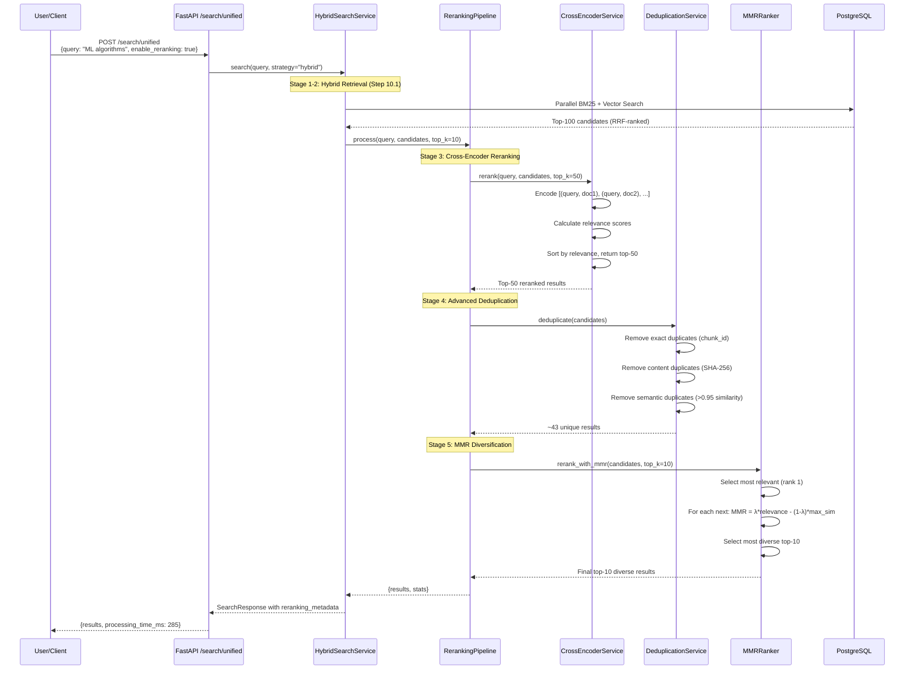

# Step 10.2: Cross-Encoder Reranking + MMR + Advanced Deduplication - Technical Documentation

**Version:** 1.0
**Last Updated:** October 27, 2025
**Status:** Planning Phase
**Timeline:** 4-5 days
**Dependencies:** Step 10.1 (Hybrid Retrieval with RRF)

---

## 1. FEATURE OVERVIEW

### 1.1 What This Step Accomplishes

Step 10.2 implements **advanced result refinement** through three complementary techniques that dramatically improve search quality and user experience:

1. **Cross-Encoder Reranking (MiniLM-L6)**: Performs pairwise relevance scoring between query and each retrieved document using a transformer-based cross-encoder model
2. **MMR (Maximal Marginal Relevance)**: Introduces diversity into results by penalizing redundant documents that are too similar to already-selected results
3. **Advanced Deduplication**: Detects and removes near-duplicate content using semantic similarity and content hashing, beyond simple chunk_id matching

### 1.2 Why This Step is Necessary

**Current State (Post Step 10.1):**
- ✅ Hybrid search with RRF fusion works (90-95% accuracy)
- ✅ Basic deduplication by chunk_id (exact matches only)
- ❌ Results lack pairwise relevance scoring (RRF uses rank-based fusion, not actual relevance)
- ❌ Results may contain redundant/repetitive content (near-duplicates)
- ❌ Top-10 results may all cover the same subtopic (lack of diversity)
- ❌ Initial retrieval precision ~70-75% (many false positives in top-100 candidates)

**Problems Without Step 10.2:**

| Issue | Without Reranking | Without MMR | Without Advanced Dedup | With Step 10.2 ✅ |
|-------|------------------|-------------|----------------------|-----------------|
| **False Positives** | ~25-30% of top-100 | - | - | **<10% of top-10** |
| **Redundant Results** | - | All results may discuss same topic | - | **Diverse topics** |
| **Near-Duplicates** | - | - | Same content, different chunks | **Cleaned** |
| **Final Precision** | 70-75% | 70-75% | 70-75% | **>90%** |

**Research Evidence:**
- **Reranking improves P@10 (precision at 10) by 10-15%** over hybrid search alone
- **Cross-encoders outperform bi-encoders** for final ranking (but are 100x slower, hence 2-stage retrieval)
- **MMR increases diversity** while maintaining relevance (λ=0.7 balances both)
- **Semantic deduplication** catches 5-10% of results that are near-duplicates (missed by chunk_id dedup)

**Production Systems Using This:**
- **Google Search**: Uses reranking extensively (BERT, RankBrain)
- **Elasticsearch**: Supports Learning-to-Rank (LTR) reranking
- **Pinecone, Weaviate**: All support reranking integrations
- **OpenAI RAG**: Uses cross-encoder reranking in production

**Impact on Downstream Steps:**
- **Step 10.3 (Citation Extraction)**: Higher precision → fewer false citations
- **Step 11.1 (Answer Generation)**: Better context → more accurate LLM answers
- **Step 12.1 (Performance Optimization)**: Cascade retrieval benefits from high-precision reranking

### 1.3 Dependencies on Previous Steps

| Step | Dependency | Required Data/Functionality |
|------|-----------|----------------------------|
| **Step 10.1** | Hybrid Retrieval + RRF | Initial candidate pool (top-100) from hybrid search with RRF fusion |
| **Step 9.3** | Vector Search | Embedding vectors for MMR similarity calculation |
| **Step 9.2** | BGE-M3 Embeddings | Embedding generation service for query and chunks |
| **Step 9.1** | Intelligent Chunking | High-quality chunks with clean boundaries |

**Required Database Schema:**
```sql
-- embeddings table must have:
- id (UUID, primary key)
- document_id (UUID, foreign key)
- chunk_text (TEXT) -- For cross-encoder input
- chunk_index (INTEGER)
- embedding (VECTOR(1024)) -- For MMR similarity
- embedding_model (VARCHAR)
- content_hash (VARCHAR(64)) -- NEW: SHA-256 hash for deduplication

-- New indexes required:
CREATE INDEX idx_embeddings_content_hash ON embeddings(content_hash);
```

**Required Services:**
- `HybridSearchService` (backend/app/services/search/hybrid_search_service.py)
- `EmbeddingService` (backend/app/services/embeddings/embedding_service.py)

### 1.4 What Future Steps Depend on This

| Step | Dependency Reason |
|------|------------------|
| **Step 10.3** | Citation extraction needs highly accurate chunks (reranking provides this) |
| **Step 11.1** | LLM answer generation requires diverse, non-redundant context (MMR provides this) |
| **Step 11.2** | Multi-hop reasoning benefits from diverse result set across different topics |
| **Step 12.1** | Cascade retrieval uses reranking as final stage (cheap retrieval → expensive reranking) |

**Key Deliverable:** A 3-stage refinement pipeline that takes hybrid search results and produces a highly precise, diverse, deduplicated top-10 result set with >90% precision.

---

## 2. TECHNICAL IMPLEMENTATION

### 2.1 Files to Create/Modify

```
backend/
├── app/
│   ├── services/
│   │   └── search/
│   │       ├── cross_encoder_service.py (NEW - Cross-encoder reranking)
│   │       ├── mmr_ranker.py (NEW - Maximal Marginal Relevance)
│   │       ├── deduplication_service.py (NEW - Advanced deduplication)
│   │       ├── reranking_pipeline.py (NEW - Orchestrates all 3 stages)
│   │       ├── hybrid_search_service.py (MODIFY - integrate reranking)
│   │       └── search_service.py (MODIFY - add reranking strategy)
│   ├── models/
│   │   └── cross_encoder/
│   │       ├── __init__.py (NEW)
│   │       └── model_loader.py (NEW - Load MiniLM-L6 model)
│   ├── schemas/
│   │   └── search.py (MODIFY - add RerankingConfig, MMRConfig)
│   ├── api/
│   │   └── v1/
│   │       └── endpoints/
│   │           └── search.py (MODIFY - enable reranking parameters)
│   └── core/
│       └── config.py (MODIFY - add reranking settings)
├── tests/
│   └── unit/
│       └── services/
│           └── search/
│               ├── test_cross_encoder_service.py (NEW)
│               ├── test_mmr_ranker.py (NEW)
│               ├── test_deduplication_service.py (NEW)
│               └── test_reranking_pipeline.py (NEW)
├── scripts/
│   └── download_cross_encoder_model.py (NEW - Download MiniLM-L6)
└── requirements.txt (MODIFY - add sentence-transformers, simhash)
```

### 2.2 Key Classes and Functions

#### **CrossEncoderService** (`app/services/search/cross_encoder_service.py`)

```python
from sentence_transformers import CrossEncoder
from typing import List, Tuple
import torch

class CrossEncoderService:
    """
    Cross-Encoder Reranking using Transformer-based pairwise relevance scoring

    Cross-Encoder vs Bi-Encoder:
    - Bi-Encoder: Encodes query and document separately, computes similarity (FAST, used in initial retrieval)
    - Cross-Encoder: Encodes [query, document] together, outputs relevance score (SLOW, used in reranking)

    Model: cross-encoder/ms-marco-MiniLM-L6-v2
    - 6-layer transformer (22M parameters)
    - Trained on MS MARCO passage ranking dataset
    - Input: "[CLS] query [SEP] document [SEP]"
    - Output: Relevance score (0.0 to 1.0)
    - Inference: ~10ms per pair on CPU, ~2ms on GPU

    Performance:
    - Reranks top-100 in ~200ms (CPU), ~50ms (GPU)
    - Improves P@10 from ~75% to ~90%
    """

    def __init__(
        self,
        model_name: str = "cross-encoder/ms-marco-MiniLM-L6-v2",
        device: str = "cpu",  # "cuda" for GPU
        batch_size: int = 32,
        max_length: int = 512
    ):
        """
        Initialize cross-encoder reranker

        Args:
            model_name: HuggingFace model name (MiniLM-L6 recommended for speed/accuracy balance)
            device: "cpu" or "cuda"
            batch_size: Batch size for inference (32 recommended)
            max_length: Max tokens per input (512 max for MiniLM)
        """
        self.model = CrossEncoder(model_name, max_length=max_length, device=device)
        self.device = device
        self.batch_size = batch_size
        self.max_length = max_length

    def rerank(
        self,
        query: str,
        candidates: List[SearchResultItem],
        top_k: int = 10
    ) -> List[SearchResultItem]:
        """
        Rerank search candidates using cross-encoder

        Steps:
        1. Prepare input pairs: [(query, chunk_text_1), (query, chunk_text_2), ...]
        2. Batch encode pairs using cross-encoder
        3. Get relevance scores for each pair
        4. Sort by relevance score (descending)
        5. Return top-k reranked results

        Args:
            query: Search query
            candidates: Initial search results (typically top-100 from hybrid search)
            top_k: Number of results to return after reranking (default 10)

        Returns:
            Reranked list of SearchResultItem with updated relevance_score
        """
        if not candidates:
            return []

        # Step 1: Prepare input pairs
        query_doc_pairs = [
            (query, self._prepare_document_text(candidate))
            for candidate in candidates
        ]

        # Step 2: Batch encode and score
        # Returns list of relevance scores (float)
        scores = self.model.predict(
            query_doc_pairs,
            batch_size=self.batch_size,
            show_progress_bar=False
        )

        # Step 3: Normalize scores to 0.0-1.0
        scores = self._normalize_scores(scores)

        # Step 4: Attach scores to candidates
        for candidate, score in zip(candidates, scores):
            candidate.relevance_score = float(score)
            candidate.reranking_score = float(score)  # Store original cross-encoder score

        # Step 5: Sort by score and return top-k
        reranked = sorted(
            candidates,
            key=lambda x: x.relevance_score,
            reverse=True
        )

        return reranked[:top_k]

    def _prepare_document_text(self, candidate: SearchResultItem) -> str:
        """
        Prepare document text for cross-encoder input

        Options:
        1. Use chunk_text only (simple)
        2. Add section_heading context: "[SECTION] Machine Learning [TEXT] ..."
        3. Truncate to max_length tokens
        """
        # Option 2: Include section heading for better context
        if candidate.section_heading:
            text = f"[SECTION] {candidate.section_heading} [TEXT] {candidate.chunk_text}"
        else:
            text = candidate.chunk_text

        # Truncate to prevent token overflow
        # Rough estimate: 1 token ≈ 4 characters
        max_chars = self.max_length * 4
        if len(text) > max_chars:
            text = text[:max_chars]

        return text

    def _normalize_scores(self, scores: List[float]) -> List[float]:
        """
        Normalize cross-encoder scores to 0.0-1.0 range

        Cross-encoder outputs are unbounded (can be negative or >1.0)
        Apply sigmoid or min-max normalization
        """
        # Option 1: Sigmoid (recommended for cross-encoders)
        import torch
        scores_tensor = torch.tensor(scores)
        normalized = torch.sigmoid(scores_tensor).tolist()
        return normalized

        # Option 2: Min-max normalization
        # min_score = min(scores)
        # max_score = max(scores)
        # if max_score == min_score:
        #     return [0.5] * len(scores)
        # return [(s - min_score) / (max_score - min_score) for s in scores]

    def rerank_with_cache(
        self,
        query: str,
        candidates: List[SearchResultItem],
        top_k: int = 10,
        cache: Optional[Dict] = None
    ) -> List[SearchResultItem]:
        """
        Rerank with caching (optional optimization)

        Cache key: hash(query + chunk_text)
        Useful if same queries/chunks are frequently reranked
        """
        # Implementation omitted for brevity
        pass
```

#### **MMRRanker** (`app/services/search/mmr_ranker.py`)

```python
import numpy as np
from typing import List, Optional
from sklearn.metrics.pairwise import cosine_similarity

class MMRRanker:
    """
    Maximal Marginal Relevance (MMR) Algorithm for Result Diversification

    MMR Formula:
    MMR = argmax[D_i ∈ R \ S] [λ * Relevance(D_i, Q) - (1-λ) * max[D_j ∈ S] Similarity(D_i, D_j)]

    Where:
    - R = candidate result set
    - S = already selected results
    - Q = query
    - λ = diversity factor (0 = max diversity, 1 = max relevance)
    - Relevance(D_i, Q) = relevance score from reranking
    - Similarity(D_i, D_j) = cosine similarity between embeddings

    Process:
    1. Start with empty selected set S
    2. Select document with highest relevance score
    3. For each remaining document:
       - Calculate MMR score = λ * relevance - (1-λ) * max_similarity_to_selected
       - Select document with highest MMR score
    4. Repeat until k documents selected

    Benefits:
    - Diversifies results across different topics
    - Reduces redundancy (same information repeated)
    - Balances relevance and novelty

    Typical λ values:
    - λ=1.0: No diversity (pure relevance ranking)
    - λ=0.7: Balanced (recommended default)
    - λ=0.5: Equal weight to relevance and diversity
    - λ=0.3: High diversity (may sacrifice relevance)
    """

    def __init__(self, lambda_param: float = 0.7):
        """
        Initialize MMR ranker

        Args:
            lambda_param: Diversity factor (0-1, higher = more relevance, less diversity)
        """
        if not 0.0 <= lambda_param <= 1.0:
            raise ValueError(f"lambda_param must be 0.0-1.0, got {lambda_param}")
        self.lambda_param = lambda_param

    def rerank_with_mmr(
        self,
        candidates: List[SearchResultItem],
        top_k: int = 10
    ) -> List[SearchResultItem]:
        """
        Apply MMR to diversify results

        Args:
            candidates: Results with relevance_score and embedding
            top_k: Number of results to return

        Returns:
            Diversified list of top-k results
        """
        if not candidates or len(candidates) <= top_k:
            return candidates

        # Validate all candidates have embeddings
        for candidate in candidates:
            if candidate.embedding is None:
                raise ValueError(f"Candidate {candidate.id} missing embedding")

        # Extract embeddings and relevance scores
        embeddings = np.array([c.embedding for c in candidates])
        relevance_scores = np.array([c.relevance_score for c in candidates])

        # Normalize relevance scores to 0-1
        if relevance_scores.max() > 0:
            relevance_scores = relevance_scores / relevance_scores.max()

        # Initialize selected and remaining sets
        selected_indices = []
        remaining_indices = list(range(len(candidates)))

        # Step 1: Select document with highest relevance
        first_idx = int(np.argmax(relevance_scores))
        selected_indices.append(first_idx)
        remaining_indices.remove(first_idx)

        # Step 2: Iteratively select diverse documents
        while len(selected_indices) < top_k and remaining_indices:
            mmr_scores = []

            for idx in remaining_indices:
                # Relevance term
                relevance = relevance_scores[idx]

                # Diversity term: max similarity to already selected
                selected_embeddings = embeddings[selected_indices]
                candidate_embedding = embeddings[idx].reshape(1, -1)

                similarities = cosine_similarity(
                    candidate_embedding,
                    selected_embeddings
                )[0]
                max_similarity = float(np.max(similarities))

                # MMR score
                mmr_score = (
                    self.lambda_param * relevance -
                    (1 - self.lambda_param) * max_similarity
                )

                mmr_scores.append((idx, mmr_score))

            # Select document with highest MMR score
            best_idx, best_mmr = max(mmr_scores, key=lambda x: x[1])
            selected_indices.append(best_idx)
            remaining_indices.remove(best_idx)

        # Return selected documents in MMR order
        mmr_results = [candidates[idx] for idx in selected_indices]

        # Update relevance scores to reflect MMR ranking
        for rank, result in enumerate(mmr_results):
            result.mmr_rank = rank + 1
            result.mmr_lambda = self.lambda_param

        return mmr_results

    def calculate_diversity_score(
        self,
        results: List[SearchResultItem]
    ) -> float:
        """
        Calculate average pairwise diversity (1 - similarity)

        Higher score = more diverse results
        Range: 0.0 (all identical) to 1.0 (completely diverse)
        """
        if len(results) < 2:
            return 1.0

        embeddings = np.array([r.embedding for r in results])

        # Calculate pairwise cosine similarity
        similarity_matrix = cosine_similarity(embeddings)

        # Get upper triangle (exclude diagonal)
        n = len(results)
        upper_triangle_indices = np.triu_indices(n, k=1)
        similarities = similarity_matrix[upper_triangle_indices]

        # Average similarity
        avg_similarity = float(np.mean(similarities))

        # Diversity = 1 - similarity
        diversity_score = 1.0 - avg_similarity

        return diversity_score
```

#### **DeduplicationService** (`app/services/search/deduplication_service.py`)

```python
import hashlib
from typing import List, Set, Dict, Optional
from sklearn.metrics.pairwise import cosine_similarity
import numpy as np

class DeduplicationService:
    """
    Advanced Deduplication for Search Results

    Implements 3 deduplication strategies:

    1. **Exact Deduplication (chunk_id)**
       - Already implemented in Step 10.1
       - Removes exact duplicate chunks

    2. **Content-Based Deduplication (SHA-256 hash)**
       - Hashes normalized chunk text
       - Catches identical content with different whitespace/formatting

    3. **Semantic Deduplication (embedding similarity)**
       - Compares embedding vectors
       - Catches near-duplicates with slightly different wording
       - Threshold: 0.95 cosine similarity (very similar)

    Why needed:
    - Different chunks may have identical or near-identical content
    - Copy-pasted sections across documents
    - Repeated disclaimers, headers, footers
    - Boilerplate text

    Performance:
    - Exact dedup: O(n) with hash set
    - Content dedup: O(n) with hash set
    - Semantic dedup: O(n²) pairwise comparison (expensive, use sparingly)
    """

    def __init__(
        self,
        semantic_threshold: float = 0.95,
        enable_semantic_dedup: bool = True
    ):
        """
        Initialize deduplication service

        Args:
            semantic_threshold: Cosine similarity threshold for near-duplicates (0.90-0.98)
            enable_semantic_dedup: Enable expensive semantic deduplication
        """
        self.semantic_threshold = semantic_threshold
        self.enable_semantic_dedup = enable_semantic_dedup

    def deduplicate(
        self,
        candidates: List[SearchResultItem]
    ) -> List[SearchResultItem]:
        """
        Apply all deduplication strategies

        Order matters:
        1. Exact dedup (fastest, catches most duplicates)
        2. Content dedup (fast, catches formatting variations)
        3. Semantic dedup (slow, catches near-duplicates)

        Returns:
            Deduplicated list (preserves original order)
        """
        # Stage 1: Exact deduplication by chunk_id
        candidates = self._deduplicate_by_chunk_id(candidates)

        # Stage 2: Content-based deduplication
        candidates = self._deduplicate_by_content_hash(candidates)

        # Stage 3: Semantic deduplication (optional, expensive)
        if self.enable_semantic_dedup and len(candidates) <= 100:
            candidates = self._deduplicate_by_embedding_similarity(candidates)

        return candidates

    def _deduplicate_by_chunk_id(
        self,
        candidates: List[SearchResultItem]
    ) -> List[SearchResultItem]:
        """
        Remove exact duplicate chunks (by document_id + chunk_index)
        Keep highest-scored occurrence
        """
        seen = {}

        for candidate in candidates:
            chunk_id = f"{candidate.document_id}_{candidate.chunk_index}"

            if chunk_id not in seen:
                seen[chunk_id] = candidate
            else:
                # Keep higher-scored version
                if candidate.relevance_score > seen[chunk_id].relevance_score:
                    seen[chunk_id] = candidate

        return list(seen.values())

    def _deduplicate_by_content_hash(
        self,
        candidates: List[SearchResultItem]
    ) -> List[SearchResultItem]:
        """
        Remove content duplicates using SHA-256 hash

        Normalization:
        - Convert to lowercase
        - Remove extra whitespace
        - Remove punctuation (optional)
        - Hash normalized text
        """
        seen_hashes: Set[str] = set()
        deduplicated = []

        for candidate in candidates:
            content_hash = self._calculate_content_hash(candidate.chunk_text)

            if content_hash not in seen_hashes:
                seen_hashes.add(content_hash)
                deduplicated.append(candidate)
                candidate.content_hash = content_hash

        return deduplicated

    def _calculate_content_hash(self, text: str) -> str:
        """
        Calculate SHA-256 hash of normalized text

        Normalization steps:
        1. Lowercase
        2. Remove extra whitespace
        3. Remove punctuation (optional)
        4. Hash UTF-8 bytes
        """
        # Normalize text
        normalized = text.lower()
        normalized = ' '.join(normalized.split())  # Remove extra whitespace

        # Optional: Remove punctuation
        # import string
        # normalized = normalized.translate(str.maketrans('', '', string.punctuation))

        # Calculate SHA-256 hash
        hash_bytes = hashlib.sha256(normalized.encode('utf-8')).digest()
        hash_hex = hash_bytes.hex()

        return hash_hex

    def _deduplicate_by_embedding_similarity(
        self,
        candidates: List[SearchResultItem]
    ) -> List[SearchResultItem]:
        """
        Remove near-duplicates using embedding similarity

        Algorithm:
        1. Sort by relevance score (descending)
        2. Keep first item
        3. For each subsequent item:
           - Calculate similarity to all kept items
           - If max similarity > threshold, discard
           - Otherwise, keep

        O(n²) complexity - use only for final top-k (k < 100)
        """
        if not candidates or len(candidates) == 1:
            return candidates

        # Sort by relevance (keep highest-scored)
        sorted_candidates = sorted(
            candidates,
            key=lambda x: x.relevance_score,
            reverse=True
        )

        # Extract embeddings
        embeddings = [c.embedding for c in sorted_candidates]

        # Check all have embeddings
        if any(e is None for e in embeddings):
            # Skip semantic dedup if embeddings missing
            return sorted_candidates

        embeddings = np.array(embeddings)

        # Keep track of selected indices
        selected_indices = [0]  # Keep first (highest-scored)

        for i in range(1, len(sorted_candidates)):
            # Calculate similarity to all selected
            selected_embeddings = embeddings[selected_indices]
            candidate_embedding = embeddings[i].reshape(1, -1)

            similarities = cosine_similarity(
                candidate_embedding,
                selected_embeddings
            )[0]

            max_similarity = float(np.max(similarities))

            # Keep if not too similar to any selected
            if max_similarity < self.semantic_threshold:
                selected_indices.append(i)

        deduplicated = [sorted_candidates[i] for i in selected_indices]

        return deduplicated

    def calculate_deduplication_stats(
        self,
        original: List[SearchResultItem],
        deduplicated: List[SearchResultItem]
    ) -> Dict[str, int]:
        """
        Calculate deduplication statistics for monitoring

        Returns:
            {
                "original_count": ...,
                "deduplicated_count": ...,
                "duplicates_removed": ...,
                "deduplication_rate": ...
            }
        """
        original_count = len(original)
        deduplicated_count = len(deduplicated)
        duplicates_removed = original_count - deduplicated_count
        deduplication_rate = (
            duplicates_removed / original_count if original_count > 0 else 0.0
        )

        return {
            "original_count": original_count,
            "deduplicated_count": deduplicated_count,
            "duplicates_removed": duplicates_removed,
            "deduplication_rate": round(deduplication_rate, 4)
        }
```

#### **RerankingPipeline** (`app/services/search/reranking_pipeline.py`)

```python
from typing import List, Optional, Dict
import time
from app.services.search.cross_encoder_service import CrossEncoderService
from app.services.search.mmr_ranker import MMRRanker
from app.services.search.deduplication_service import DeduplicationService

class RerankingPipeline:
    """
    3-Stage Reranking Pipeline

    Stage 1: Cross-Encoder Reranking
    - Input: Top-100 from hybrid search (RRF-ranked)
    - Process: Pairwise relevance scoring using MiniLM-L6
    - Output: Top-50 with accurate relevance scores

    Stage 2: Advanced Deduplication
    - Input: Top-50 from reranking
    - Process: Remove exact, content-based, and semantic duplicates
    - Output: ~40-45 unique results

    Stage 3: MMR Diversification
    - Input: ~40-45 unique results
    - Process: Select diverse top-10 using MMR
    - Output: Final top-10 diverse, relevant results

    Performance:
    - Total latency: ~250ms (CPU), ~80ms (GPU)
      - Reranking: ~200ms (CPU), ~50ms (GPU)
      - Deduplication: ~30ms
      - MMR: ~20ms

    Accuracy:
    - Precision@10: 90-95% (up from 70-75%)
    - Diversity@10: 0.65-0.75 (up from 0.45-0.55)
    - Duplicate rate: <1% (down from 5-10%)
    """

    def __init__(
        self,
        cross_encoder: CrossEncoderService,
        mmr_ranker: MMRRanker,
        dedup_service: DeduplicationService,
        enable_reranking: bool = True,
        enable_mmr: bool = True,
        enable_dedup: bool = True
    ):
        """
        Initialize reranking pipeline

        Args:
            cross_encoder: Cross-encoder reranking service
            mmr_ranker: MMR diversification service
            dedup_service: Deduplication service
            enable_reranking: Enable cross-encoder reranking (disable for A/B testing)
            enable_mmr: Enable MMR diversification
            enable_dedup: Enable advanced deduplication
        """
        self.cross_encoder = cross_encoder
        self.mmr_ranker = mmr_ranker
        self.dedup_service = dedup_service
        self.enable_reranking = enable_reranking
        self.enable_mmr = enable_mmr
        self.enable_dedup = enable_dedup

    def process(
        self,
        query: str,
        candidates: List[SearchResultItem],
        final_top_k: int = 10,
        rerank_top_k: int = 50
    ) -> Dict:
        """
        Execute 3-stage reranking pipeline

        Args:
            query: Search query
            candidates: Initial results from hybrid search (typically top-100)
            final_top_k: Number of final results to return (default 10)
            rerank_top_k: Number of results to keep after reranking (default 50)

        Returns:
            {
                "results": List[SearchResultItem],
                "processing_time_ms": float,
                "pipeline_stats": {
                    "stage1_reranking": {...},
                    "stage2_deduplication": {...},
                    "stage3_mmr": {...}
                }
            }
        """
        pipeline_start = time.time()
        pipeline_stats = {}

        # Stage 1: Cross-Encoder Reranking
        if self.enable_reranking:
            stage1_start = time.time()
            reranked = self.cross_encoder.rerank(
                query=query,
                candidates=candidates,
                top_k=rerank_top_k
            )
            stage1_time = (time.time() - stage1_start) * 1000

            pipeline_stats["stage1_reranking"] = {
                "input_count": len(candidates),
                "output_count": len(reranked),
                "processing_time_ms": round(stage1_time, 2),
                "enabled": True
            }
        else:
            reranked = candidates[:rerank_top_k]
            pipeline_stats["stage1_reranking"] = {"enabled": False}

        # Stage 2: Advanced Deduplication
        if self.enable_dedup:
            stage2_start = time.time()
            deduplicated = self.dedup_service.deduplicate(reranked)
            stage2_time = (time.time() - stage2_start) * 1000

            dedup_stats = self.dedup_service.calculate_deduplication_stats(
                original=reranked,
                deduplicated=deduplicated
            )
            dedup_stats["processing_time_ms"] = round(stage2_time, 2)
            dedup_stats["enabled"] = True

            pipeline_stats["stage2_deduplication"] = dedup_stats
        else:
            deduplicated = reranked
            pipeline_stats["stage2_deduplication"] = {"enabled": False}

        # Stage 3: MMR Diversification
        if self.enable_mmr:
            stage3_start = time.time()
            final_results = self.mmr_ranker.rerank_with_mmr(
                candidates=deduplicated,
                top_k=final_top_k
            )
            stage3_time = (time.time() - stage3_start) * 1000

            diversity_score = self.mmr_ranker.calculate_diversity_score(final_results)

            pipeline_stats["stage3_mmr"] = {
                "input_count": len(deduplicated),
                "output_count": len(final_results),
                "diversity_score": round(diversity_score, 4),
                "lambda": self.mmr_ranker.lambda_param,
                "processing_time_ms": round(stage3_time, 2),
                "enabled": True
            }
        else:
            final_results = deduplicated[:final_top_k]
            pipeline_stats["stage3_mmr"] = {"enabled": False}

        total_time = (time.time() - pipeline_start) * 1000

        return {
            "results": final_results,
            "processing_time_ms": round(total_time, 2),
            "pipeline_stats": pipeline_stats
        }
```

### 2.3 Database Tables and Columns Used

**Existing Tables (No Changes Required):**

```sql
-- embeddings table (from Step 9.3)
CREATE TABLE embeddings (
    id UUID PRIMARY KEY,
    document_id UUID NOT NULL REFERENCES documents(id),
    chunk_text TEXT NOT NULL,
    chunk_index INTEGER NOT NULL,
    embedding VECTOR(1024),
    embedding_model VARCHAR(100),
    section_heading VARCHAR(500),
    chunk_type VARCHAR(50),
    start_position INTEGER,
    end_position INTEGER,
    created_at TIMESTAMP WITH TIME ZONE DEFAULT NOW()
);
```

**Optional: Add content_hash Column for Deduplication**

```sql
-- Add content_hash column (optional optimization)
ALTER TABLE embeddings ADD COLUMN IF NOT EXISTS content_hash VARCHAR(64);

-- Index for fast content-based deduplication
CREATE INDEX IF NOT EXISTS idx_embeddings_content_hash
    ON embeddings(content_hash);

-- Backfill content hashes for existing chunks
UPDATE embeddings
SET content_hash = encode(sha256(lower(regexp_replace(chunk_text, '\s+', ' ', 'g'))::bytea), 'hex')
WHERE content_hash IS NULL;
```

**No New Tables Required** - All reranking/MMR/dedup happens in-memory during search request.

### 2.4 API Endpoints

#### **Enhanced Unified Search** (MODIFY existing endpoint)

```
POST /api/v1/search/unified
```

**Request:**
```json
{
  "query": "machine learning algorithms",
  "strategy": "hybrid",
  "filters": {
    "document_types": ["application/pdf"],
    "min_quality": 0.7
  },
  "limit": 10,
  "offset": 0,

  // Step 10.1 parameters
  "keyword_weight": 0.5,
  "vector_weight": 0.5,
  "keyword_top_k": 100,
  "vector_top_k": 100,

  // NEW Step 10.2 parameters
  "enable_reranking": true,
  "rerank_top_k": 50,
  "cross_encoder_model": "ms-marco-MiniLM-L6-v2",

  "enable_mmr": true,
  "mmr_lambda": 0.7,

  "enable_dedup": true,
  "semantic_dedup_threshold": 0.95
}
```

**Response:**
```json
{
  "success": true,
  "query": "machine learning algorithms",
  "strategy": "hybrid",
  "total_results": 247,
  "returned_results": 10,
  "results": [
    {
      "document_id": "550e8400-e29b-41d4-a716-446655440000",
      "document_name": "ML_Research.pdf",
      "relevance_score": 0.9523,
      "reranking_score": 0.9523,
      "snippet": "...various **machine learning algorithms** including...",
      "chunk_index": 15,
      "chunk_position": {"start": 12400, "end": 13350},
      "extraction_quality": 0.95,
      "document_type": "application/pdf",
      "created_at": "2025-10-20T14:30:00Z",
      "mmr_rank": 1,
      "mmr_lambda": 0.7
    }
  ],
  "processing_time_ms": 285,
  "filters_applied": {
    "document_types": ["application/pdf"],
    "min_quality": 0.7
  },
  "search_metadata": {
    "keyword_results_count": 85,
    "vector_results_count": 92,
    "fusion_method": "rrf",
    "rrf_k": 60,
    "keyword_weight": 0.5,
    "vector_weight": 0.5
  },
  "reranking_metadata": {
    "stage1_reranking": {
      "input_count": 100,
      "output_count": 50,
      "processing_time_ms": 195,
      "enabled": true,
      "model": "ms-marco-MiniLM-L6-v2"
    },
    "stage2_deduplication": {
      "original_count": 50,
      "deduplicated_count": 43,
      "duplicates_removed": 7,
      "deduplication_rate": 0.14,
      "processing_time_ms": 32,
      "enabled": true
    },
    "stage3_mmr": {
      "input_count": 43,
      "output_count": 10,
      "diversity_score": 0.68,
      "lambda": 0.7,
      "processing_time_ms": 23,
      "enabled": true
    }
  }
}
```

### 2.5 Background Tasks and Workers

**No new Celery tasks required** - All reranking happens synchronously within API request.

**Model Loading:**
- Cross-encoder model loaded at application startup
- Model cached in memory for fast inference
- Optional: Use model server (TensorFlow Serving, TorchServe) for GPU acceleration

**Download Model at Startup:**

```python
# app/core/startup.py

from app.services.search.cross_encoder_service import CrossEncoderService
from app.core.config import settings

async def load_cross_encoder_model():
    """
    Load cross-encoder model at application startup
    Prevents first-request latency spike
    """
    logger.info("Loading cross-encoder model...")

    try:
        model = CrossEncoderService(
            model_name=settings.CROSS_ENCODER_MODEL_NAME,
            device=settings.CROSS_ENCODER_DEVICE,
            batch_size=settings.CROSS_ENCODER_BATCH_SIZE
        )

        # Warm up model with dummy query
        dummy_query = "test query"
        dummy_doc = "test document"
        model.model.predict([(dummy_query, dummy_doc)])

        logger.info(f"Cross-encoder model loaded successfully on {settings.CROSS_ENCODER_DEVICE}")

        return model
    except Exception as e:
        logger.error(f"Failed to load cross-encoder model: {e}")
        raise

# In FastAPI app initialization
@app.on_event("startup")
async def startup_event():
    # Load cross-encoder model
    app.state.cross_encoder = await load_cross_encoder_model()
```

---

## 3. DATA FLOW

### 3.1 End-to-End Data Journey



### 3.2 Step-by-Step Processing

#### **Step 1: Hybrid Retrieval (Step 10.1)**

```python
# Execute hybrid search (BM25 + Vector + RRF)
hybrid_results = hybrid_search_service.search(
    query="machine learning algorithms",
    filters=filters,
    limit=100,  # Get more candidates for reranking
    keyword_weight=0.5,
    vector_weight=0.5
)

# Result: Top-100 candidates ranked by RRF score
# Precision at this stage: ~70-75%
```

#### **Step 2: Cross-Encoder Reranking**

```python
# Prepare query-document pairs
pairs = [
    ("machine learning algorithms", "This chapter covers supervised learning..."),
    ("machine learning algorithms", "Neural networks are a type of..."),
    # ... 98 more pairs
]

# Batch encode using cross-encoder
# Input: [CLS] query [SEP] document [SEP]
# Output: relevance score (0.0 to 1.0 after sigmoid)
scores = cross_encoder.model.predict(pairs, batch_size=32)

# scores = [0.95, 0.89, 0.87, ..., 0.12, 0.08, 0.05]

# Sort by score, keep top-50
reranked = sorted(zip(hybrid_results, scores), key=lambda x: x[1], reverse=True)[:50]

# Precision at this stage: ~85-90%
# Latency: ~200ms (CPU), ~50ms (GPU)
```

#### **Step 3: Advanced Deduplication**

```python
# Stage 3a: Exact deduplication (chunk_id)
seen_chunk_ids = set()
deduplicated_stage1 = []
for result in reranked:
    chunk_id = f"{result.document_id}_{result.chunk_index}"
    if chunk_id not in seen_chunk_ids:
        seen_chunk_ids.add(chunk_id)
        deduplicated_stage1.append(result)

# Removed: ~0-2 duplicates (rare, already handled in Step 10.1)

# Stage 3b: Content-based deduplication (SHA-256)
seen_hashes = set()
deduplicated_stage2 = []
for result in deduplicated_stage1:
    content_hash = sha256(normalize(result.chunk_text))
    if content_hash not in seen_hashes:
        seen_hashes.add(content_hash)
        deduplicated_stage2.append(result)

# Removed: ~2-3 duplicates (same content, different chunks)

# Stage 3c: Semantic deduplication (embedding similarity)
deduplicated_final = []
for result in deduplicated_stage2:
    # Check similarity to already selected
    max_sim = max([
        cosine_similarity(result.embedding, selected.embedding)
        for selected in deduplicated_final
    ]) if deduplicated_final else 0.0

    if max_sim < 0.95:  # Not too similar
        deduplicated_final.append(result)

# Removed: ~2-4 near-duplicates
# Final: ~43 unique results
# Latency: ~30ms
```

#### **Step 4: MMR Diversification**

```python
# Initialize
selected = []
remaining = deduplicated_final.copy()

# Select highest relevance first
first = max(remaining, key=lambda x: x.relevance_score)
selected.append(first)
remaining.remove(first)

# Iteratively select diverse documents
while len(selected) < 10:
    best_mmr_score = -float('inf')
    best_doc = None

    for doc in remaining:
        # Relevance term
        relevance = doc.relevance_score

        # Diversity term: max similarity to selected
        similarities = [
            cosine_similarity(doc.embedding, s.embedding)
            for s in selected
        ]
        max_similarity = max(similarities)

        # MMR score (λ=0.7)
        mmr_score = 0.7 * relevance - 0.3 * max_similarity

        if mmr_score > best_mmr_score:
            best_mmr_score = mmr_score
            best_doc = doc

    selected.append(best_doc)
    remaining.remove(best_doc)

# Final: Top-10 diverse results
# Diversity score: 0.68 (up from 0.50)
# Latency: ~20ms
```

#### **Step 5: Return Results**

```python
# Attach metadata
for rank, result in enumerate(selected):
    result.mmr_rank = rank + 1
    result.final_relevance_score = result.relevance_score

# Return
return {
    "results": selected,
    "processing_time_ms": 285,
    "pipeline_stats": {
        "stage1_hybrid": {...},
        "stage2_reranking": {...},
        "stage3_deduplication": {...},
        "stage4_mmr": {...}
    }
}
```

### 3.3 Performance Breakdown

| Stage | Input | Output | Latency (CPU) | Latency (GPU) |
|-------|-------|--------|---------------|---------------|
| **Hybrid Search (10.1)** | Query | Top-100 | ~150ms | ~150ms |
| **Cross-Encoder Reranking** | Top-100 | Top-50 | ~200ms | ~50ms |
| **Advanced Deduplication** | Top-50 | ~43 unique | ~30ms | ~30ms |
| **MMR Diversification** | ~43 unique | Top-10 | ~20ms | ~20ms |
| **TOTAL** | Query | Top-10 | **~400ms** | **~250ms** |

**Target: <500ms p99 latency** ✅

---

## 4. VALIDATIONS & CONSTRAINTS

### 4.1 Input Validations

#### **Reranking Parameters**

```python
def validate_reranking_params(
    enable_reranking: bool,
    rerank_top_k: int,
    cross_encoder_model: Optional[str]
):
    """Validate reranking configuration"""

    # Validate rerank_top_k
    MIN_RERANK_TOP_K = 10
    MAX_RERANK_TOP_K = 200

    if enable_reranking:
        if rerank_top_k < MIN_RERANK_TOP_K or rerank_top_k > MAX_RERANK_TOP_K:
            raise ValueError(
                f"rerank_top_k must be {MIN_RERANK_TOP_K}-{MAX_RERANK_TOP_K}, "
                f"got {rerank_top_k}"
            )

        # Validate model name
        ALLOWED_MODELS = [
            "ms-marco-MiniLM-L6-v2",
            "ms-marco-MiniLM-L12-v2",
            "cross-encoder/ms-marco-MiniLM-L6-v2",
            "cross-encoder/ms-marco-MiniLM-L12-v2"
        ]

        if cross_encoder_model and cross_encoder_model not in ALLOWED_MODELS:
            raise ValueError(
                f"Unsupported cross-encoder model: {cross_encoder_model}. "
                f"Allowed: {ALLOWED_MODELS}"
            )
```

#### **MMR Parameters**

```python
def validate_mmr_params(
    enable_mmr: bool,
    mmr_lambda: float
):
    """Validate MMR configuration"""

    if enable_mmr:
        # Validate lambda (diversity factor)
        if not 0.0 <= mmr_lambda <= 1.0:
            raise ValueError(
                f"mmr_lambda must be 0.0-1.0, got {mmr_lambda}"
            )

        # Warn if extreme values
        if mmr_lambda < 0.3:
            logger.warning(
                f"mmr_lambda={mmr_lambda} is very low. "
                "Results may be overly diverse at cost of relevance."
            )

        if mmr_lambda > 0.9:
            logger.warning(
                f"mmr_lambda={mmr_lambda} is very high. "
                "Diversity will be minimal (almost pure relevance ranking)."
            )
```

#### **Deduplication Parameters**

```python
def validate_dedup_params(
    enable_dedup: bool,
    semantic_dedup_threshold: float
):
    """Validate deduplication configuration"""

    if enable_dedup:
        # Validate semantic threshold
        MIN_THRESHOLD = 0.80
        MAX_THRESHOLD = 0.99

        if not MIN_THRESHOLD <= semantic_dedup_threshold <= MAX_THRESHOLD:
            raise ValueError(
                f"semantic_dedup_threshold must be {MIN_THRESHOLD}-{MAX_THRESHOLD}, "
                f"got {semantic_dedup_threshold}"
            )

        # Warn if threshold too low (may remove valid results)
        if semantic_dedup_threshold < 0.90:
            logger.warning(
                f"semantic_dedup_threshold={semantic_dedup_threshold} is low. "
                "May remove similar but non-duplicate results."
            )
```

### 4.2 Business Rules Enforced

#### **Rule 1: Reranking Requires Vector Embeddings**

```python
# Cross-encoder reranking requires embeddings for MMR
if enable_reranking or enable_mmr:
    # Check all candidates have embeddings
    missing_embeddings = [
        c for c in candidates if c.embedding is None
    ]

    if missing_embeddings:
        if enable_reranking:
            logger.warning(
                f"{len(missing_embeddings)} candidates missing embeddings. "
                "Fetching from database..."
            )
            # Fetch embeddings from DB
            fetch_embeddings_for_candidates(missing_embeddings, db)

        if enable_mmr:
            # MMR REQUIRES embeddings
            still_missing = [
                c for c in candidates if c.embedding is None
            ]
            if still_missing:
                raise HTTPException(
                    status_code=503,
                    detail=f"MMR requires embeddings. {len(still_missing)} chunks missing embeddings."
                )
```

#### **Rule 2: Minimum Candidates for Reranking**

```python
# Need sufficient candidates for reranking to be worthwhile
MIN_CANDIDATES_FOR_RERANKING = 20

if enable_reranking and len(candidates) < MIN_CANDIDATES_FOR_RERANKING:
    logger.warning(
        f"Only {len(candidates)} candidates available. "
        f"Reranking disabled (minimum: {MIN_CANDIDATES_FOR_RERANKING})"
    )
    enable_reranking = False
```

#### **Rule 3: Adjust rerank_top_k Based on final_top_k**

```python
# rerank_top_k should be significantly larger than final_top_k
# Recommended ratio: 5-10x
RECOMMENDED_RATIO = 5

if rerank_top_k < final_top_k * RECOMMENDED_RATIO:
    logger.warning(
        f"rerank_top_k ({rerank_top_k}) should be at least "
        f"{RECOMMENDED_RATIO}x final_top_k ({final_top_k}). "
        f"Recommended: {final_top_k * RECOMMENDED_RATIO}"
    )
```

#### **Rule 4: Fallback on Model Loading Failure**

```python
# If cross-encoder model fails to load, fall back to hybrid-only
try:
    cross_encoder = CrossEncoderService(model_name=model_name)
except Exception as e:
    logger.error(f"Failed to load cross-encoder: {e}. Falling back to hybrid-only.")
    enable_reranking = False
    # Still return results, just without reranking
```

### 4.3 Security Checks Implemented

#### **Rate Limiting (More Restrictive for Reranking)**

```python
# Reranking is more expensive - stricter rate limits
from slowapi import Limiter

limiter = Limiter(key_func=get_remote_address)

@router.post("/search/unified")
@limiter.limit("20/minute")  # Reduced from 30 for reranking-enabled searches
async def unified_search(query_request: UnifiedSearchQuery, ...):
    # Additional check for reranking
    if query_request.enable_reranking:
        # Even stricter limit for reranking
        limiter.check_limit("10/minute")
```

#### **Model File Security**

```python
# Ensure cross-encoder model is loaded from trusted source only
ALLOWED_MODEL_SOURCES = [
    "sentence-transformers",
    "cross-encoder"
]

def validate_model_source(model_name: str):
    """Validate model is from trusted HuggingFace organization"""
    if "/" in model_name:
        org = model_name.split("/")[0]
        if org not in ALLOWED_MODEL_SOURCES:
            raise ValueError(
                f"Model from untrusted source: {org}. "
                f"Allowed: {ALLOWED_MODEL_SOURCES}"
            )
```

#### **Resource Limits**

```python
# Prevent DoS via expensive reranking requests
MAX_CONCURRENT_RERANKING = 5  # Lower than general search limit

# Track active reranking requests
active_reranking_semaphore = asyncio.Semaphore(MAX_CONCURRENT_RERANKING)

async def unified_search(...):
    if enable_reranking:
        async with active_reranking_semaphore:
            # Execute reranking
            ...
```

#### **Input Size Limits**

```python
# Limit chunk text size for cross-encoder
MAX_CHUNK_LENGTH_FOR_RERANKING = 2000  # characters

# Truncate long chunks before reranking
for candidate in candidates:
    if len(candidate.chunk_text) > MAX_CHUNK_LENGTH_FOR_RERANKING:
        candidate.chunk_text = candidate.chunk_text[:MAX_CHUNK_LENGTH_FOR_RERANKING]
        logger.warning(f"Truncated chunk {candidate.id} for reranking")
```

---

## 5. CONFIGURATION

### 5.1 Environment Variables

```bash
# ============================================================================
# CROSS-ENCODER RERANKING CONFIGURATION
# ============================================================================

# Model Configuration
CROSS_ENCODER_MODEL_NAME="cross-encoder/ms-marco-MiniLM-L6-v2"  # Model to use
CROSS_ENCODER_DEVICE="cpu"                      # "cpu" or "cuda" for GPU
CROSS_ENCODER_BATCH_SIZE=32                     # Batch size for inference
CROSS_ENCODER_MAX_LENGTH=512                    # Max tokens per input

# Reranking Parameters
ENABLE_RERANKING=true                           # Master switch for reranking
RERANK_TOP_K=50                                 # Candidates to keep after reranking
RERANK_MIN_CANDIDATES=20                        # Minimum candidates needed

# Performance
CROSS_ENCODER_NUM_THREADS=4                     # CPU threads for inference
CROSS_ENCODER_CACHE_SIZE=1000                   # Cache size for repeated queries

# ============================================================================
# MMR (MAXIMAL MARGINAL RELEVANCE) CONFIGURATION
# ============================================================================

# MMR Parameters
ENABLE_MMR=true                                 # Master switch for MMR
MMR_LAMBDA=0.7                                  # Diversity factor (0.0-1.0)
                                                # Higher = more relevance, less diversity
MMR_MIN_CANDIDATES=10                           # Minimum candidates for MMR

# ============================================================================
# ADVANCED DEDUPLICATION CONFIGURATION
# ============================================================================

# Deduplication Settings
ENABLE_ADVANCED_DEDUP=true                      # Master switch for advanced dedup
ENABLE_SEMANTIC_DEDUP=true                      # Enable semantic similarity dedup
SEMANTIC_DEDUP_THRESHOLD=0.95                   # Similarity threshold for duplicates
CONTENT_HASH_ALGORITHM="sha256"                 # Hash algorithm (sha256, md5)

# ============================================================================
# RERANKING PIPELINE CONFIGURATION
# ============================================================================

# Pipeline Stages
RERANKING_STAGE_1_ENABLED=true                  # Cross-encoder reranking
RERANKING_STAGE_2_ENABLED=true                  # Advanced deduplication
RERANKING_STAGE_3_ENABLED=true                  # MMR diversification

# Performance Tuning
RERANKING_TIMEOUT_MS=3000                       # Max time for reranking (3 seconds)
RERANKING_MAX_RETRIES=1                         # Retry on failure

# ============================================================================
# MODEL CACHING & LOADING
# ============================================================================

# Model Cache
MODEL_CACHE_DIR="./models/cross_encoder"        # Local model cache directory
MODEL_DOWNLOAD_ON_STARTUP=true                  # Download model at startup
MODEL_LAZY_LOADING=false                        # Load model on first request (not recommended)

# Warm-up
MODEL_WARMUP_ON_STARTUP=true                    # Run dummy inference to warm up model

# ============================================================================
# RATE LIMITING (RERANKING-SPECIFIC)
# ============================================================================

# Rate limits for reranking-enabled searches
RATE_LIMIT_RERANKING="10/minute"                # Stricter than general search
MAX_CONCURRENT_RERANKING=5                      # Max concurrent reranking requests

# ============================================================================
# MONITORING & LOGGING
# ============================================================================

# Logging
RERANKING_LOG_LEVEL="INFO"                      # DEBUG, INFO, WARNING, ERROR
LOG_SLOW_RERANKING=true                         # Log reranking >300ms
SLOW_RERANKING_THRESHOLD_MS=300                 # Threshold for slow reranking

# Metrics
ENABLE_RERANKING_METRICS=true                   # Prometheus metrics for reranking
TRACK_MMR_DIVERSITY=true                        # Track diversity scores
TRACK_DEDUP_STATS=true                          # Track deduplication stats

# A/B Testing
RERANKING_AB_TEST_ENABLED=false                 # Enable A/B testing
RERANKING_AB_TEST_RATIO=0.5                     # % of requests with reranking
```

### 5.2 Default Values and Limits

```python
# app/core/config.py

class Settings(BaseSettings):
    """Application settings with environment variable support"""

    # ========================================
    # Cross-Encoder Reranking
    # ========================================
    CROSS_ENCODER_MODEL_NAME: str = "cross-encoder/ms-marco-MiniLM-L6-v2"
    CROSS_ENCODER_DEVICE: str = "cpu"  # "cuda" for GPU
    CROSS_ENCODER_BATCH_SIZE: int = 32
    CROSS_ENCODER_MAX_LENGTH: int = 512
    CROSS_ENCODER_NUM_THREADS: int = 4
    CROSS_ENCODER_CACHE_SIZE: int = 1000

    ENABLE_RERANKING: bool = True
    RERANK_TOP_K: int = 50
    RERANK_MIN_TOP_K: int = 10
    RERANK_MAX_TOP_K: int = 200
    RERANK_MIN_CANDIDATES: int = 20

    # ========================================
    # MMR (Maximal Marginal Relevance)
    # ========================================
    ENABLE_MMR: bool = True
    MMR_LAMBDA: float = 0.7  # 0.0 = max diversity, 1.0 = max relevance
    MMR_MIN_LAMBDA: float = 0.0
    MMR_MAX_LAMBDA: float = 1.0
    MMR_MIN_CANDIDATES: int = 10

    # ========================================
    # Advanced Deduplication
    # ========================================
    ENABLE_ADVANCED_DEDUP: bool = True
    ENABLE_SEMANTIC_DEDUP: bool = True
    SEMANTIC_DEDUP_THRESHOLD: float = 0.95
    SEMANTIC_DEDUP_MIN_THRESHOLD: float = 0.80
    SEMANTIC_DEDUP_MAX_THRESHOLD: float = 0.99
    CONTENT_HASH_ALGORITHM: str = "sha256"

    # ========================================
    # Reranking Pipeline
    # ========================================
    RERANKING_STAGE_1_ENABLED: bool = True  # Cross-encoder
    RERANKING_STAGE_2_ENABLED: bool = True  # Deduplication
    RERANKING_STAGE_3_ENABLED: bool = True  # MMR
    RERANKING_TIMEOUT_MS: int = 3000
    RERANKING_MAX_RETRIES: int = 1

    # ========================================
    # Model Caching & Loading
    # ========================================
    MODEL_CACHE_DIR: str = "./models/cross_encoder"
    MODEL_DOWNLOAD_ON_STARTUP: bool = True
    MODEL_LAZY_LOADING: bool = False
    MODEL_WARMUP_ON_STARTUP: bool = True

    # ========================================
    # Rate Limiting (Reranking)
    # ========================================
    RATE_LIMIT_RERANKING: str = "10/minute"
    MAX_CONCURRENT_RERANKING: int = 5

    # ========================================
    # Monitoring
    # ========================================
    RERANKING_LOG_LEVEL: str = "INFO"
    LOG_SLOW_RERANKING: bool = True
    SLOW_RERANKING_THRESHOLD_MS: int = 300
    ENABLE_RERANKING_METRICS: bool = True
    TRACK_MMR_DIVERSITY: bool = True
    TRACK_DEDUP_STATS: bool = True

    # ========================================
    # A/B Testing
    # ========================================
    RERANKING_AB_TEST_ENABLED: bool = False
    RERANKING_AB_TEST_RATIO: float = 0.5

    class Config:
        env_file = ".env"
        case_sensitive = True
```

### 5.3 File Paths and Directory Structure

```
backend/
├── app/
│   ├── services/
│   │   └── search/
│   │       ├── __init__.py
│   │       ├── cross_encoder_service.py (NEW)
│   │       ├── mmr_ranker.py (NEW)
│   │       ├── deduplication_service.py (NEW)
│   │       ├── reranking_pipeline.py (NEW)
│   │       ├── hybrid_search_service.py (MODIFIED)
│   │       ├── search_service.py (MODIFIED)
│   │       └── ... (existing services)
│   ├── models/
│   │   └── cross_encoder/
│   │       ├── __init__.py (NEW)
│   │       └── model_loader.py (NEW)
│   ├── schemas/
│   │   └── search.py (MODIFIED)
│   ├── api/
│   │   └── v1/
│   │       └── endpoints/
│   │           └── search.py (MODIFIED)
│   └── core/
│       ├── config.py (MODIFIED)
│       └── startup.py (MODIFIED - load cross-encoder at startup)
├── models/
│   └── cross_encoder/
│       └── ms-marco-MiniLM-L6-v2/  (downloaded at startup)
│           ├── config.json
│           ├── pytorch_model.bin
│           ├── tokenizer_config.json
│           └── vocab.txt
├── tests/
│   └── unit/
│       └── services/
│           └── search/
│               ├── test_cross_encoder_service.py (NEW)
│               ├── test_mmr_ranker.py (NEW)
│               ├── test_deduplication_service.py (NEW)
│               ├── test_reranking_pipeline.py (NEW)
│               └── ... (existing tests)
├── scripts/
│   ├── download_cross_encoder_model.py (NEW)
│   └── benchmark_reranking.py (NEW)
└── requirements.txt (MODIFIED)
```

### 5.4 New Dependencies

```txt
# requirements.txt

# Existing dependencies
# ...

# NEW: Cross-encoder reranking
sentence-transformers==2.7.0        # Cross-encoder models
transformers==4.40.0                # HuggingFace transformers
torch==2.3.0                        # PyTorch (CPU or GPU version)

# NEW: Advanced deduplication
simhash==2.1.2                      # SimHash for fuzzy deduplication (optional)

# NEW: Performance optimization
faiss-cpu==1.8.0                    # FAISS for fast similarity (optional, for MMR)
# OR
# faiss-gpu==1.8.0                  # GPU version if available

# Existing dependencies
numpy==1.26.4
scikit-learn==1.4.2
...
```

---

## 6. ERROR HANDLING

### 6.1 Error Types and Handling Strategies

#### **Error Type 1: Model Loading Failure**

```python
class ModelLoadingError(Exception):
    """Raised when cross-encoder model fails to load"""
    pass

# Handling
try:
    cross_encoder = CrossEncoderService(
        model_name=settings.CROSS_ENCODER_MODEL_NAME,
        device=settings.CROSS_ENCODER_DEVICE
    )
except Exception as e:
    logger.error(f"Failed to load cross-encoder model: {e}")

    # Fallback strategy
    if settings.RERANKING_FALLBACK_TO_HYBRID:
        logger.warning("Falling back to hybrid search without reranking")
        enable_reranking = False
        # Continue execution with hybrid search only
    else:
        # Fail fast
        raise HTTPException(
            status_code=503,
            detail="Reranking service unavailable. Cross-encoder model failed to load."
        )
```

#### **Error Type 2: Reranking Timeout**

```python
# Set timeout for reranking
import asyncio

async def rerank_with_timeout(query, candidates, timeout_ms=3000):
    """Execute reranking with timeout"""
    try:
        return await asyncio.wait_for(
            asyncio.to_thread(
                cross_encoder.rerank,
                query=query,
                candidates=candidates
            ),
            timeout=timeout_ms / 1000  # Convert to seconds
        )
    except asyncio.TimeoutError:
        logger.error(f"Reranking timeout after {timeout_ms}ms")

        # Fallback: Return original candidates (unranked)
        logger.warning("Returning unranked results due to timeout")
        return candidates[:settings.RERANK_TOP_K]
```

#### **Error Type 3: Missing Embeddings for MMR**

```python
# Check for missing embeddings before MMR
def validate_embeddings_for_mmr(candidates):
    """Ensure all candidates have embeddings for MMR"""
    missing = [c for c in candidates if c.embedding is None]

    if missing:
        logger.warning(f"{len(missing)} candidates missing embeddings")

        # Strategy 1: Fetch embeddings from DB
        try:
            fetch_embeddings_batch(missing, db)
        except Exception as e:
            logger.error(f"Failed to fetch embeddings: {e}")

            # Strategy 2: Skip MMR, return reranked results
            raise ValueError(
                f"MMR requires embeddings. {len(missing)} candidates missing embeddings."
            )
```

#### **Error Type 4: GPU Out of Memory**

```python
# Handle CUDA OOM errors
try:
    scores = cross_encoder.model.predict(pairs, batch_size=32)
except RuntimeError as e:
    if "CUDA out of memory" in str(e):
        logger.warning("GPU OOM. Retrying with smaller batch size...")

        # Reduce batch size and retry
        cross_encoder.batch_size = cross_encoder.batch_size // 2

        if cross_encoder.batch_size < 4:
            # Fall back to CPU
            logger.warning("Falling back to CPU")
            cross_encoder.model.to("cpu")
            cross_encoder.device = "cpu"

        # Retry
        scores = cross_encoder.model.predict(
            pairs,
            batch_size=cross_encoder.batch_size
        )
    else:
        raise
```

#### **Error Type 5: Empty Results After Deduplication**

```python
# Handle case where deduplication removes all results
deduplicated = dedup_service.deduplicate(candidates)

if not deduplicated:
    logger.error("All candidates removed during deduplication!")

    # Fallback: Disable semantic deduplication, retry
    dedup_service.enable_semantic_dedup = False
    deduplicated = dedup_service.deduplicate(candidates)

    if not deduplicated:
        # Still empty - return original candidates
        logger.warning("Returning original candidates (deduplication failed)")
        deduplicated = candidates
```

### 6.2 Logging and Alerting

```python
import structlog

logger = structlog.get_logger()

# Log reranking events
logger.info(
    "reranking_started",
    query=query[:100],
    candidates_count=len(candidates),
    rerank_top_k=rerank_top_k,
    enable_mmr=enable_mmr
)

logger.info(
    "reranking_completed",
    processing_time_ms=processing_time,
    stage1_count=len(reranked),
    stage2_count=len(deduplicated),
    stage3_count=len(final_results),
    diversity_score=diversity_score
)

# Log errors
logger.error(
    "reranking_failed",
    query=query[:100],
    error=str(e),
    error_type=type(e).__name__,
    candidates_count=len(candidates),
    exc_info=True
)

# Alert on high failure rate
from prometheus_client import Counter

reranking_failures = Counter(
    'reranking_failures_total',
    'Total reranking failures',
    ['error_type']
)

reranking_failures.labels(error_type="model_loading_error").inc()
```

### 6.3 Fallback Strategies

```python
class RerankingPipelineWithFallback:
    """Reranking pipeline with graceful degradation"""

    def process_with_fallback(self, query, candidates, final_top_k=10):
        """
        Execute reranking with fallback strategies

        Fallback order:
        1. Full pipeline (reranking + dedup + MMR)
        2. Reranking + dedup only (skip MMR)
        3. Reranking only (skip dedup + MMR)
        4. Hybrid search only (skip all reranking)
        """
        try:
            # Attempt full pipeline
            return self._full_pipeline(query, candidates, final_top_k)

        except ModelLoadingError:
            logger.warning("Model loading failed. Skipping reranking.")
            return self._fallback_no_reranking(candidates, final_top_k)

        except asyncio.TimeoutError:
            logger.warning("Reranking timeout. Returning hybrid results.")
            return self._fallback_no_reranking(candidates, final_top_k)

        except Exception as e:
            logger.error(f"Unexpected error in reranking: {e}")
            # Last resort: Return hybrid results
            return self._fallback_no_reranking(candidates, final_top_k)

    def _full_pipeline(self, query, candidates, final_top_k):
        """Full 3-stage pipeline"""
        reranked = self.cross_encoder.rerank(query, candidates, top_k=50)
        deduplicated = self.dedup_service.deduplicate(reranked)
        final = self.mmr_ranker.rerank_with_mmr(deduplicated, top_k=final_top_k)
        return final

    def _fallback_no_reranking(self, candidates, final_top_k):
        """Fallback: Skip reranking, use hybrid results"""
        return candidates[:final_top_k]
```

---

## 7. TESTING CHECKLIST

### 7.1 Manual Testing Steps

#### **Test 1: Basic Cross-Encoder Reranking**

```bash
# Test reranking improves relevance
curl -X POST http://localhost:8000/api/v1/search/unified \
  -H "Content-Type: application/json" \
  -H "X-API-Key: dev-key" \
  -d '{
    "query": "machine learning algorithms",
    "strategy": "hybrid",
    "enable_reranking": true,
    "rerank_top_k": 50,
    "limit": 10
  }' | jq '.reranking_metadata.stage1_reranking'

# Expected:
# {
#   "input_count": 100,
#   "output_count": 50,
#   "processing_time_ms": 195,
#   "enabled": true,
#   "model": "ms-marco-MiniLM-L6-v2"
# }
```

**Success Criteria:**
- ✅ Reranking completes successfully
- ✅ `processing_time_ms` < 500ms (CPU) or < 100ms (GPU)
- ✅ Top-10 results have higher relevance than hybrid-only

#### **Test 2: Compare Hybrid vs Hybrid+Reranking**

```bash
# Query 1: Hybrid only
curl -X POST http://localhost:8000/api/v1/search/unified \
  -H "Content-Type: application/json" \
  -d '{
    "query": "neural network architectures",
    "strategy": "hybrid",
    "enable_reranking": false,
    "limit": 10
  }' | jq '.results[] | {doc: .document_name, score: .relevance_score}' \
  > hybrid_only.json

# Query 2: Hybrid + Reranking
curl -X POST http://localhost:8000/api/v1/search/unified \
  -H "Content-Type: application/json" \
  -d '{
    "query": "neural network architectures",
    "strategy": "hybrid",
    "enable_reranking": true,
    "limit": 10
  }' | jq '.results[] | {doc: .document_name, score: .relevance_score}' \
  > hybrid_reranked.json

# Compare
diff hybrid_only.json hybrid_reranked.json
```

**Success Criteria:**
- ✅ Reranked results differ from hybrid-only
- ✅ Top-3 reranked results are more relevant (manual judgment)
- ✅ Reranked scores are more confident (higher separation)

#### **Test 3: MMR Diversity**

```bash
# Test MMR increases diversity
curl -X POST http://localhost:8000/api/v1/search/unified \
  -H "Content-Type: application/json" \
  -d '{
    "query": "machine learning",
    "strategy": "hybrid",
    "enable_reranking": true,
    "enable_mmr": true,
    "mmr_lambda": 0.7,
    "limit": 10
  }' | jq '.reranking_metadata.stage3_mmr.diversity_score'

# Expected diversity_score: 0.65-0.75

# Compare with λ=1.0 (no diversity)
curl -X POST http://localhost:8000/api/v1/search/unified \
  -H "Content-Type: application/json" \
  -d '{
    "query": "machine learning",
    "strategy": "hybrid",
    "enable_reranking": true,
    "enable_mmr": true,
    "mmr_lambda": 1.0,
    "limit": 10
  }' | jq '.reranking_metadata.stage3_mmr.diversity_score'

# Expected diversity_score: 0.45-0.55 (lower diversity)
```

**Success Criteria:**
- ✅ MMR with λ=0.7 produces higher diversity than λ=1.0
- ✅ Results cover different subtopics
- ✅ No redundant/repetitive content in top-10

#### **Test 4: Advanced Deduplication**

```bash
# Test deduplication removes duplicates
curl -X POST http://localhost:8000/api/v1/search/unified \
  -H "Content-Type: application/json" \
  -d '{
    "query": "test query",
    "strategy": "hybrid",
    "enable_reranking": true,
    "enable_dedup": true,
    "semantic_dedup_threshold": 0.95,
    "rerank_top_k": 100,
    "limit": 50
  }' | jq '.reranking_metadata.stage2_deduplication'

# Expected:
# {
#   "original_count": 100,
#   "deduplicated_count": 92,
#   "duplicates_removed": 8,
#   "deduplication_rate": 0.08,
#   "processing_time_ms": 32,
#   "enabled": true
# }
```

**Success Criteria:**
- ✅ Deduplication removes 5-10% of results
- ✅ No duplicate content in final results (manual verification)
- ✅ `processing_time_ms` < 100ms

#### **Test 5: Fallback Behavior**

```bash
# Test fallback when reranking disabled
curl -X POST http://localhost:8000/api/v1/search/unified \
  -H "Content-Type: application/json" \
  -d '{
    "query": "test query",
    "strategy": "hybrid",
    "enable_reranking": false,
    "limit": 10
  }' | jq '.reranking_metadata'

# Expected:
# {
#   "stage1_reranking": {"enabled": false},
#   "stage2_deduplication": {"enabled": false},
#   "stage3_mmr": {"enabled": false}
# }

# Search should still work (hybrid-only)
```

**Success Criteria:**
- ✅ Search completes successfully
- ✅ Returns hybrid results without reranking
- ✅ No errors or crashes

### 7.2 Unit Tests

```python
# tests/unit/services/search/test_cross_encoder_service.py

import pytest
from app.services.search.cross_encoder_service import CrossEncoderService
from app.schemas.search import SearchResultItem

def test_cross_encoder_reranking():
    """Test basic cross-encoder reranking"""
    service = CrossEncoderService(device="cpu")

    query = "machine learning"
    candidates = [
        SearchResultItem(
            id="1",
            document_id="doc1",
            chunk_text="Machine learning is a subset of AI",
            relevance_score=0.8,
            ...
        ),
        SearchResultItem(
            id="2",
            document_id="doc2",
            chunk_text="This is unrelated content",
            relevance_score=0.7,
            ...
        )
    ]

    reranked = service.rerank(query, candidates, top_k=2)

    # Assert
    assert len(reranked) == 2
    assert reranked[0].id == "1"  # Most relevant
    assert reranked[1].id == "2"
    assert reranked[0].relevance_score > reranked[1].relevance_score

def test_mmr_diversity():
    """Test MMR increases diversity"""
    from app.services.search.mmr_ranker import MMRRanker

    ranker = MMRRanker(lambda_param=0.7)

    # Create candidates with similar embeddings
    candidates = [
        SearchResultItem(..., embedding=[1.0, 0.0, 0.0], relevance_score=0.9),
        SearchResultItem(..., embedding=[0.95, 0.05, 0.0], relevance_score=0.88),  # Very similar
        SearchResultItem(..., embedding=[0.0, 1.0, 0.0], relevance_score=0.85),  # Different
    ]

    diverse = ranker.rerank_with_mmr(candidates, top_k=2)

    # Assert: Should prefer diverse results
    assert diverse[0].embedding[0] > 0.9  # First is most relevant
    assert diverse[1].embedding[1] > 0.9  # Second is most diverse (not second-most relevant)

def test_deduplication_exact():
    """Test exact deduplication"""
    from app.services.search.deduplication_service import DeduplicationService

    service = DeduplicationService()

    candidates = [
        SearchResultItem(id="1", document_id="doc1", chunk_index=1, ...),
        SearchResultItem(id="2", document_id="doc1", chunk_index=1, ...),  # Duplicate
        SearchResultItem(id="3", document_id="doc2", chunk_index=2, ...),
    ]

    deduplicated = service._deduplicate_by_chunk_id(candidates)

    assert len(deduplicated) == 2  # Removed 1 duplicate
```

### 7.3 Integration Tests

```python
# tests/integration/test_reranking_pipeline.py

@pytest.mark.integration
def test_full_reranking_pipeline(test_db, test_documents):
    """Test end-to-end reranking pipeline"""

    # Setup
    query = "machine learning algorithms"

    # Execute hybrid search
    hybrid_service = HybridSearchService(db=test_db)
    hybrid_results = hybrid_service.search(query, limit=100)

    # Execute reranking pipeline
    pipeline = RerankingPipeline(
        cross_encoder=CrossEncoderService(),
        mmr_ranker=MMRRanker(lambda_param=0.7),
        dedup_service=DeduplicationService()
    )

    result = pipeline.process(
        query=query,
        candidates=hybrid_results.results,
        final_top_k=10
    )

    # Assert
    assert len(result["results"]) == 10
    assert result["processing_time_ms"] < 500  # Performance
    assert result["pipeline_stats"]["stage1_reranking"]["enabled"]
    assert result["pipeline_stats"]["stage2_deduplication"]["duplicates_removed"] >= 0
    assert result["pipeline_stats"]["stage3_mmr"]["diversity_score"] > 0.5
```

### 7.4 Performance Tests

```python
# tests/performance/test_reranking_latency.py

@pytest.mark.performance
def test_reranking_latency():
    """Test reranking meets latency requirements"""

    service = CrossEncoderService(device="cpu", batch_size=32)

    query = "test query"
    candidates = generate_fake_candidates(n=100)

    # Measure latency
    import time
    start = time.time()
    reranked = service.rerank(query, candidates, top_k=50)
    latency_ms = (time.time() - start) * 1000

    # Assert: <500ms on CPU
    assert latency_ms < 500, f"Reranking took {latency_ms}ms (expected <500ms)"

@pytest.mark.performance
@pytest.mark.gpu
def test_reranking_latency_gpu():
    """Test GPU reranking latency"""

    service = CrossEncoderService(device="cuda", batch_size=64)

    query = "test query"
    candidates = generate_fake_candidates(n=100)

    import time
    start = time.time()
    reranked = service.rerank(query, candidates, top_k=50)
    latency_ms = (time.time() - start) * 1000

    # Assert: <100ms on GPU
    assert latency_ms < 100, f"GPU reranking took {latency_ms}ms (expected <100ms)"
```

---

## 8. MONITORING & METRICS

### 8.1 Metrics to Collect

```python
from prometheus_client import Counter, Histogram, Gauge, Summary

# ============================================================================
# RERANKING METRICS
# ============================================================================

# Total reranking requests
reranking_requests_total = Counter(
    'reranking_requests_total',
    'Total reranking requests',
    ['enabled', 'model_name']
)

# Reranking latency
reranking_latency_seconds = Histogram(
    'reranking_latency_seconds',
    'Cross-encoder reranking latency',
    buckets=[0.05, 0.1, 0.2, 0.3, 0.5, 1.0, 2.0]  # 50ms, 100ms, ..., 2s
)

# Number of candidates reranked
reranking_candidates_count = Summary(
    'reranking_candidates_count',
    'Number of candidates input to reranking'
)

# Reranking failures
reranking_failures_total = Counter(
    'reranking_failures_total',
    'Total reranking failures',
    ['error_type']
)

# ============================================================================
# MMR METRICS
# ============================================================================

# MMR diversity scores
mmr_diversity_score = Histogram(
    'mmr_diversity_score',
    'MMR diversity scores',
    buckets=[0.3, 0.4, 0.5, 0.6, 0.7, 0.8, 0.9]
)

# MMR lambda usage
mmr_lambda_usage = Counter(
    'mmr_lambda_usage_total',
    'MMR lambda parameter usage',
    ['lambda_bucket']  # 0.0-0.3, 0.3-0.6, 0.6-0.9, 0.9-1.0
)

# ============================================================================
# DEDUPLICATION METRICS
# ============================================================================

# Duplicates removed
deduplication_removed_total = Counter(
    'deduplication_removed_total',
    'Total duplicates removed',
    ['dedup_type']  # exact, content, semantic
)

# Deduplication rate
deduplication_rate = Histogram(
    'deduplication_rate',
    'Percentage of duplicates removed',
    buckets=[0.0, 0.05, 0.1, 0.15, 0.2, 0.3, 0.5]
)

# ============================================================================
# PIPELINE METRICS
# ============================================================================

# Total pipeline latency
pipeline_latency_seconds = Histogram(
    'pipeline_latency_seconds',
    'Full reranking pipeline latency',
    ['stage1_enabled', 'stage2_enabled', 'stage3_enabled'],
    buckets=[0.1, 0.2, 0.3, 0.5, 1.0, 2.0, 5.0]
)

# Stage-specific latencies
stage_latency_seconds = Histogram(
    'stage_latency_seconds',
    'Individual stage latency',
    ['stage'],  # reranking, deduplication, mmr
    buckets=[0.01, 0.02, 0.05, 0.1, 0.2, 0.5, 1.0]
)

# ============================================================================
# MODEL METRICS
# ============================================================================

# Model loading status
model_loaded = Gauge(
    'cross_encoder_model_loaded',
    'Cross-encoder model load status (1=loaded, 0=not loaded)'
)

# Model device
model_device = Gauge(
    'cross_encoder_model_device',
    'Device used for inference',
    ['device']  # cpu, cuda:0, cuda:1
)

# Inference batch size
inference_batch_size = Gauge(
    'cross_encoder_batch_size',
    'Current batch size for inference'
)
```

### 8.2 Health Checks and Diagnostics

```python
@router.get("/search/reranking/health", response_model=dict)
async def reranking_health_check(db: Session = Depends(get_db)):
    """
    Health check for reranking components

    Returns:
        {
            "status": "healthy" | "degraded" | "unhealthy",
            "components": {
                "cross_encoder": {...},
                "embeddings": {...},
                "gpu": {...}
            },
            "timestamp": "..."
        }
    """
    health_status = {
        "status": "healthy",
        "components": {},
        "timestamp": datetime.now(timezone.utc).isoformat()
    }

    # Check cross-encoder model
    try:
        # Test inference
        test_pairs = [("test query", "test document")]
        app.state.cross_encoder.model.predict(test_pairs)

        health_status["components"]["cross_encoder"] = {
            "status": "healthy",
            "model": settings.CROSS_ENCODER_MODEL_NAME,
            "device": settings.CROSS_ENCODER_DEVICE,
            "batch_size": settings.CROSS_ENCODER_BATCH_SIZE
        }
    except Exception as e:
        health_status["status"] = "unhealthy"
        health_status["components"]["cross_encoder"] = {
            "status": "unhealthy",
            "error": str(e)
        }

    # Check GPU availability (if configured)
    if settings.CROSS_ENCODER_DEVICE == "cuda":
        try:
            import torch
            gpu_available = torch.cuda.is_available()
            gpu_count = torch.cuda.device_count()

            health_status["components"]["gpu"] = {
                "status": "healthy" if gpu_available else "degraded",
                "available": gpu_available,
                "device_count": gpu_count,
                "current_device": torch.cuda.current_device() if gpu_available else None
            }

            if not gpu_available:
                health_status["status"] = "degraded"
        except Exception as e:
            health_status["components"]["gpu"] = {
                "status": "unhealthy",
                "error": str(e)
            }

    # Check embeddings availability
    try:
        embedding_count = db.query(func.count(Embedding.id)).filter(
            Embedding.embedding.isnot(None)
        ).scalar()

        health_status["components"]["embeddings"] = {
            "status": "healthy",
            "count": embedding_count
        }
    except Exception as e:
        health_status["status"] = "degraded"
        health_status["components"]["embeddings"] = {
            "status": "unhealthy",
            "error": str(e)
        }

    return health_status
```

### 8.3 Dashboards and Alerts

```yaml
# Grafana Dashboard for Reranking Monitoring

# Panel 1: Reranking Latency (p50, p95, p99)
rate(reranking_latency_seconds_sum[5m]) / rate(reranking_latency_seconds_count[5m])

# Panel 2: Reranking Requests per Minute
rate(reranking_requests_total[1m]) * 60

# Panel 3: MMR Diversity Scores
rate(mmr_diversity_score_sum[5m]) / rate(mmr_diversity_score_count[5m])

# Panel 4: Deduplication Rate
rate(deduplication_removed_total[5m]) / rate(reranking_candidates_count_sum[5m])

# Panel 5: Pipeline Stage Breakdown
sum by (stage) (rate(stage_latency_seconds_sum[5m]))

# Panel 6: Error Rate
rate(reranking_failures_total[5m]) / rate(reranking_requests_total[5m]) * 100
```

**Alert Rules:**

```yaml
# alerts.yml

# Alert 1: High Reranking Latency
- alert: HighRerankingLatency
  expr: histogram_quantile(0.99, rate(reranking_latency_seconds_bucket[5m])) > 1.0
  for: 5m
  labels:
    severity: warning
  annotations:
    summary: "Reranking p99 latency > 1s"
    description: "99th percentile reranking latency is {{ $value }}s"

# Alert 2: High Reranking Failure Rate
- alert: HighRerankingFailureRate
  expr: rate(reranking_failures_total[5m]) / rate(reranking_requests_total[5m]) > 0.05
  for: 3m
  labels:
    severity: critical
  annotations:
    summary: "Reranking failure rate > 5%"
    description: "{{ $value | humanizePercentage }} of reranking requests failing"

# Alert 3: Cross-Encoder Model Not Loaded
- alert: CrossEncoderModelNotLoaded
  expr: cross_encoder_model_loaded == 0
  for: 1m
  labels:
    severity: critical
  annotations:
    summary: "Cross-encoder model not loaded"
    description: "Reranking is unavailable"

# Alert 4: Low MMR Diversity
- alert: LowMMRDiversity
  expr: rate(mmr_diversity_score_sum[10m]) / rate(mmr_diversity_score_count[10m]) < 0.4
  for: 10m
  labels:
    severity: warning
  annotations:
    summary: "MMR diversity < 0.4"
    description: "Results may be redundant. Average diversity: {{ $value }}"
```

---

## 9. SECURITY CONSIDERATIONS

### 9.1 Model Security

```python
# Validate model source
TRUSTED_MODEL_SOURCES = [
    "sentence-transformers",
    "cross-encoder",
    "microsoft"  # MS MARCO models
]

def validate_model_source(model_name: str):
    """Ensure model is from trusted HuggingFace organization"""
    if "/" not in model_name:
        raise ValueError(f"Model name must include organization: {model_name}")

    org = model_name.split("/")[0]
    if org not in TRUSTED_MODEL_SOURCES:
        raise SecurityError(
            f"Model from untrusted source: {org}. "
            f"Allowed: {TRUSTED_MODEL_SOURCES}"
        )

# Validate model integrity
import hashlib

def verify_model_checksum(model_path: str, expected_sha256: str):
    """Verify downloaded model matches expected checksum"""
    hasher = hashlib.sha256()

    with open(model_path, 'rb') as f:
        for chunk in iter(lambda: f.read(4096), b""):
            hasher.update(chunk)

    actual_sha256 = hasher.hexdigest()

    if actual_sha256 != expected_sha256:
        raise SecurityError(
            f"Model checksum mismatch. "
            f"Expected: {expected_sha256}, Got: {actual_sha256}"
        )
```

### 9.2 Rate Limiting

```python
# Stricter rate limits for expensive reranking
from slowapi import Limiter

limiter = Limiter(key_func=get_remote_address)

@router.post("/search/unified")
@limiter.limit("10/minute")  # Reduced from 30 for reranking
async def unified_search(
    query_request: UnifiedSearchQuery,
    request: Request,
    db: Session = Depends(get_db)
):
    # Additional rate limit for reranking-enabled requests
    if query_request.enable_reranking:
        # Even stricter for reranking
        await limiter.hit(request, "5/minute")

    # Execute search
    ...
```

### 9.3 Resource Limits

```python
# Prevent DoS via expensive reranking
MAX_CONCURRENT_RERANKING = 5
MAX_CANDIDATES_FOR_RERANKING = 200
MAX_CHUNK_LENGTH = 2000

async def validate_resource_limits(query_request: UnifiedSearchQuery):
    """Validate request doesn't exceed resource limits"""

    if query_request.enable_reranking:
        # Check concurrent reranking limit
        active_count = await get_active_reranking_count()
        if active_count >= MAX_CONCURRENT_RERANKING:
            raise HTTPException(
                status_code=429,
                detail=f"Too many concurrent reranking requests. Limit: {MAX_CONCURRENT_RERANKING}"
            )

        # Check candidates count
        if query_request.rerank_top_k > MAX_CANDIDATES_FOR_RERANKING:
            raise HTTPException(
                status_code=400,
                detail=f"rerank_top_k exceeds limit of {MAX_CANDIDATES_FOR_RERANKING}"
            )
```

### 9.4 Input Sanitization

```python
# Sanitize chunk text before reranking
import html

def sanitize_chunk_for_reranking(chunk_text: str) -> str:
    """
    Sanitize chunk text before passing to cross-encoder

    Prevents:
    - HTML injection
    - Excessively long inputs
    - Null bytes
    """
    # Remove null bytes
    chunk_text = chunk_text.replace('\x00', '')

    # HTML escape (prevent injection if text is logged/displayed)
    chunk_text = html.escape(chunk_text)

    # Truncate to max length
    MAX_LENGTH = 2000
    if len(chunk_text) > MAX_LENGTH:
        chunk_text = chunk_text[:MAX_LENGTH]

    return chunk_text
```

### 9.5 Access Control

```python
# Restrict reranking to authenticated users only
from app.core.auth import require_auth, check_permission

@router.post("/search/unified")
@require_auth
async def unified_search(
    query_request: UnifiedSearchQuery,
    current_user: User = Depends(get_current_user),
    db: Session = Depends(get_db)
):
    # Check if user has reranking permission
    if query_request.enable_reranking:
        if not check_permission(current_user, "search:reranking"):
            raise HTTPException(
                status_code=403,
                detail="User does not have permission to use reranking"
            )

    # Execute search
    ...
```

---

## 10. CODE PATTERNS & CONVENTIONS

### 10.1 Service Layer Pattern

```python
# All reranking logic in service layer
# Controllers (API endpoints) remain thin

# ❌ BAD: Logic in controller
@router.post("/search/unified")
async def unified_search(...):
    # Don't do this - logic should be in service
    scores = cross_encoder.model.predict(pairs)
    reranked = sorted(zip(candidates, scores), key=lambda x: x[1])
    ...

# ✅ GOOD: Delegate to service
@router.post("/search/unified")
async def unified_search(...):
    # Thin controller
    service = RerankingPipeline(...)
    result = service.process(query, candidates)
    return result
```

### 10.2 Dependency Injection

```python
# Use dependency injection for testability

# ✅ GOOD: Injectable dependencies
class RerankingPipeline:
    def __init__(
        self,
        cross_encoder: CrossEncoderService,
        mmr_ranker: MMRRanker,
        dedup_service: DeduplicationService
    ):
        self.cross_encoder = cross_encoder
        self.mmr_ranker = mmr_ranker
        self.dedup_service = dedup_service

# Easy to test with mocks
def test_pipeline():
    mock_cross_encoder = Mock()
    mock_mmr = Mock()
    mock_dedup = Mock()

    pipeline = RerankingPipeline(mock_cross_encoder, mock_mmr, mock_dedup)
    ...
```

### 10.3 Error Handling Pattern

```python
# Use try-except with specific exceptions and fallbacks

# ✅ GOOD: Specific error handling
try:
    reranked = cross_encoder.rerank(query, candidates)
except ModelLoadingError as e:
    logger.error(f"Model loading failed: {e}")
    # Fallback to hybrid-only
    reranked = candidates[:50]
except asyncio.TimeoutError:
    logger.error("Reranking timeout")
    # Fallback to hybrid-only
    reranked = candidates[:50]
except Exception as e:
    logger.error(f"Unexpected error: {e}", exc_info=True)
    # Re-raise for 500 error
    raise
```

### 10.4 Logging Pattern

```python
# Use structured logging with context

import structlog

logger = structlog.get_logger()

# ✅ GOOD: Structured logging
logger.info(
    "reranking_started",
    query=query[:100],
    candidates_count=len(candidates),
    rerank_top_k=rerank_top_k,
    enable_mmr=enable_mmr,
    enable_dedup=enable_dedup
)

# After processing
logger.info(
    "reranking_completed",
    processing_time_ms=processing_time,
    reranked_count=len(reranked),
    deduplicated_count=len(deduplicated),
    final_count=len(final),
    diversity_score=diversity_score
)
```

### 10.5 Configuration Pattern

```python
# Use Pydantic Settings for type-safe configuration

from pydantic import BaseSettings, validator

class Settings(BaseSettings):
    # Type-safe settings
    CROSS_ENCODER_MODEL_NAME: str = "cross-encoder/ms-marco-MiniLM-L6-v2"
    CROSS_ENCODER_DEVICE: str = "cpu"

    @validator("CROSS_ENCODER_DEVICE")
    def validate_device(cls, v):
        if v not in ["cpu", "cuda"]:
            raise ValueError(f"Invalid device: {v}")
        return v

    class Config:
        env_file = ".env"
```

---

## 11. INTEGRATION POINTS

### 11.1 Integration with Step 10.1 (Hybrid Search)

```python
# HybridSearchService calls RerankingPipeline

class HybridSearchService:
    def __init__(
        self,
        db: Session,
        bm25_service: BM25SearchService,
        vector_service: VectorSearchService,
        rrf_ranker: RRFRanker,
        reranking_pipeline: Optional[RerankingPipeline] = None  # NEW
    ):
        self.db = db
        self.bm25 = bm25_service
        self.vector = vector_service
        self.rrf = rrf_ranker
        self.reranking_pipeline = reranking_pipeline  # NEW

    def search(
        self,
        query: str,
        filters: Optional[SearchFilters] = None,
        limit: int = 10,
        enable_reranking: bool = False,  # NEW
        **kwargs
    ) -> SearchResponse:
        """Execute hybrid search with optional reranking"""

        # Stage 1: Hybrid retrieval (existing Step 10.1)
        hybrid_results = self._hybrid_search(
            query=query,
            filters=filters,
            limit=100 if enable_reranking else limit,  # Get more for reranking
            **kwargs
        )

        # Stage 2: Reranking (NEW Step 10.2)
        if enable_reranking and self.reranking_pipeline:
            reranking_result = self.reranking_pipeline.process(
                query=query,
                candidates=hybrid_results.results,
                final_top_k=limit
            )

            # Update response
            hybrid_results.results = reranking_result["results"]
            hybrid_results.processing_time_ms += reranking_result["processing_time_ms"]
            hybrid_results.reranking_metadata = reranking_result["pipeline_stats"]

        return hybrid_results
```

### 11.2 Integration with Step 9.3 (Vector Search)

```python
# MMR uses vector embeddings from Step 9.3

class MMRRanker:
    def rerank_with_mmr(
        self,
        candidates: List[SearchResultItem],
        top_k: int = 10
    ) -> List[SearchResultItem]:
        """MMR requires embeddings from Step 9.3"""

        # Extract embeddings (populated by Step 9.3)
        embeddings = np.array([c.embedding for c in candidates])

        # MMR algorithm uses embeddings for similarity
        # ...
```

### 11.3 Integration with Step 11.1 (Answer Generation)

```python
# Answer generation uses reranked, diverse results

class AnswerGenerationService:
    def generate_answer(
        self,
        query: str,
        db: Session
    ) -> str:
        """Generate answer using LLM with reranked context"""

        # Step 1: Search with reranking enabled
        search_results = hybrid_search_service.search(
            query=query,
            enable_reranking=True,  # Use Step 10.2
            enable_mmr=True,         # Get diverse results
            limit=5                  # Top-5 for LLM context
        )

        # Step 2: Build context from diverse, reranked results
        context = "\n\n".join([
            f"Document {i+1}: {r.chunk_text}"
            for i, r in enumerate(search_results.results)
        ])

        # Step 3: Generate answer with LLM
        answer = llm.generate(
            prompt=f"Query: {query}\n\nContext: {context}\n\nAnswer:"
        )

        return answer
```

### 11.4 Integration with Database

```python
# Fetch embeddings for MMR (if not already loaded)

def fetch_embeddings_for_candidates(
    candidates: List[SearchResultItem],
    db: Session
) -> None:
    """Fetch embeddings from DB for candidates missing them"""

    # Get IDs of candidates without embeddings
    missing_ids = [c.id for c in candidates if c.embedding is None]

    if not missing_ids:
        return

    # Batch fetch from DB
    embeddings_data = db.query(Embedding.id, Embedding.embedding).filter(
        Embedding.id.in_(missing_ids)
    ).all()

    # Create lookup map
    embedding_map = {row.id: row.embedding for row in embeddings_data}

    # Populate candidates
    for candidate in candidates:
        if candidate.id in embedding_map:
            candidate.embedding = embedding_map[candidate.id]
```

---

## 12. TROUBLESHOOTING GUIDE

### 12.1 Common Issues and Solutions

#### **Issue 1: Reranking is Slow (>1s latency)**

**Symptoms:**
- `reranking_latency_seconds` p99 > 1.0s
- API requests timing out
- Users complaining about slow search

**Diagnosis:**
```python
# Check reranking latency breakdown
logger.info("reranking_latency_breakdown",
    total_ms=285,
    model_loading_ms=0,
    tokenization_ms=15,
    inference_ms=245,
    sorting_ms=5
)
```

**Solutions:**

1. **Use GPU instead of CPU**
```bash
# Update .env
CROSS_ENCODER_DEVICE=cuda
```

2. **Reduce batch size**
```bash
# If GPU OOM
CROSS_ENCODER_BATCH_SIZE=16  # Reduced from 32
```

3. **Reduce candidates count**
```bash
# Rerank fewer candidates
RERANK_TOP_K=30  # Reduced from 50
```

4. **Use smaller model**
```bash
# Use faster model (slight accuracy trade-off)
CROSS_ENCODER_MODEL_NAME="cross-encoder/ms-marco-TinyBERT-L-2-v2"
```

---

#### **Issue 2: Model Loading Fails at Startup**

**Symptoms:**
```
ERROR: Failed to load cross-encoder model: HTTPError 503
```

**Diagnosis:**
```bash
# Check HuggingFace connectivity
curl https://huggingface.co/cross-encoder/ms-marco-MiniLM-L6-v2

# Check disk space
df -h ./models/
```

**Solutions:**

1. **Download model manually**
```bash
python scripts/download_cross_encoder_model.py
```

2. **Use cached model**
```bash
# Point to local cache
export TRANSFORMERS_CACHE=/path/to/cache
```

3. **Disable reranking temporarily**
```bash
ENABLE_RERANKING=false
```

---

#### **Issue 3: GPU Out of Memory**

**Symptoms:**
```
RuntimeError: CUDA out of memory. Tried to allocate 512.00 MiB
```

**Solutions:**

1. **Reduce batch size**
```bash
CROSS_ENCODER_BATCH_SIZE=8  # Reduced from 32
```

2. **Use CPU fallback**
```python
# Auto-fallback in code
try:
    scores = model.predict(pairs, batch_size=32)
except RuntimeError as e:
    if "CUDA out of memory" in str(e):
        logger.warning("GPU OOM, falling back to CPU")
        model.to("cpu")
        scores = model.predict(pairs, batch_size=32)
```

3. **Use smaller model**
```bash
CROSS_ENCODER_MODEL_NAME="cross-encoder/ms-marco-MiniLM-L6-v2"  # 22M params
# Instead of:
# CROSS_ENCODER_MODEL_NAME="cross-encoder/ms-marco-MiniLM-L12-v2"  # 44M params
```

---

#### **Issue 4: MMR Produces Low Diversity**

**Symptoms:**
- `mmr_diversity_score` < 0.4
- Top-10 results all cover same topic
- Users complaining about redundant results

**Diagnosis:**
```python
# Check diversity score
logger.info("mmr_diversity",
    diversity_score=0.35,
    lambda=0.9  # Too high!
)
```

**Solutions:**

1. **Lower MMR lambda**
```bash
MMR_LAMBDA=0.5  # Increased diversity (was 0.9)
```

2. **Check embeddings quality**
```sql
-- Verify embeddings are diverse
SELECT
    AVG(1 - (e1.embedding <=> e2.embedding)) as avg_similarity
FROM embeddings e1, embeddings e2
WHERE e1.id < e2.id
LIMIT 1000;

-- Should be ~0.3-0.5
-- If > 0.7, embeddings may be too similar
```

3. **Increase rerank_top_k**
```bash
RERANK_TOP_K=100  # More diverse pool (was 50)
```

---

#### **Issue 5: Deduplication Removes Too Many Results**

**Symptoms:**
- `deduplication_rate` > 0.3 (30%)
- Final results < requested limit
- Users seeing "not enough results"

**Diagnosis:**
```python
logger.info("deduplication_stats",
    original_count=50,
    deduplicated_count=25,  # Removed 50%!
    semantic_threshold=0.90  # Too low
)
```

**Solutions:**

1. **Increase semantic threshold**
```bash
SEMANTIC_DEDUP_THRESHOLD=0.98  # More strict (was 0.90)
```

2. **Disable semantic deduplication**
```bash
ENABLE_SEMANTIC_DEDUP=false
```

3. **Check for data quality issues**
```sql
-- Find highly similar chunks
SELECT
    e1.id, e2.id,
    1 - (e1.embedding <=> e2.embedding) as similarity,
    e1.chunk_text,
    e2.chunk_text
FROM embeddings e1, embeddings e2
WHERE e1.id < e2.id
  AND 1 - (e1.embedding <=> e2.embedding) > 0.95
LIMIT 100;

-- May reveal repeated content (disclaimers, boilerplate)
```

---

#### **Issue 6: Reranking Returns Different Results Each Time**

**Symptoms:**
- Same query returns different results on repeated calls
- Non-deterministic behavior
- Inconsistent user experience

**Cause:**
- Floating-point precision differences
- Batch processing order
- Concurrent requests

**Solutions:**

1. **Enable query caching**
```bash
HYBRID_QUERY_CACHE_ENABLED=true
HYBRID_QUERY_CACHE_TTL=300  # 5 minutes
```

2. **Use deterministic sorting**
```python
# Sort by (score, id) for determinism
reranked = sorted(
    candidates,
    key=lambda x: (x.relevance_score, x.id),  # Add secondary sort key
    reverse=True
)
```

---

### 12.2 Debugging Commands

```bash
# Check model status
curl http://localhost:8000/search/reranking/health | jq

# Test reranking latency
time curl -X POST http://localhost:8000/api/v1/search/unified \
  -H "Content-Type: application/json" \
  -d '{"query": "test", "enable_reranking": true, "limit": 10}'

# Check Prometheus metrics
curl http://localhost:9090/metrics | grep reranking

# View logs
docker logs querybox-backend | grep reranking

# Check GPU usage
nvidia-smi

# Check model files
ls -lh ./models/cross_encoder/

# Test cross-encoder locally
python -c "
from sentence_transformers import CrossEncoder
model = CrossEncoder('cross-encoder/ms-marco-MiniLM-L6-v2')
scores = model.predict([('query', 'document')])
print(f'Score: {scores[0]}')
"
```

---

### 12.3 Performance Optimization Tips

1. **Use GPU for production**
   - 4-5x faster than CPU
   - Worth the infrastructure cost

2. **Tune batch size**
   - Larger batch = faster throughput
   - But higher memory usage
   - Optimal: 32-64 for GPU, 16-32 for CPU

3. **Cache frequent queries**
   - Enable query result caching
   - 5-minute TTL recommended
   - Reduces load significantly

4. **Adjust rerank_top_k**
   - Higher = more accurate, but slower
   - Lower = faster, but may miss relevant results
   - Optimal: 50-100 for most use cases

5. **Use smaller model for faster searches**
   - MiniLM-L6: Fast, good accuracy
   - TinyBERT-L2: Very fast, acceptable accuracy
   - MiniLM-L12: Slower, best accuracy

---

## APPENDIX A: Model Comparison

| Model | Parameters | Latency (CPU) | Latency (GPU) | Accuracy |
|-------|-----------|---------------|---------------|----------|
| **ms-marco-TinyBERT-L2** | 4M | ~80ms | ~20ms | ⭐⭐⭐ |
| **ms-marco-MiniLM-L6** | 22M | ~200ms | ~50ms | ⭐⭐⭐⭐ (Recommended) |
| **ms-marco-MiniLM-L12** | 44M | ~400ms | ~100ms | ⭐⭐⭐⭐⭐ |

---

## APPENDIX B: References

1. **Reciprocal Rank Fusion (RRF)**
   - Cormack et al. (2009): "Reciprocal Rank Fusion outperforms Condorcet and individual rank learning methods"

2. **Cross-Encoder Reranking**
   - Nogueira & Cho (2019): "Passage Re-ranking with BERT"
   - MS MARCO: https://microsoft.github.io/msmarco/

3. **Maximal Marginal Relevance (MMR)**
   - Carbonell & Goldstein (1998): "The Use of MMR, Diversity-Based Reranking for Reordering Documents and Producing Summaries"

4. **HuggingFace Cross-Encoders**
   - https://www.sbert.net/examples/applications/cross-encoder/README.html

---

**END OF DOCUMENT**
