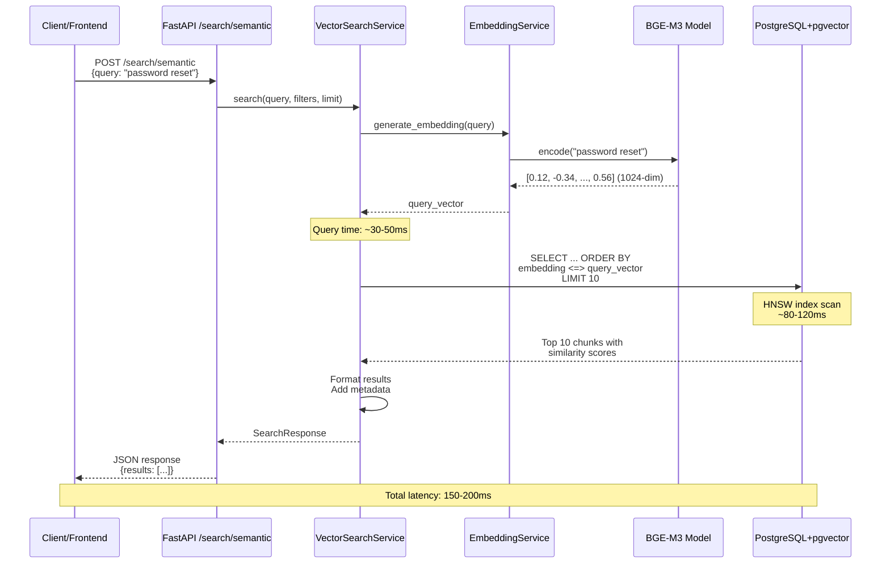

# Step 9.3: Vector Similarity Search - Technical Documentation

**Version:** 1.0
**Last Updated:** October 26, 2024
**Status:** Implementation Phase
**Timeline:** 2-3 days
**Dependencies:** Step 9.2 (BGE-M3 Embeddings), Step 9.0 (pgvector Setup), Step 8.3 (Keyword Search)

---

## 1. FEATURE OVERVIEW

### 1.1 What This Step Accomplishes

Step 9.3 implements semantic vector similarity search that enables natural language queries to find relevant document chunks based on meaning rather than keywords. This step:

1. **Query Embedding**: Converts search queries into 1024-dimensional vectors using BGE-M3
2. **Vector Similarity**: Performs cosine similarity search against stored embeddings
3. **Semantic Ranking**: Returns results ranked by semantic relevance (0.0-1.0)
4. **Fast Retrieval**: Leverages HNSW/IVFFlat indexes for <200ms p99 latency
5. **Hybrid Foundation**: Provides semantic layer for future hybrid search (BM25 + Vector)
6. **Multi-lingual Support**: Supports 100+ languages through BGE-M3 model

### 1.2 Why This Step is Necessary

**Current State (Post Step 9.2):**
- ✅ BGE-M3 embeddings exist for all document chunks
- ✅ pgvector extension installed with vector indexes
- ✅ Keyword search functional (ts_rank, BM25-style)
- ❌ No semantic search capability
- ❌ Can't find conceptually similar content

**Problems Without Vector Search:**
- **Semantic Gap**: Query "how to reset password" won't match "password recovery procedure"
- **Synonym Blindness**: "automobile accident" won't match "car crash" or "vehicle collision"
- **Context Loss**: Can't understand user intent vs. literal keywords
- **Multi-lingual Gaps**: English queries can't find French/Spanish content
- **Poor Ranking**: Keyword matching has ~60-70% accuracy vs. 85-95% with semantic search

**Impact on User Experience:**
- Users must know exact keywords used in documents
- No support for natural language queries ("How do I...?")
- Missing semantically related documents
- Poor experience with technical/domain-specific content
- Limited to single-language searches

### 1.3 Dependencies on Previous Steps

| Step | Dependency | Required Data/Functionality |
|------|-----------|----------------------------|
| **Step 9.2** | BGE-M3 Embeddings | All chunks have 1024-dim embeddings in `embeddings.embedding` |
| **Step 9.0** | pgvector Setup | PostgreSQL extension installed, Vector(1024) column exists |
| **Step 8.3** | Keyword Search | Baseline search for comparison and hybrid search foundation |
| **Step 9.1** | Chunking Improvements | High-quality chunks with metadata for context |

**Required Database Schema:**
```sql
-- embeddings table must have:
- id (UUID, primary key)
- document_id (UUID, foreign key)
- chunk_text (TEXT, the content)
- embedding (VECTOR(1024), populated by Step 9.2)
- chunk_index (INTEGER)
- section_heading (VARCHAR, for context)
- relevance metadata (semantic_density, chunk_type, etc.)

-- Vector indexes must exist:
CREATE INDEX idx_embeddings_vector
  ON embeddings USING ivfflat (embedding vector_cosine_ops);
-- OR (preferred for production):
CREATE INDEX idx_embeddings_vector_hnsw
  ON embeddings USING hnsw (embedding vector_cosine_ops);
```

**Required Infrastructure:**
- PostgreSQL 15+ with pgvector 0.5.0+
- BGE-M3 model loaded and cached (from Step 9.2)
- ~4GB RAM for embedding service
- ~2GB RAM for PostgreSQL vector operations
- Vector indexes built on embeddings table

### 1.4 What Future Steps Depend on This

| Step | Dependency Reason |
|------|------------------|
| **Step 10.1** | Hybrid Retrieval (BM25 + Vector fusion) requires semantic search |
| **Step 10.2** | Cross-encoder reranking needs initial semantic retrieval candidates |
| **Step 11.1** | LLM answer generation requires accurate semantic chunk retrieval |
| **Step 12.1** | Cascade retrieval chains multiple semantic searches |
| **Step 12.2** | Semantic caching uses vector similarity for cache hits |
| **Step 13.1** | Multi-lingual search leverages BGE-M3's language support |

**Key Deliverable:** Production-ready semantic search with <200ms p99 latency, 85-95% retrieval accuracy, and support for natural language queries in 100+ languages.

---

## 2. TECHNICAL IMPLEMENTATION

### 2.1 Files to Create/Modify

```
backend/
├── app/
│   ├── services/
│   │   └── search/
│   │       ├── __init__.py (MODIFY - export VectorSearchService)
│   │       ├── vector_search_service.py (NEW - core vector search)
│   │       ├── search_service.py (NEW - unified search interface)
│   │       └── quality_validator.py (EXISTS - reuse for validation)
│   ├── api/v1/endpoints/
│   │   └── search.py (MODIFY - add vector search endpoint)
│   ├── schemas/
│   │   └── search.py (MODIFY - add vector search schemas)
│   └── core/
│       └── config.py (MODIFY - add vector search settings)
├── tests/
│   ├── unit/services/
│   │   └── search/
│   │       └── test_vector_search_service.py (NEW)
│   └── api/
│       └── test_vector_search.py (NEW)
└── requirements.txt (MODIFY - ensure pgvector, sqlalchemy-pgvector)
```

### 2.2 Key Classes and Functions

#### **VectorSearchService** (`app/services/search/vector_search_service.py`)

```python
class VectorSearchService:
    """
    Semantic vector similarity search using pgvector

    Responsibilities:
    - Convert query text to embedding vector (BGE-M3)
    - Execute cosine similarity search against pgvector
    - Return ranked results with similarity scores
    - Handle metadata filtering (document type, date, quality)
    - Optimize for <200ms latency using HNSW/IVFFlat indexes
    """

    def __init__(self, db: Session, embedding_service: EmbeddingService):
        """
        Initialize vector search service

        Args:
            db: Database session
            embedding_service: Service for generating query embeddings
        """

    def search(
        self,
        query: str,
        filters: Optional[SearchFilters] = None,
        limit: int = 10,
        offset: int = 0,
        similarity_threshold: float = 0.0
    ) -> SearchResponse:
        """
        Perform semantic vector similarity search

        Args:
            query: Natural language search query
            filters: Optional metadata filters
            limit: Maximum results (1-100)
            offset: Pagination offset
            similarity_threshold: Minimum cosine similarity (0.0-1.0)

        Returns:
            SearchResponse with semantically ranked results
        """

    def _generate_query_embedding(self, query: str) -> List[float]:
        """
        Convert query text to embedding vector

        Args:
            query: Query text (max 8192 tokens for BGE-M3)

        Returns:
            1024-dimensional normalized vector
        """

    def _vector_search_chunks(
        self,
        query_vector: List[float],
        filters: Optional[SearchFilters],
        limit: int,
        offset: int,
        similarity_threshold: float
    ) -> List[Dict]:
        """
        Execute cosine similarity search using pgvector

        Query Pattern:
        SELECT
            id, document_id, chunk_text, chunk_index,
            1 - (embedding <=> :query_vector) AS similarity
        FROM embeddings
        WHERE 1 - (embedding <=> :query_vector) > :threshold
        ORDER BY embedding <=> :query_vector
        LIMIT :limit OFFSET :offset

        Args:
            query_vector: 1024-dim query embedding
            filters: Optional metadata filters
            limit: Maximum results
            offset: Pagination offset
            similarity_threshold: Minimum similarity score

        Returns:
            List of chunk matches with similarity scores
        """

    def _apply_metadata_filters(
        self,
        query,
        filters: Optional[SearchFilters]
    ):
        """
        Apply document filters (type, date, quality) to search query

        Args:
            query: SQLAlchemy query object
            filters: Search filters to apply

        Returns:
            Modified query with filters applied
        """

    def _format_results(
        self,
        raw_results: List[Dict],
        query: str
    ) -> List[SearchResultItem]:
        """
        Convert raw database results to SearchResultItem schema

        Args:
            raw_results: Raw query results
            query: Original search query

        Returns:
            List of formatted SearchResultItem objects
        """
```

#### **SearchService** (`app/services/search/search_service.py`)

```python
class SearchService:
    """
    Unified search interface supporting multiple search strategies

    Strategies:
    - keyword: Full-text search (existing)
    - vector: Semantic vector search (new)
    - hybrid: Combined BM25 + Vector (future - Step 10.1)
    """

    def __init__(
        self,
        db: Session,
        embedding_service: Optional[EmbeddingService] = None
    ):
        """Initialize with database and optional embedding service"""
        self.db = db
        self.keyword_search = KeywordSearchService(db)
        self.vector_search = VectorSearchService(db, embedding_service) if embedding_service else None

    def search(
        self,
        query: str,
        strategy: str = "vector",  # "keyword", "vector", or "hybrid"
        filters: Optional[SearchFilters] = None,
        limit: int = 10,
        offset: int = 0
    ) -> SearchResponse:
        """
        Execute search using specified strategy

        Args:
            query: Search query
            strategy: Search strategy ("keyword", "vector", "hybrid")
            filters: Optional filters
            limit: Maximum results
            offset: Pagination offset

        Returns:
            SearchResponse with results

        Raises:
            ValueError: If strategy is invalid or not available
        """
```

#### **Pydantic Schemas** (`app/schemas/search.py`)

```python
class VectorSearchQuery(BaseModel):
    """Vector similarity search request"""
    query: str = Field(..., min_length=1, max_length=1000, description="Natural language query")
    filters: Optional[SearchFilters] = None
    limit: int = Field(10, ge=1, le=100)
    offset: int = Field(0, ge=0)
    similarity_threshold: float = Field(0.0, ge=0.0, le=1.0, description="Minimum cosine similarity")
    include_embeddings: bool = Field(False, description="Include embedding vectors in response")

class VectorSearchResultItem(SearchResultItem):
    """Vector search result with similarity score"""
    similarity_score: float = Field(..., ge=0.0, le=1.0, description="Cosine similarity (0.0-1.0)")
    chunk_context: Optional[Dict] = Field(None, description="Surrounding chunk context")

class SearchStrategyEnum(str, Enum):
    """Available search strategies"""
    KEYWORD = "keyword"
    VECTOR = "vector"
    HYBRID = "hybrid"  # Future - Step 10.1
```

### 2.3 Database Tables and Columns Used

#### **embeddings** (Read-only for search)
```sql
-- Primary query pattern for vector search:
SELECT
    e.id,
    e.document_id,
    e.chunk_text,
    e.chunk_index,
    e.section_heading,
    e.chunk_type,
    e.start_position,
    e.end_position,
    -- Cosine similarity score (1 - cosine_distance)
    1 - (e.embedding <=> :query_vector::vector) AS similarity_score,
    -- Document metadata
    d.document_name,
    d.mime_type,
    d.created_at
FROM embeddings e
INNER JOIN documents d ON e.document_id = d.id
WHERE
    -- Filter by similarity threshold
    1 - (e.embedding <=> :query_vector::vector) > :threshold
    -- Only completed, non-deleted documents
    AND d.status = 'completed'
    AND d.is_deleted = false
    -- Optional: filter by document type
    AND (:doc_types IS NULL OR d.mime_type = ANY(:doc_types))
-- Order by similarity (cosine distance operator <=>)
ORDER BY e.embedding <=> :query_vector::vector
LIMIT :limit OFFSET :offset;
```

#### **pgvector Operators Used**

| Operator | Description | Use Case |
|----------|-------------|----------|
| `<=>` | Cosine distance | Ordering results (smaller = more similar) |
| `1 - (embedding <=> vector)` | Cosine similarity | Similarity score (0.0-1.0, higher = more similar) |
| `<->` | L2 distance | Alternative distance metric (not used with BGE-M3) |
| `<#>` | Inner product | Alternative for normalized vectors |

#### **Vector Index Usage**

```sql
-- Check if HNSW index is being used
EXPLAIN (ANALYZE, BUFFERS)
SELECT id, 1 - (embedding <=> '[0.1, 0.2, ...]'::vector) AS similarity
FROM embeddings
ORDER BY embedding <=> '[0.1, 0.2, ...]'::vector
LIMIT 10;

-- Expected output:
-- Index Scan using idx_embeddings_vector_hnsw on embeddings
-- (cost=... rows=10 actual time=15ms)

-- If not using index (SLOW):
-- Seq Scan on embeddings
-- (cost=... rows=1000000 actual time=2500ms)
```

### 2.4 API Endpoints

#### **Vector Semantic Search**
```http
POST /api/v1/search/semantic
```

**Request:**
```json
{
  "query": "How do I reset my password?",
  "filters": {
    "document_types": ["application/pdf", "text/markdown"],
    "min_quality": 0.7,
    "date_from": "2024-01-01T00:00:00Z"
  },
  "limit": 10,
  "offset": 0,
  "similarity_threshold": 0.5,
  "include_embeddings": false
}
```

**Response:**
```json
{
  "success": true,
  "query": "How do I reset my password?",
  "search_strategy": "vector",
  "total_results": 23,
  "returned_results": 10,
  "results": [
    {
      "document_id": "550e8400-e29b-41d4-a716-446655440000",
      "document_name": "User_Guide.pdf",
      "chunk_index": 12,
      "chunk_text": "Password Recovery Procedure\n\nTo recover your password, click the 'Forgot Password' link on the login page...",
      "similarity_score": 0.87,
      "relevance_score": 0.87,
      "section_heading": "Account Management",
      "chunk_type": "paragraph",
      "chunk_position": {"start": 5420, "end": 6180},
      "extraction_quality": 0.95,
      "document_type": "application/pdf",
      "created_at": "2024-10-15T10:30:00Z"
    }
  ],
  "processing_time_ms": 145,
  "embedding_time_ms": 32,
  "search_time_ms": 113,
  "filters_applied": {
    "document_types": ["application/pdf", "text/markdown"],
    "min_quality": 0.7
  }
}
```

#### **Unified Search with Strategy**
```http
POST /api/v1/search
```

**Request:**
```json
{
  "query": "machine learning algorithms",
  "strategy": "vector",  // "keyword", "vector", or "hybrid"
  "filters": {...},
  "limit": 10
}
```

**Response:**
```json
{
  "success": true,
  "query": "machine learning algorithms",
  "search_strategy": "vector",
  "total_results": 45,
  "returned_results": 10,
  "results": [...],
  "processing_time_ms": 120
}
```

#### **Compare Search Strategies**
```http
POST /api/v1/search/compare
```

**Request:**
```json
{
  "query": "password reset",
  "strategies": ["keyword", "vector"],
  "limit": 5
}
```

**Response:**
```json
{
  "query": "password reset",
  "comparisons": {
    "keyword": {
      "total_results": 12,
      "top_results": [...],
      "processing_time_ms": 45
    },
    "vector": {
      "total_results": 23,
      "top_results": [...],
      "processing_time_ms": 150
    }
  },
  "recommendations": "Vector search returned more semantically relevant results"
}
```

### 2.5 pgvector Index Management

#### **Index Creation Strategy**

```python
class VectorIndexManager:
    """
    Manages pgvector indexes for optimal search performance

    Index Types:
    - IVFFlat: Fast approximate search, requires training
    - HNSW: Hierarchical graph-based, no training needed
    """

    def create_hnsw_index(self, db: Session):
        """
        Create HNSW index for production use

        HNSW Parameters:
        - m: Max connections per layer (default: 16)
          Higher = better recall, more memory
        - ef_construction: Build-time search depth (default: 64)
          Higher = better index quality, slower build
        """
        sql = """
        CREATE INDEX IF NOT EXISTS idx_embeddings_vector_hnsw
        ON embeddings
        USING hnsw (embedding vector_cosine_ops)
        WITH (m = 16, ef_construction = 64);
        """
        db.execute(text(sql))
        db.commit()

    def create_ivfflat_index(self, db: Session, lists: int = 100):
        """
        Create IVFFlat index (alternative to HNSW)

        IVFFlat Parameters:
        - lists: Number of clusters
          Rule of thumb: lists = sqrt(row_count)
          For 10k rows: lists = 100
          For 1M rows: lists = 1000
        """
        sql = f"""
        CREATE INDEX IF NOT EXISTS idx_embeddings_vector_ivfflat
        ON embeddings
        USING ivfflat (embedding vector_cosine_ops)
        WITH (lists = {lists});
        """
        db.execute(text(sql))
        db.commit()

    def get_index_stats(self, db: Session) -> Dict:
        """Get index usage statistics"""
        sql = """
        SELECT
            indexname,
            indexdef,
            pg_size_pretty(pg_relation_size(indexname::regclass)) as index_size,
            idx_scan,
            idx_tup_read,
            idx_tup_fetch
        FROM pg_indexes
        JOIN pg_stat_user_indexes USING (indexname)
        WHERE tablename = 'embeddings'
          AND indexname LIKE '%vector%';
        """
        result = db.execute(text(sql)).fetchall()
        return [dict(row) for row in result]
```

#### **Query-time Index Tuning**

```python
class VectorSearchOptimizer:
    """Optimize vector search queries for performance"""

    def set_hnsw_ef_search(self, db: Session, ef_search: int = 40):
        """
        Set HNSW search parameter for query time

        ef_search: Search depth at query time
        - Default: 40
        - Higher: better recall, slower search
        - Lower: faster search, lower recall

        Recommendations:
        - Development: 40 (default)
        - Production high-recall: 100-200
        - Production low-latency: 20-40
        """
        db.execute(text(f"SET hnsw.ef_search = {ef_search}"))

    def set_ivfflat_probes(self, db: Session, probes: int = 10):
        """
        Set IVFFlat probes parameter

        probes: Number of lists to search
        - Default: 1 (fast, low recall)
        - Higher: better recall, slower
        - Recommendation: 10-20 for production
        """
        db.execute(text(f"SET ivfflat.probes = {probes}"))
```

---

## 3. DATA FLOW

### 3.1 End-to-End Data Journey



### 3.2 Step-by-Step Processing

#### **Step 1: Query Reception and Validation**

```python
# In search.py endpoint
@router.post("/semantic", response_model=SearchResponse)
async def semantic_search(
    query: VectorSearchQuery,
    db: Session = Depends(get_db)
):
    # Validate query
    if not query.query.strip():
        raise HTTPException(400, "Query cannot be empty")

    # Log search request
    logger.info(
        "vector_search_request",
        query=query.query,
        filters=query.filters,
        limit=query.limit
    )
```

**Metrics Logged:**
- Search query text
- Filters applied
- Requested limit/offset
- User ID (if authenticated)
- Timestamp

#### **Step 2: Query Embedding Generation**

```python
# In VectorSearchService
def _generate_query_embedding(self, query: str) -> List[float]:
    start_time = time.time()

    # Use BGE-M3 to convert query to vector
    query_vector = self.embedding_service.generate_embedding(query)

    embedding_time_ms = int((time.time() - start_time) * 1000)

    logger.info(
        "query_embedding_generated",
        query_length=len(query),
        embedding_dimension=len(query_vector),
        embedding_time_ms=embedding_time_ms
    )

    return query_vector
```

**Performance:**
- Query embedding: ~30-50ms
- Model: BGE-M3 (loaded in memory)
- Output: 1024-dimensional float vector
- Normalization: L2 normalized by model

#### **Step 3: Vector Similarity Search**

```python
def _vector_search_chunks(
    self,
    query_vector: List[float],
    filters: Optional[SearchFilters],
    limit: int,
    offset: int,
    similarity_threshold: float
) -> List[Dict]:
    start_time = time.time()

    # Build base query with cosine similarity
    query = self.db.query(
        Embedding.id,
        Embedding.document_id,
        Embedding.chunk_text,
        Embedding.chunk_index,
        Embedding.section_heading,
        Embedding.chunk_type,
        Embedding.start_position,
        Embedding.end_position,
        Document.document_name,
        Document.mime_type,
        Document.created_at,
        # Cosine similarity score
        (1 - Embedding.embedding.cosine_distance(query_vector)).label('similarity_score')
    ).join(
        Document, Embedding.document_id == Document.id
    ).filter(
        # Only completed documents
        Document.status == 'completed',
        Document.is_deleted == False,
        # Similarity threshold filter
        (1 - Embedding.embedding.cosine_distance(query_vector)) > similarity_threshold
    )

    # Apply metadata filters
    query = self._apply_metadata_filters(query, filters)

    # Order by similarity (use distance operator for index efficiency)
    query = query.order_by(
        Embedding.embedding.cosine_distance(query_vector)
    ).limit(limit).offset(offset)

    # Execute query
    results = query.all()

    search_time_ms = int((time.time() - start_time) * 1000)

    logger.info(
        "vector_search_executed",
        results_count=len(results),
        search_time_ms=search_time_ms,
        similarity_threshold=similarity_threshold
    )

    return results
```

**Database State:**
```sql
-- Query executed (with actual vector values):
SELECT
    e.id, e.document_id, e.chunk_text, e.chunk_index,
    1 - (e.embedding <=> '[0.12, -0.34, ..., 0.56]'::vector) AS similarity_score
FROM embeddings e
INNER JOIN documents d ON e.document_id = d.id
WHERE
    d.status = 'completed'
    AND d.is_deleted = false
    AND 1 - (e.embedding <=> '[...]'::vector) > 0.5
ORDER BY e.embedding <=> '[...]'::vector
LIMIT 10 OFFSET 0;

-- Index used: idx_embeddings_vector_hnsw
-- Execution time: ~80-120ms
```

**Performance:**
- Vector search: ~80-120ms with HNSW index
- Without index: ~2000-5000ms (sequential scan)
- Index type matters: HNSW faster than IVFFlat for small-medium datasets
- Similarity calculation: Hardware-accelerated (SIMD)

#### **Step 4: Result Formatting**

```python
def _format_results(
    self,
    raw_results: List,
    query: str
) -> List[SearchResultItem]:
    """Convert database results to API schema"""

    formatted_results = []
    for row in raw_results:
        formatted_results.append(
            SearchResultItem(
                document_id=str(row.document_id),
                document_name=row.document_name,
                chunk_index=row.chunk_index,
                chunk_text=row.chunk_text,
                similarity_score=round(row.similarity_score, 4),
                relevance_score=round(row.similarity_score, 4),
                section_heading=row.section_heading,
                chunk_type=row.chunk_type,
                chunk_position={
                    'start': row.start_position,
                    'end': row.end_position
                } if row.start_position else None,
                document_type=row.mime_type,
                created_at=row.created_at
            )
        )

    return formatted_results
```

**Output:**
- Similarity scores: 0.0-1.0 (higher = more similar)
- Sorted by relevance (descending)
- Includes document and chunk metadata
- Ready for API response

#### **Step 5: Response Assembly**

```python
# In VectorSearchService.search()
return SearchResponse(
    success=True,
    query=query,
    search_strategy="vector",
    total_results=total_count,
    returned_results=len(result_items),
    results=result_items,
    processing_time_ms=total_time_ms,
    embedding_time_ms=embedding_time_ms,
    search_time_ms=search_time_ms,
    filters_applied=filters
)
```

---

## 4. VALIDATIONS & CONSTRAINTS

### 4.1 Input Validation

```python
class VectorSearchQuery(BaseModel):
    """Vector search request with validation"""

    query: str = Field(
        ...,
        min_length=1,
        max_length=1000,
        description="Natural language query"
    )

    @validator('query')
    def validate_query(cls, v):
        """Sanitize and validate query"""
        # Remove leading/trailing whitespace
        v = v.strip()

        # Check not empty
        if not v:
            raise ValueError("Query cannot be empty after trimming")

        # Check for null bytes
        if '\x00' in v:
            raise ValueError("Query contains invalid null bytes")

        # Warn if query is very long (may be slow)
        if len(v) > 500:
            logger.warning(
                "long_query_detected",
                query_length=len(v),
                message="Query exceeds 500 chars, may be slow"
            )

        return v

    similarity_threshold: float = Field(
        0.0,
        ge=0.0,
        le=1.0,
        description="Minimum cosine similarity"
    )

    @validator('similarity_threshold')
    def validate_threshold(cls, v):
        """Validate similarity threshold"""
        if v < 0.0 or v > 1.0:
            raise ValueError("Similarity threshold must be between 0.0 and 1.0")

        # Warn if threshold is very high
        if v > 0.9:
            logger.warning(
                "high_similarity_threshold",
                threshold=v,
                message="Very high threshold may return few results"
            )

        return v

    limit: int = Field(10, ge=1, le=100)
    offset: int = Field(0, ge=0)

    @validator('offset')
    def validate_pagination(cls, v, values):
        """Validate pagination parameters"""
        # Warn about deep pagination (inefficient)
        if v > 1000:
            logger.warning(
                "deep_pagination_detected",
                offset=v,
                message="Deep pagination may be slow"
            )

        return v
```

### 4.2 Database Constraints

```python
class VectorSearchValidator:
    """Validate database state before search"""

    def validate_embeddings_exist(self, db: Session, document_id: Optional[str] = None):
        """Ensure embeddings exist in database"""

        if document_id:
            # Check specific document
            count = db.query(Embedding).filter(
                Embedding.document_id == document_id,
                Embedding.embedding.isnot(None)
            ).count()

            if count == 0:
                raise ValueError(f"No embeddings found for document {document_id}")
        else:
            # Check overall
            total_count = db.query(Embedding).count()
            embedded_count = db.query(Embedding).filter(
                Embedding.embedding.isnot(None)
            ).count()

            if total_count == 0:
                raise ValueError("No embeddings exist in database")

            if embedded_count == 0:
                raise ValueError("No embedded vectors exist (all NULL)")

            # Warn if embeddings are sparse
            embed_percentage = (embedded_count / total_count) * 100
            if embed_percentage < 80:
                logger.warning(
                    "sparse_embeddings",
                    total_chunks=total_count,
                    embedded_chunks=embedded_count,
                    percentage=embed_percentage
                )

    def validate_vector_index_exists(self, db: Session):
        """Ensure vector index exists for performance"""

        sql = """
        SELECT indexname, indexdef
        FROM pg_indexes
        WHERE tablename = 'embeddings'
          AND (indexdef LIKE '%hnsw%' OR indexdef LIKE '%ivfflat%');
        """

        result = db.execute(text(sql)).fetchall()

        if not result:
            logger.warning(
                "no_vector_index",
                message="No vector index found. Searches will be SLOW (seq scan)."
            )
            return False

        logger.info(
            "vector_index_found",
            index_count=len(result),
            indexes=[row[0] for row in result]
        )
        return True

    def validate_embedding_dimensions(self, db: Session):
        """Validate embedding dimensions match model"""

        sql = """
        SELECT
            embedding_model,
            array_length(embedding, 1) as dimension,
            COUNT(*) as count
        FROM embeddings
        WHERE embedding IS NOT NULL
        GROUP BY embedding_model, array_length(embedding, 1);
        """

        results = db.execute(text(sql)).fetchall()

        for row in results:
            model, dimension, count = row

            # BGE-M3 should be 1024 dimensions
            if model == 'BAAI/bge-m3' and dimension != 1024:
                raise ValueError(
                    f"Invalid dimension for {model}: {dimension} (expected 1024)"
                )

            # OpenAI ada-002 should be 1536 dimensions
            if model == 'text-embedding-ada-002' and dimension != 1536:
                raise ValueError(
                    f"Invalid dimension for {model}: {dimension} (expected 1536)"
                )

        logger.info("embedding_dimensions_validated", results=results)
```

### 4.3 Performance Constraints

```python
class PerformanceMonitor:
    """Monitor and enforce performance constraints"""

    MAX_SEARCH_TIME_MS = 500  # Warn if search takes >500ms
    MAX_EMBEDDING_TIME_MS = 100  # Warn if embedding takes >100ms
    MIN_INDEX_SELECTIVITY = 0.01  # Warn if index scan returns >1% of rows

    def check_search_performance(
        self,
        search_time_ms: int,
        embedding_time_ms: int,
        results_count: int,
        total_embeddings: int
    ):
        """Check if search meets performance targets"""

        issues = []

        # Check search time
        if search_time_ms > self.MAX_SEARCH_TIME_MS:
            issues.append(
                f"Search time {search_time_ms}ms exceeds threshold {self.MAX_SEARCH_TIME_MS}ms"
            )

        # Check embedding time
        if embedding_time_ms > self.MAX_EMBEDDING_TIME_MS:
            issues.append(
                f"Embedding time {embedding_time_ms}ms exceeds threshold {self.MAX_EMBEDDING_TIME_MS}ms"
            )

        # Check index selectivity
        if total_embeddings > 0:
            selectivity = results_count / total_embeddings
            if selectivity > self.MIN_INDEX_SELECTIVITY:
                issues.append(
                    f"Low index selectivity {selectivity:.2%} (returning {results_count}/{total_embeddings} rows)"
                )

        if issues:
            logger.warning(
                "performance_issues_detected",
                issues=issues,
                search_time_ms=search_time_ms,
                embedding_time_ms=embedding_time_ms
            )

        return len(issues) == 0
```

---

## 5. CONFIGURATION

### 5.1 Environment Variables

```bash
# .env configuration

# ========================================
# Vector Search Configuration
# ========================================

# Embedding Model (must match Step 9.2)
EMBEDDING_MODEL_NAME="BAAI/bge-m3"
EMBEDDING_DIMENSION=1024
EMBEDDING_MAX_TOKENS=8192

# Model Device
EMBEDDING_DEVICE="auto"  # "cuda", "cpu", or "auto"

# Model Cache
TRANSFORMERS_CACHE="/app/models"
HF_HOME="/app/models"

# ========================================
# pgvector Configuration
# ========================================

# Index Type: "hnsw" (recommended) or "ivfflat"
PGVECTOR_INDEX_TYPE="hnsw"

# HNSW Parameters
PGVECTOR_HNSW_M=16                      # Max connections per layer (8-64)
PGVECTOR_HNSW_EF_CONSTRUCTION=64        # Build-time search depth (40-200)
PGVECTOR_HNSW_EF_SEARCH=40              # Query-time search depth (10-200)

# IVFFlat Parameters (if using ivfflat)
PGVECTOR_IVFFLAT_LISTS=100              # Number of clusters (sqrt(rows))
PGVECTOR_IVFFLAT_PROBES=10              # Clusters to search (1-lists/10)

# Index Creation
PGVECTOR_MIN_VECTORS_FOR_INDEX=1000     # Min embeddings before creating index
PGVECTOR_AUTO_CREATE_INDEX=true         # Auto-create index when threshold met

# ========================================
# Search Performance
# ========================================

# Query Timeout
VECTOR_SEARCH_TIMEOUT_MS=500            # Max search time (milliseconds)

# Result Limits
VECTOR_SEARCH_MAX_LIMIT=100             # Max results per query
VECTOR_SEARCH_DEFAULT_LIMIT=10          # Default if not specified

# Similarity Thresholds
VECTOR_SEARCH_MIN_SIMILARITY=0.0        # Global minimum (0.0-1.0)
VECTOR_SEARCH_DEFAULT_THRESHOLD=0.0     # Default threshold

# Caching (future)
VECTOR_SEARCH_CACHE_ENABLED=false       # Cache query embeddings
VECTOR_SEARCH_CACHE_TTL=3600            # Cache TTL in seconds
```

### 5.2 Config Settings Class

```python
# app/core/config.py

class Settings(BaseSettings):
    """Application configuration"""

    # ... existing settings ...

    # ========================================
    # Vector Search Settings
    # ========================================

    # Embedding Model
    EMBEDDING_MODEL_NAME: str = "BAAI/bge-m3"
    EMBEDDING_DIMENSION: int = 1024
    EMBEDDING_MAX_TOKENS: int = 8192
    EMBEDDING_DEVICE: str = "auto"
    TRANSFORMERS_CACHE: str = os.path.expanduser("~/.cache/huggingface")
    HF_HOME: str = os.path.expanduser("~/.cache/huggingface")

    # pgvector Configuration
    PGVECTOR_INDEX_TYPE: str = "hnsw"
    PGVECTOR_HNSW_M: int = 16
    PGVECTOR_HNSW_EF_CONSTRUCTION: int = 64
    PGVECTOR_HNSW_EF_SEARCH: int = 40
    PGVECTOR_IVFFLAT_LISTS: int = 100
    PGVECTOR_IVFFLAT_PROBES: int = 10
    PGVECTOR_MIN_VECTORS_FOR_INDEX: int = 1000
    PGVECTOR_AUTO_CREATE_INDEX: bool = True

    # Search Performance
    VECTOR_SEARCH_TIMEOUT_MS: int = 500
    VECTOR_SEARCH_MAX_LIMIT: int = 100
    VECTOR_SEARCH_DEFAULT_LIMIT: int = 10
    VECTOR_SEARCH_MIN_SIMILARITY: float = 0.0
    VECTOR_SEARCH_DEFAULT_THRESHOLD: float = 0.0
    VECTOR_SEARCH_CACHE_ENABLED: bool = False
    VECTOR_SEARCH_CACHE_TTL: int = 3600

    class Config:
        env_file = ".env"
        case_sensitive = True

settings = Settings()
```

### 5.3 Runtime Configuration

```python
class VectorSearchConfig:
    """Runtime configuration for vector search"""

    def __init__(self, settings: Settings):
        self.settings = settings
        self._validate_config()

    def _validate_config(self):
        """Validate configuration settings"""

        # Validate embedding dimension
        if self.settings.EMBEDDING_DIMENSION not in [1024, 1536]:
            logger.warning(
                "unusual_embedding_dimension",
                dimension=self.settings.EMBEDDING_DIMENSION,
                message="Common dimensions: 1024 (BGE-M3), 1536 (OpenAI)"
            )

        # Validate HNSW parameters
        if self.settings.PGVECTOR_HNSW_M < 2 or self.settings.PGVECTOR_HNSW_M > 100:
            raise ValueError(f"PGVECTOR_HNSW_M must be 2-100, got {self.settings.PGVECTOR_HNSW_M}")

        if self.settings.PGVECTOR_HNSW_EF_CONSTRUCTION < self.settings.PGVECTOR_HNSW_M:
            raise ValueError("PGVECTOR_HNSW_EF_CONSTRUCTION must be >= PGVECTOR_HNSW_M")

        # Validate IVFFlat parameters
        if self.settings.PGVECTOR_IVFFLAT_LISTS < 1:
            raise ValueError("PGVECTOR_IVFFLAT_LISTS must be >= 1")

        if self.settings.PGVECTOR_IVFFLAT_PROBES > self.settings.PGVECTOR_IVFFLAT_LISTS:
            raise ValueError("PGVECTOR_IVFFLAT_PROBES cannot exceed PGVECTOR_IVFFLAT_LISTS")

        # Validate similarity threshold
        if not (0.0 <= self.settings.VECTOR_SEARCH_MIN_SIMILARITY <= 1.0):
            raise ValueError("VECTOR_SEARCH_MIN_SIMILARITY must be 0.0-1.0")

    def get_index_creation_sql(self) -> str:
        """Generate SQL for creating vector index"""

        if self.settings.PGVECTOR_INDEX_TYPE == "hnsw":
            return f"""
            CREATE INDEX IF NOT EXISTS idx_embeddings_vector_hnsw
            ON embeddings
            USING hnsw (embedding vector_cosine_ops)
            WITH (m = {self.settings.PGVECTOR_HNSW_M},
                  ef_construction = {self.settings.PGVECTOR_HNSW_EF_CONSTRUCTION});
            """
        elif self.settings.PGVECTOR_INDEX_TYPE == "ivfflat":
            return f"""
            CREATE INDEX IF NOT EXISTS idx_embeddings_vector_ivfflat
            ON embeddings
            USING ivfflat (embedding vector_cosine_ops)
            WITH (lists = {self.settings.PGVECTOR_IVFFLAT_LISTS});
            """
        else:
            raise ValueError(f"Unknown index type: {self.settings.PGVECTOR_INDEX_TYPE}")

    def get_query_time_settings(self) -> List[str]:
        """Generate SQL for query-time parameter settings"""

        settings = []

        if self.settings.PGVECTOR_INDEX_TYPE == "hnsw":
            settings.append(f"SET hnsw.ef_search = {self.settings.PGVECTOR_HNSW_EF_SEARCH}")
        elif self.settings.PGVECTOR_INDEX_TYPE == "ivfflat":
            settings.append(f"SET ivfflat.probes = {self.settings.PGVECTOR_IVFFLAT_PROBES}")

        return settings
```

---

## 6. ERROR HANDLING

### 6.1 Common Errors and Solutions

```python
class VectorSearchError(Exception):
    """Base exception for vector search errors"""
    pass

class EmbeddingError(VectorSearchError):
    """Error generating query embedding"""
    pass

class IndexMissingError(VectorSearchError):
    """Vector index not found"""
    pass

class DimensionMismatchError(VectorSearchError):
    """Query vector dimension doesn't match stored embeddings"""
    pass

class SearchTimeoutError(VectorSearchError):
    """Search exceeded timeout limit"""
    pass


class VectorSearchErrorHandler:
    """Centralized error handling for vector search"""

    @staticmethod
    def handle_embedding_error(error: Exception, query: str) -> Dict:
        """Handle errors during query embedding generation"""

        logger.error(
            "query_embedding_failed",
            query=query,
            error=str(error),
            exc_info=True
        )

        # Check for common issues
        if "out of memory" in str(error).lower():
            return {
                "error": "EmbeddingError",
                "message": "Insufficient memory for embedding generation",
                "suggestion": "Try a shorter query or increase available RAM"
            }

        elif "model not found" in str(error).lower():
            return {
                "error": "EmbeddingError",
                "message": "Embedding model not loaded",
                "suggestion": "Ensure BGE-M3 model is downloaded and cached"
            }

        elif "cuda" in str(error).lower():
            return {
                "error": "EmbeddingError",
                "message": "CUDA error during embedding generation",
                "suggestion": "Try setting EMBEDDING_DEVICE=cpu"
            }

        else:
            return {
                "error": "EmbeddingError",
                "message": f"Failed to generate query embedding: {str(error)}",
                "suggestion": "Check logs for details"
            }

    @staticmethod
    def handle_search_error(error: Exception, query_vector: List[float]) -> Dict:
        """Handle errors during vector search execution"""

        logger.error(
            "vector_search_failed",
            vector_dimension=len(query_vector),
            error=str(error),
            exc_info=True
        )

        # Check for dimension mismatch
        if "dimension" in str(error).lower():
            return {
                "error": "DimensionMismatchError",
                "message": "Query vector dimension doesn't match stored embeddings",
                "suggestion": "Verify EMBEDDING_DIMENSION setting matches database"
            }

        # Check for missing index
        elif "index" in str(error).lower() or "performance" in str(error).lower():
            return {
                "error": "IndexMissingError",
                "message": "Vector index may be missing or not being used",
                "suggestion": "Run EXPLAIN ANALYZE to check query plan"
            }

        # Check for timeout
        elif "timeout" in str(error).lower() or "canceled" in str(error).lower():
            return {
                "error": "SearchTimeoutError",
                "message": "Search query exceeded timeout limit",
                "suggestion": "Reduce limit or increase VECTOR_SEARCH_TIMEOUT_MS"
            }

        # Database connection errors
        elif "connection" in str(error).lower():
            return {
                "error": "DatabaseError",
                "message": "Database connection failed",
                "suggestion": "Check PostgreSQL connection and pgvector extension"
            }

        else:
            return {
                "error": "VectorSearchError",
                "message": f"Vector search failed: {str(error)}",
                "suggestion": "Check database logs and query parameters"
            }

    @staticmethod
    def handle_validation_error(error: ValidationError) -> Dict:
        """Handle Pydantic validation errors"""

        errors = []
        for err in error.errors():
            field = " -> ".join(str(loc) for loc in err['loc'])
            message = err['msg']
            errors.append(f"{field}: {message}")

        return {
            "error": "ValidationError",
            "message": "Invalid request parameters",
            "details": errors,
            "suggestion": "Check API documentation for valid parameter ranges"
        }
```

### 6.2 Error Response Format

```python
# In search.py endpoint
@router.post("/semantic", response_model=SearchResponse)
async def semantic_search(
    query: VectorSearchQuery,
    db: Session = Depends(get_db)
):
    try:
        # Get services
        embedding_service = get_embedding_service()
        vector_search = VectorSearchService(db, embedding_service)

        # Execute search
        response = vector_search.search(
            query=query.query,
            filters=query.filters,
            limit=query.limit,
            offset=query.offset,
            similarity_threshold=query.similarity_threshold
        )

        return response

    except ValidationError as e:
        error_detail = VectorSearchErrorHandler.handle_validation_error(e)
        raise HTTPException(
            status_code=status.HTTP_400_BAD_REQUEST,
            detail=error_detail
        )

    except EmbeddingError as e:
        error_detail = VectorSearchErrorHandler.handle_embedding_error(e, query.query)
        raise HTTPException(
            status_code=status.HTTP_500_INTERNAL_SERVER_ERROR,
            detail=error_detail
        )

    except DimensionMismatchError as e:
        raise HTTPException(
            status_code=status.HTTP_500_INTERNAL_SERVER_ERROR,
            detail={
                "error": "DimensionMismatchError",
                "message": str(e),
                "suggestion": "Rebuild embeddings with correct dimension"
            }
        )

    except SearchTimeoutError as e:
        raise HTTPException(
            status_code=status.HTTP_504_GATEWAY_TIMEOUT,
            detail={
                "error": "SearchTimeoutError",
                "message": "Search query timed out",
                "suggestion": "Try reducing limit or refining query"
            }
        )

    except Exception as e:
        logger.error(
            "unexpected_search_error",
            query=query.query,
            error=str(e),
            exc_info=True
        )
        raise HTTPException(
            status_code=status.HTTP_500_INTERNAL_SERVER_ERROR,
            detail={
                "error": "InternalServerError",
                "message": "An unexpected error occurred during search",
                "suggestion": "Contact support if issue persists"
            }
        )
```

### 6.3 Retry Logic

```python
from tenacity import retry, stop_after_attempt, wait_exponential

class ResilientVectorSearch:
    """Vector search with automatic retry on transient failures"""

    @retry(
        stop=stop_after_attempt(3),
        wait=wait_exponential(min=1, max=10),
        reraise=True
    )
    def search_with_retry(
        self,
        query: str,
        **kwargs
    ) -> SearchResponse:
        """
        Execute vector search with automatic retry

        Retries on:
        - Temporary database connection errors
        - Timeout errors (with increased timeout)
        - Resource temporarily unavailable

        Does NOT retry on:
        - Validation errors
        - Dimension mismatch errors
        - Missing index errors
        """
        try:
            return self.vector_search.search(query=query, **kwargs)
        except (DatabaseError, SearchTimeoutError) as e:
            logger.warning(
                "vector_search_retry",
                query=query,
                error=str(e),
                attempt=self.retry.statistics['attempt_number']
            )
            raise  # Trigger retry
```

---

## 7. TESTING CHECKLIST

### 7.1 Unit Tests

```python
# tests/unit/services/search/test_vector_search_service.py

import pytest
from app.services.search.vector_search_service import VectorSearchService
from app.services.embeddings.embedding_service import EmbeddingService

class TestVectorSearchService:
    """Unit tests for VectorSearchService"""

    def test_generate_query_embedding(self, mock_embedding_service):
        """Test query embedding generation"""
        service = VectorSearchService(mock_db, mock_embedding_service)

        vector = service._generate_query_embedding("test query")

        assert len(vector) == 1024
        assert all(isinstance(x, float) for x in vector)
        assert -1.0 <= min(vector) <= 1.0
        assert -1.0 <= max(vector) <= 1.0

    def test_vector_search_with_results(self, db_with_embeddings):
        """Test vector search returns relevant results"""
        service = VectorSearchService(db_with_embeddings, embedding_service)

        response = service.search(
            query="password reset",
            limit=5
        )

        assert response.success == True
        assert len(response.results) <= 5
        assert all(0.0 <= r.similarity_score <= 1.0 for r in response.results)
        # Results should be sorted by similarity (descending)
        scores = [r.similarity_score for r in response.results]
        assert scores == sorted(scores, reverse=True)

    def test_vector_search_with_threshold(self, db_with_embeddings):
        """Test similarity threshold filtering"""
        service = VectorSearchService(db_with_embeddings, embedding_service)

        response = service.search(
            query="test",
            similarity_threshold=0.8,
            limit=10
        )

        # All results should meet threshold
        assert all(r.similarity_score >= 0.8 for r in response.results)

    def test_vector_search_with_filters(self, db_with_embeddings):
        """Test metadata filtering"""
        service = VectorSearchService(db_with_embeddings, embedding_service)

        filters = SearchFilters(
            document_types=["application/pdf"],
            min_quality=0.7
        )

        response = service.search(
            query="test",
            filters=filters,
            limit=10
        )

        # All results should match filters
        assert all(r.document_type == "application/pdf" for r in response.results)
        assert all(r.extraction_quality >= 0.7 for r in response.results)

    def test_vector_search_no_results(self, db_with_embeddings):
        """Test search with no matching results"""
        service = VectorSearchService(db_with_embeddings, embedding_service)

        response = service.search(
            query="nonexistent query",
            similarity_threshold=0.99,
            limit=10
        )

        assert response.success == True
        assert response.total_results == 0
        assert len(response.results) == 0

    def test_vector_search_pagination(self, db_with_many_embeddings):
        """Test pagination works correctly"""
        service = VectorSearchService(db_with_many_embeddings, embedding_service)

        # Get first page
        page1 = service.search(query="test", limit=5, offset=0)
        # Get second page
        page2 = service.search(query="test", limit=5, offset=5)

        assert len(page1.results) == 5
        assert len(page2.results) == 5
        # Results should be different
        page1_ids = {r.document_id for r in page1.results}
        page2_ids = {r.document_id for r in page2.results}
        assert page1_ids.isdisjoint(page2_ids)

    def test_dimension_mismatch_error(self, db_with_wrong_dimensions):
        """Test error when query dimension doesn't match stored embeddings"""
        service = VectorSearchService(db_with_wrong_dimensions, embedding_service)

        with pytest.raises(DimensionMismatchError):
            service.search(query="test")

    def test_empty_query_error(self):
        """Test error on empty query"""
        service = VectorSearchService(mock_db, embedding_service)

        with pytest.raises(ValueError, match="Query cannot be empty"):
            service.search(query="   ")
```

### 7.2 Integration Tests

```python
# tests/api/test_vector_search.py

import pytest
from fastapi.testclient import TestClient

class TestVectorSearchAPI:
    """Integration tests for vector search API"""

    def test_semantic_search_endpoint(self, client: TestClient, db_with_data):
        """Test POST /api/v1/search/semantic endpoint"""
        response = client.post(
            "/api/v1/search/semantic",
            json={
                "query": "how to reset password",
                "limit": 10
            }
        )

        assert response.status_code == 200
        data = response.json()
        assert data["success"] == True
        assert "results" in data
        assert "processing_time_ms" in data
        assert data["search_strategy"] == "vector"

    def test_semantic_search_with_filters(self, client, db_with_data):
        """Test semantic search with metadata filters"""
        response = client.post(
            "/api/v1/search/semantic",
            json={
                "query": "test",
                "filters": {
                    "document_types": ["application/pdf"],
                    "min_quality": 0.8
                },
                "limit": 5
            }
        )

        assert response.status_code == 200
        data = response.json()
        # All results should match filters
        for result in data["results"]:
            assert result["document_type"] == "application/pdf"
            assert result["extraction_quality"] >= 0.8

    def test_unified_search_with_vector_strategy(self, client, db_with_data):
        """Test unified search endpoint with vector strategy"""
        response = client.post(
            "/api/v1/search",
            json={
                "query": "test",
                "strategy": "vector",
                "limit": 10
            }
        )

        assert response.status_code == 200
        data = response.json()
        assert data["search_strategy"] == "vector"

    def test_search_strategy_comparison(self, client, db_with_data):
        """Test comparing keyword vs vector search"""
        response = client.post(
            "/api/v1/search/compare",
            json={
                "query": "password reset",
                "strategies": ["keyword", "vector"],
                "limit": 5
            }
        )

        assert response.status_code == 200
        data = response.json()
        assert "keyword" in data["comparisons"]
        assert "vector" in data["comparisons"]

    def test_invalid_query_error(self, client):
        """Test error handling for invalid query"""
        response = client.post(
            "/api/v1/search/semantic",
            json={
                "query": "",  # Empty query
                "limit": 10
            }
        )

        assert response.status_code == 400
        data = response.json()
        assert "error" in data["detail"]

    def test_invalid_similarity_threshold(self, client):
        """Test error handling for invalid threshold"""
        response = client.post(
            "/api/v1/search/semantic",
            json={
                "query": "test",
                "similarity_threshold": 1.5  # Invalid (>1.0)
            }
        )

        assert response.status_code == 400

    def test_search_performance(self, client, db_with_large_dataset):
        """Test search meets performance requirements"""
        response = client.post(
            "/api/v1/search/semantic",
            json={
                "query": "test query",
                "limit": 10
            }
        )

        assert response.status_code == 200
        data = response.json()
        # Should complete in <500ms
        assert data["processing_time_ms"] < 500
        # Embedding should be <100ms
        assert data["embedding_time_ms"] < 100
        # Search should be <200ms
        assert data["search_time_ms"] < 200
```

### 7.3 Performance Tests

```python
# tests/performance/test_vector_search_performance.py

import pytest
import time
import statistics

class TestVectorSearchPerformance:
    """Performance and load tests for vector search"""

    def test_search_latency_p99(self, db_with_100k_embeddings):
        """Test p99 latency is <200ms"""
        service = VectorSearchService(db_with_100k_embeddings, embedding_service)

        latencies = []
        for _ in range(100):
            start = time.time()
            service.search(query="test query", limit=10)
            latency_ms = (time.time() - start) * 1000
            latencies.append(latency_ms)

        p50 = statistics.quantiles(latencies, n=100)[49]
        p95 = statistics.quantiles(latencies, n=100)[94]
        p99 = statistics.quantiles(latencies, n=100)[98]

        print(f"Latency - p50: {p50:.1f}ms, p95: {p95:.1f}ms, p99: {p99:.1f}ms")

        assert p99 < 200, f"p99 latency {p99:.1f}ms exceeds target 200ms"
        assert p50 < 100, f"p50 latency {p50:.1f}ms exceeds target 100ms"

    def test_concurrent_searches(self, db_with_data):
        """Test concurrent search requests"""
        import concurrent.futures

        service = VectorSearchService(db_with_data, embedding_service)

        def search():
            return service.search(query="test", limit=10)

        with concurrent.futures.ThreadPoolExecutor(max_workers=10) as executor:
            futures = [executor.submit(search) for _ in range(50)]
            results = [f.result() for f in concurrent.futures.as_completed(futures)]

        assert len(results) == 50
        assert all(r.success for r in results)

    def test_index_usage(self, db_with_data):
        """Verify HNSW/IVFFlat index is being used"""
        service = VectorSearchService(db_with_data, embedding_service)

        # Enable query plan logging
        db_with_data.execute(text("SET client_min_messages = 'log'"))
        db_with_data.execute(text("SET log_statement = 'all'"))

        # Execute search
        service.search(query="test", limit=10)

        # Check query plan
        explain_result = db_with_data.execute(text("""
            EXPLAIN (ANALYZE, BUFFERS)
            SELECT * FROM embeddings
            ORDER BY embedding <=> '[...]'::vector
            LIMIT 10
        """)).fetchall()

        plan = " ".join([str(row) for row in explain_result])

        # Should use index scan, not sequential scan
        assert ("Index Scan" in plan) or ("Bitmap" in plan)
        assert "Seq Scan" not in plan, "Query using slow sequential scan instead of index"

    def test_memory_usage(self, db_with_data):
        """Test memory usage stays reasonable under load"""
        import tracemalloc

        tracemalloc.start()

        service = VectorSearchService(db_with_data, embedding_service)

        # Run multiple searches
        for _ in range(100):
            service.search(query="test query", limit=10)

        current, peak = tracemalloc.get_traced_memory()
        tracemalloc.stop()

        peak_mb = peak / 1024 / 1024
        print(f"Peak memory usage: {peak_mb:.1f} MB")

        # Should not exceed 500MB
        assert peak_mb < 500, f"Peak memory {peak_mb:.1f}MB exceeds 500MB limit"
```

### 7.4 Manual Testing Checklist

- [ ] **Basic Search**
  - [ ] Search with simple query returns results
  - [ ] Results are ranked by similarity (highest first)
  - [ ] Similarity scores are 0.0-1.0 range
  - [ ] Empty query returns validation error

- [ ] **Semantic Understanding**
  - [ ] Query "password reset" matches "forgot password", "account recovery"
  - [ ] Query "automobile" matches "car", "vehicle", "auto"
  - [ ] Multi-lingual queries work (e.g., Spanish query finds Spanish docs)

- [ ] **Filters**
  - [ ] Document type filter works
  - [ ] Date range filter works
  - [ ] Quality threshold filter works
  - [ ] Multiple filters work together

- [ ] **Performance**
  - [ ] Search completes in <200ms
  - [ ] Query embedding generation <50ms
  - [ ] Database query <150ms
  - [ ] EXPLAIN shows index usage

- [ ] **Edge Cases**
  - [ ] Very long query (>500 chars) handled
  - [ ] Special characters in query handled
  - [ ] No results scenario returns empty list
  - [ ] High similarity threshold (>0.9) handled

- [ ] **Comparison**
  - [ ] Vector search more accurate than keyword for semantic queries
  - [ ] Keyword search faster for exact matches
  - [ ] Hybrid search improves both precision and recall (future)

---

## 8. MONITORING & METRICS

### 8.1 Key Metrics to Track

```python
class VectorSearchMetrics:
    """Metrics for monitoring vector search performance"""

    # Latency metrics (milliseconds)
    SEARCH_LATENCY_P50 = "vector_search.latency.p50"
    SEARCH_LATENCY_P95 = "vector_search.latency.p95"
    SEARCH_LATENCY_P99 = "vector_search.latency.p99"
    EMBEDDING_LATENCY_P99 = "vector_search.embedding_latency.p99"

    # Throughput metrics
    SEARCHES_PER_SECOND = "vector_search.throughput.searches_per_second"
    CONCURRENT_SEARCHES = "vector_search.concurrent.active_searches"

    # Result quality metrics
    AVG_SIMILARITY_SCORE = "vector_search.quality.avg_similarity"
    ZERO_RESULTS_RATE = "vector_search.quality.zero_results_rate"
    LOW_QUALITY_RATE = "vector_search.quality.low_quality_rate"  # <0.5 similarity

    # Resource metrics
    MEMORY_USAGE_MB = "vector_search.resources.memory_mb"
    DB_CONNECTION_POOL_SIZE = "vector_search.resources.db_connections"

    # Error metrics
    ERROR_RATE = "vector_search.errors.rate"
    TIMEOUT_RATE = "vector_search.errors.timeout_rate"
    DIMENSION_MISMATCH_COUNT = "vector_search.errors.dimension_mismatch"

    # Index metrics
    INDEX_HIT_RATE = "vector_search.index.hit_rate"
    INDEX_SIZE_MB = "vector_search.index.size_mb"
    INDEX_SCAN_TIME_MS = "vector_search.index.scan_time_ms"
```

### 8.2 Logging Strategy

```python
import structlog

logger = structlog.get_logger()

class VectorSearchLogger:
    """Structured logging for vector search"""

    @staticmethod
    def log_search_request(
        query: str,
        filters: Optional[SearchFilters],
        limit: int,
        user_id: Optional[str] = None
    ):
        """Log incoming search request"""
        logger.info(
            "vector_search_request",
            query=query[:100],  # Truncate long queries
            query_length=len(query),
            has_filters=filters is not None,
            limit=limit,
            user_id=user_id
        )

    @staticmethod
    def log_search_result(
        query: str,
        total_results: int,
        returned_results: int,
        processing_time_ms: int,
        embedding_time_ms: int,
        search_time_ms: int,
        avg_similarity: float
    ):
        """Log search results and performance"""
        logger.info(
            "vector_search_completed",
            query=query[:100],
            total_results=total_results,
            returned_results=returned_results,
            processing_time_ms=processing_time_ms,
            embedding_time_ms=embedding_time_ms,
            search_time_ms=search_time_ms,
            avg_similarity=round(avg_similarity, 3),
            performance_target_met=processing_time_ms < 200
        )

    @staticmethod
    def log_search_error(
        query: str,
        error_type: str,
        error_message: str,
        duration_ms: int
    ):
        """Log search errors"""
        logger.error(
            "vector_search_error",
            query=query[:100],
            error_type=error_type,
            error_message=error_message,
            duration_ms=duration_ms,
            exc_info=True
        )

    @staticmethod
    def log_performance_warning(
        query: str,
        processing_time_ms: int,
        threshold_ms: int,
        reason: str
    ):
        """Log performance issues"""
        logger.warning(
            "vector_search_slow",
            query=query[:100],
            processing_time_ms=processing_time_ms,
            threshold_ms=threshold_ms,
            reason=reason
        )
```

### 8.3 Monitoring Dashboard

```python
class VectorSearchMonitor:
    """Monitoring and alerting for vector search"""

    def __init__(self):
        self.metrics_buffer = []
        self.alert_thresholds = {
            'latency_p99_ms': 200,
            'error_rate': 0.01,  # 1%
            'zero_results_rate': 0.30,  # 30%
            'timeout_rate': 0.001  # 0.1%
        }

    def record_search(
        self,
        processing_time_ms: int,
        embedding_time_ms: int,
        search_time_ms: int,
        results_count: int,
        success: bool,
        error_type: Optional[str] = None
    ):
        """Record search metrics"""
        metric = {
            'timestamp': time.time(),
            'processing_time_ms': processing_time_ms,
            'embedding_time_ms': embedding_time_ms,
            'search_time_ms': search_time_ms,
            'results_count': results_count,
            'success': success,
            'error_type': error_type
        }
        self.metrics_buffer.append(metric)

        # Keep only last 1000 searches in memory
        if len(self.metrics_buffer) > 1000:
            self.metrics_buffer.pop(0)

    def get_metrics_summary(self) -> Dict:
        """Get aggregated metrics"""
        if not self.metrics_buffer:
            return {}

        processing_times = [m['processing_time_ms'] for m in self.metrics_buffer]
        embedding_times = [m['embedding_time_ms'] for m in self.metrics_buffer]
        search_times = [m['search_time_ms'] for m in self.metrics_buffer]

        total_searches = len(self.metrics_buffer)
        successful_searches = sum(1 for m in self.metrics_buffer if m['success'])
        zero_results = sum(1 for m in self.metrics_buffer if m['results_count'] == 0)

        return {
            'total_searches': total_searches,
            'success_rate': successful_searches / total_searches,
            'error_rate': 1 - (successful_searches / total_searches),
            'zero_results_rate': zero_results / total_searches,
            'latency': {
                'p50_ms': statistics.median(processing_times),
                'p95_ms': statistics.quantiles(processing_times, n=100)[94],
                'p99_ms': statistics.quantiles(processing_times, n=100)[98],
                'max_ms': max(processing_times)
            },
            'embedding_latency_p99_ms': statistics.quantiles(embedding_times, n=100)[98],
            'search_latency_p99_ms': statistics.quantiles(search_times, n=100)[98]
        }

    def check_alerts(self) -> List[str]:
        """Check for alert conditions"""
        metrics = self.get_metrics_summary()
        alerts = []

        # Check latency
        if metrics['latency']['p99_ms'] > self.alert_thresholds['latency_p99_ms']:
            alerts.append(
                f"ALERT: p99 latency {metrics['latency']['p99_ms']:.1f}ms exceeds threshold {self.alert_thresholds['latency_p99_ms']}ms"
            )

        # Check error rate
        if metrics['error_rate'] > self.alert_thresholds['error_rate']:
            alerts.append(
                f"ALERT: Error rate {metrics['error_rate']:.2%} exceeds threshold {self.alert_thresholds['error_rate']:.2%}"
            )

        # Check zero results rate
        if metrics['zero_results_rate'] > self.alert_thresholds['zero_results_rate']:
            alerts.append(
                f"WARNING: Zero results rate {metrics['zero_results_rate']:.2%} exceeds threshold {self.alert_thresholds['zero_results_rate']:.2%}"
            )

        return alerts
```

### 8.4 Prometheus Metrics (Optional)

```python
from prometheus_client import Counter, Histogram, Gauge

# Counters
vector_searches_total = Counter(
    'vector_searches_total',
    'Total number of vector searches',
    ['status', 'strategy']
)

vector_search_errors_total = Counter(
    'vector_search_errors_total',
    'Total number of vector search errors',
    ['error_type']
)

# Histograms
vector_search_duration_seconds = Histogram(
    'vector_search_duration_seconds',
    'Vector search duration in seconds',
    buckets=[0.01, 0.05, 0.1, 0.2, 0.5, 1.0, 2.0]
)

vector_embedding_duration_seconds = Histogram(
    'vector_embedding_duration_seconds',
    'Query embedding duration in seconds',
    buckets=[0.01, 0.02, 0.05, 0.1, 0.2]
)

# Gauges
vector_search_results_count = Gauge(
    'vector_search_results_count',
    'Number of results returned'
)

vector_search_avg_similarity = Gauge(
    'vector_search_avg_similarity',
    'Average similarity score'
)

# Usage in VectorSearchService
def search(self, query: str, **kwargs) -> SearchResponse:
    start_time = time.time()

    try:
        # Generate embedding
        embedding_start = time.time()
        query_vector = self._generate_query_embedding(query)
        vector_embedding_duration_seconds.observe(time.time() - embedding_start)

        # Execute search
        results = self._vector_search_chunks(query_vector, **kwargs)

        # Record metrics
        vector_searches_total.labels(status='success', strategy='vector').inc()
        vector_search_duration_seconds.observe(time.time() - start_time)
        vector_search_results_count.set(len(results))

        if results:
            avg_sim = statistics.mean([r['similarity_score'] for r in results])
            vector_search_avg_similarity.set(avg_sim)

        return self._format_response(results, query)

    except Exception as e:
        vector_searches_total.labels(status='error', strategy='vector').inc()
        vector_search_errors_total.labels(error_type=type(e).__name__).inc()
        raise
```

---

## 9. SECURITY CONSIDERATIONS

### 9.1 Input Sanitization

```python
class QuerySanitizer:
    """Sanitize search queries for security"""

    @staticmethod
    def sanitize_query(query: str) -> str:
        """Clean and validate user query"""

        # Remove null bytes
        query = query.replace('\x00', '')

        # Remove control characters
        query = ''.join(char for char in query if ord(char) >= 32 or char in '\n\r\t')

        # Limit length
        MAX_QUERY_LENGTH = 1000
        if len(query) > MAX_QUERY_LENGTH:
            logger.warning(
                "query_truncated",
                original_length=len(query),
                max_length=MAX_QUERY_LENGTH
            )
            query = query[:MAX_QUERY_LENGTH]

        # Strip leading/trailing whitespace
        query = query.strip()

        return query

    @staticmethod
    def validate_filters(filters: SearchFilters):
        """Validate filter parameters"""

        if filters.document_types:
            # Whitelist allowed MIME types
            allowed_types = [
                'application/pdf',
                'application/vnd.openxmlformats-officedocument.wordprocessingml.document',
                'text/plain',
                'text/markdown',
                'text/html'
            ]

            invalid_types = set(filters.document_types) - set(allowed_types)
            if invalid_types:
                raise ValueError(f"Invalid document types: {invalid_types}")

        if filters.min_quality:
            if not (0.0 <= filters.min_quality <= 1.0):
                raise ValueError("min_quality must be between 0.0 and 1.0")

        if filters.date_from and filters.date_to:
            if filters.date_to < filters.date_from:
                raise ValueError("date_to must be after date_from")
```

### 9.2 Rate Limiting

```python
from fastapi import Request
from slowapi import Limiter
from slowapi.util import get_remote_address

limiter = Limiter(key_func=get_remote_address)

# In search.py endpoint
@router.post("/semantic")
@limiter.limit("100/minute")  # 100 searches per minute per IP
async def semantic_search(
    request: Request,
    query: VectorSearchQuery,
    db: Session = Depends(get_db)
):
    """Semantic search with rate limiting"""
    # ... implementation ...
```

### 9.3 Query Cost Limiting

```python
class QueryCostLimiter:
    """Prevent expensive queries from overloading system"""

    MAX_CONCURRENT_SEARCHES = 50
    MAX_LIMIT_PER_QUERY = 100
    MAX_OFFSET = 10000

    def __init__(self):
        self.active_searches = 0
        self.lock = asyncio.Lock()

    async def acquire(self):
        """Acquire search slot"""
        async with self.lock:
            if self.active_searches >= self.MAX_CONCURRENT_SEARCHES:
                raise HTTPException(
                    status_code=429,
                    detail="Too many concurrent searches. Please retry in a moment."
                )
            self.active_searches += 1

    async def release(self):
        """Release search slot"""
        async with self.lock:
            self.active_searches = max(0, self.active_searches - 1)

    def validate_query_cost(self, limit: int, offset: int):
        """Validate query parameters won't be too expensive"""

        if limit > self.MAX_LIMIT_PER_QUERY:
            raise ValueError(f"Limit {limit} exceeds maximum {self.MAX_LIMIT_PER_QUERY}")

        if offset > self.MAX_OFFSET:
            raise ValueError(f"Offset {offset} exceeds maximum {self.MAX_OFFSET}")

        # Warn about expensive pagination
        if offset > 1000:
            logger.warning(
                "expensive_pagination",
                offset=offset,
                message="Deep pagination is inefficient"
            )

# Usage
cost_limiter = QueryCostLimiter()

@router.post("/semantic")
async def semantic_search(query: VectorSearchQuery, db: Session = Depends(get_db)):
    # Validate cost
    cost_limiter.validate_query_cost(query.limit, query.offset)

    # Acquire slot
    await cost_limiter.acquire()

    try:
        # Execute search
        response = vector_search.search(...)
        return response
    finally:
        # Release slot
        await cost_limiter.release()
```

### 9.4 Access Control

```python
class SearchAccessControl:
    """Control access to search functionality"""

    @staticmethod
    def check_document_access(
        user_id: str,
        document_id: str,
        db: Session
    ) -> bool:
        """Check if user has access to document"""
        # TODO: Implement based on your auth system
        # Example:
        # - Check if document is public
        # - Check if user owns document
        # - Check if document is shared with user
        pass

    @staticmethod
    def filter_results_by_access(
        results: List[SearchResultItem],
        user_id: str,
        db: Session
    ) -> List[SearchResultItem]:
        """Filter search results by user access"""
        accessible_results = []

        for result in results:
            if SearchAccessControl.check_document_access(
                user_id, result.document_id, db
            ):
                accessible_results.append(result)

        return accessible_results
```

### 9.5 Data Privacy

```python
class SearchPrivacy:
    """Ensure search respects data privacy"""

    @staticmethod
    def anonymize_query_log(query: str) -> str:
        """Anonymize query before logging"""
        # Remove potential PII
        # - Email addresses
        # - Phone numbers
        # - Credit card numbers
        # - SSNs
        import re

        # Remove emails
        query = re.sub(r'\b[A-Za-z0-9._%+-]+@[A-Za-z0-9.-]+\.[A-Z|a-z]{2,}\b', '[EMAIL]', query)

        # Remove phone numbers
        query = re.sub(r'\b\d{3}[-.]?\d{3}[-.]?\d{4}\b', '[PHONE]', query)

        # Remove credit cards
        query = re.sub(r'\b\d{4}[-\s]?\d{4}[-\s]?\d{4}[-\s]?\d{4}\b', '[CC]', query)

        return query

    @staticmethod
    def redact_sensitive_results(
        results: List[SearchResultItem],
        sensitivity_level: str = 'medium'
    ) -> List[SearchResultItem]:
        """Redact sensitive information from results"""
        # Implement based on your data classification
        # Example: redact SSNs, credit cards from snippets
        return results
```

---

## 10. CODE PATTERNS & CONVENTIONS

### 10.1 Service Layer Pattern

```python
# Good: Separation of concerns
class VectorSearchService:
    """Service handles business logic"""

    def __init__(self, db: Session, embedding_service: EmbeddingService):
        self.db = db
        self.embedding_service = embedding_service

    def search(self, query: str, **kwargs) -> SearchResponse:
        """Public API method"""
        # 1. Validate inputs
        # 2. Generate query embedding
        # 3. Execute search
        # 4. Format results
        # 5. Return response

# Bad: Business logic in endpoint
@router.post("/search")
async def search(query: str, db: Session = Depends(get_db)):
    # DON'T put all logic here
    embedding = embedding_service.generate_embedding(query)
    results = db.query(...).filter(...).all()
    # ... more logic ...
```

### 10.2 Dependency Injection

```python
# Good: Dependencies injected
def get_embedding_service() -> EmbeddingService:
    """Factory for embedding service"""
    return EmbeddingService(
        model_name=settings.EMBEDDING_MODEL_NAME,
        device=settings.EMBEDDING_DEVICE
    )

def get_vector_search_service(
    db: Session = Depends(get_db),
    embedding_service: EmbeddingService = Depends(get_embedding_service)
) -> VectorSearchService:
    """Factory for vector search service"""
    return VectorSearchService(db, embedding_service)

@router.post("/search")
async def search(
    query: VectorSearchQuery,
    search_service: VectorSearchService = Depends(get_vector_search_service)
):
    return search_service.search(query.query, ...)

# Bad: Direct instantiation
@router.post("/search")
async def search(query: str):
    embedding_service = EmbeddingService(...)  # Hard-coded
    search_service = VectorSearchService(...)  # Hard to test
```

### 10.3 Error Handling Pattern

```python
# Good: Structured error handling
class VectorSearchService:
    def search(self, query: str, **kwargs) -> SearchResponse:
        try:
            # Generate embedding
            query_vector = self._generate_query_embedding(query)
        except Exception as e:
            logger.error("embedding_generation_failed", error=str(e))
            raise EmbeddingError(f"Failed to generate query embedding: {e}")

        try:
            # Execute search
            results = self._vector_search_chunks(query_vector, **kwargs)
        except Exception as e:
            logger.error("vector_search_failed", error=str(e))
            raise VectorSearchError(f"Vector search execution failed: {e}")

        return self._format_response(results, query)

# Bad: Generic error handling
def search(query: str) -> SearchResponse:
    try:
        # All logic here
        pass
    except Exception as e:
        # Generic error, hard to debug
        return {"error": str(e)}
```

### 10.4 Logging Pattern

```python
# Good: Structured logging with context
import structlog

logger = structlog.get_logger()

class VectorSearchService:
    def search(self, query: str, **kwargs) -> SearchResponse:
        # Log request
        logger.info(
            "vector_search_started",
            query=query[:100],
            limit=kwargs.get('limit', 10),
            has_filters=kwargs.get('filters') is not None
        )

        start_time = time.time()

        try:
            # ... execute search ...

            # Log success
            logger.info(
                "vector_search_completed",
                query=query[:100],
                results_count=len(results),
                processing_time_ms=int((time.time() - start_time) * 1000)
            )

            return response

        except Exception as e:
            # Log error with context
            logger.error(
                "vector_search_failed",
                query=query[:100],
                error=str(e),
                duration_ms=int((time.time() - start_time) * 1000),
                exc_info=True
            )
            raise

# Bad: Print statements or generic logging
def search(query: str):
    print(f"Searching for: {query}")  # DON'T use print
    logging.info("Starting search")  # Missing context
    try:
        # ... logic ...
        logging.info("Search done")  # Missing details
    except Exception as e:
        logging.error(e)  # Missing context
```

### 10.5 Type Hints Pattern

```python
# Good: Full type hints
from typing import List, Optional, Dict, Tuple

class VectorSearchService:
    def __init__(self, db: Session, embedding_service: EmbeddingService):
        self.db: Session = db
        self.embedding_service: EmbeddingService = embedding_service

    def search(
        self,
        query: str,
        filters: Optional[SearchFilters] = None,
        limit: int = 10,
        offset: int = 0
    ) -> SearchResponse:
        """Execute vector similarity search"""
        pass

    def _generate_query_embedding(self, query: str) -> List[float]:
        """Generate query embedding"""
        pass

    def _vector_search_chunks(
        self,
        query_vector: List[float],
        filters: Optional[SearchFilters],
        limit: int,
        offset: int
    ) -> List[Dict[str, Any]]:
        """Execute pgvector search"""
        pass

# Bad: No type hints
class VectorSearchService:
    def search(self, query, filters=None, limit=10):  # No types
        pass
```

### 10.6 Testing Pattern

```python
# Good: Arrange-Act-Assert pattern
def test_vector_search_with_results(db_session, embedding_service):
    # Arrange: Set up test data
    document = create_test_document(db_session)
    embeddings = create_test_embeddings(db_session, document.id, count=10)
    service = VectorSearchService(db_session, embedding_service)

    # Act: Execute the test
    response = service.search(query="test query", limit=5)

    # Assert: Verify results
    assert response.success == True
    assert len(response.results) <= 5
    assert all(0.0 <= r.similarity_score <= 1.0 for r in response.results)
    assert response.results == sorted(
        response.results,
        key=lambda x: x.similarity_score,
        reverse=True
    )

# Bad: Unclear test structure
def test_search():
    response = service.search("test")  # Where did service come from?
    assert response  # What are we testing?
```

---

## 11. INTEGRATION POINTS

### 11.1 Integration with Step 9.2 (BGE-M3 Embeddings)

**Dependency:**
- Vector search requires embeddings generated by Step 9.2
- Must use same model (BGE-M3) for query embeddings
- Embedding dimensions must match (1024)

**Integration Pattern:**
```python
# In VectorSearchService.__init__()
def __init__(self, db: Session, embedding_service: EmbeddingService):
    """
    embedding_service is from Step 9.2
    Must be same instance used for document embeddings
    """
    self.db = db
    self.embedding_service = embedding_service

    # Validate dimensions match
    expected_dim = settings.EMBEDDING_DIMENSION
    service_dim = embedding_service.get_embedding_dimension()
    if expected_dim != service_dim:
        raise ValueError(
            f"Dimension mismatch: config={expected_dim}, service={service_dim}"
        )
```

**Data Flow:**
```
Step 9.2: Document → Chunks → BGE-M3 → embeddings.embedding (1024-dim)
                                  ↓
Step 9.3: Query → BGE-M3 (same model) → query_vector (1024-dim)
                                  ↓
          embeddings.embedding <=> query_vector → similarity scores
```

### 11.2 Integration with Step 8.3 (Keyword Search)

**Unified Search Interface:**
```python
class UnifiedSearchService:
    """Combine keyword and vector search"""

    def __init__(self, db: Session, embedding_service: EmbeddingService):
        self.keyword_search = KeywordSearchService(db)
        self.vector_search = VectorSearchService(db, embedding_service)

    def search(
        self,
        query: str,
        strategy: SearchStrategyEnum = SearchStrategyEnum.VECTOR,
        **kwargs
    ) -> SearchResponse:
        """Execute search with specified strategy"""

        if strategy == SearchStrategyEnum.KEYWORD:
            return self.keyword_search.search(query, **kwargs)

        elif strategy == SearchStrategyEnum.VECTOR:
            return self.vector_search.search(query, **kwargs)

        elif strategy == SearchStrategyEnum.HYBRID:
            # Future: Step 10.1 - Hybrid Retrieval
            return self._hybrid_search(query, **kwargs)

        else:
            raise ValueError(f"Unknown strategy: {strategy}")
```

**Comparison Endpoint:**
```python
@router.post("/search/compare")
async def compare_search_strategies(
    query: str,
    db: Session = Depends(get_db)
):
    """Compare keyword vs vector search results"""

    unified_search = UnifiedSearchService(db, embedding_service)

    keyword_results = unified_search.search(
        query=query,
        strategy=SearchStrategyEnum.KEYWORD,
        limit=10
    )

    vector_results = unified_search.search(
        query=query,
        strategy=SearchStrategyEnum.VECTOR,
        limit=10
    )

    return {
        "query": query,
        "keyword": {
            "results": keyword_results.results,
            "total": keyword_results.total_results,
            "time_ms": keyword_results.processing_time_ms
        },
        "vector": {
            "results": vector_results.results,
            "total": vector_results.total_results,
            "time_ms": vector_results.processing_time_ms
        },
        "recommendation": _recommend_strategy(keyword_results, vector_results)
    }
```

### 11.3 Integration with Future Steps

**Step 10.1: Hybrid Retrieval (BM25 + Vector)**
```python
class HybridSearchService:
    """Combine keyword and vector search (Reciprocal Rank Fusion)"""

    def __init__(self, db: Session, embedding_service: EmbeddingService):
        self.keyword_search = KeywordSearchService(db)
        self.vector_search = VectorSearchService(db, embedding_service)

    def search(
        self,
        query: str,
        alpha: float = 0.5,  # Weight: 0.5 = equal, >0.5 = favor vector
        **kwargs
    ) -> SearchResponse:
        """
        Hybrid search using Reciprocal Rank Fusion

        Formula: score = alpha * vector_score + (1-alpha) * keyword_score
        """
        # Get results from both
        vector_results = self.vector_search.search(query, **kwargs)
        keyword_results = self.keyword_search.search(query, **kwargs)

        # Merge with RRF
        merged_results = self._reciprocal_rank_fusion(
            vector_results.results,
            keyword_results.results,
            alpha=alpha
        )

        return SearchResponse(
            success=True,
            query=query,
            search_strategy="hybrid",
            results=merged_results,
            # ... metadata ...
        )
```

**Step 10.2: Cross-encoder Reranking**
```python
class RerankingService:
    """Rerank vector search results with cross-encoder"""

    def __init__(self, vector_search: VectorSearchService):
        self.vector_search = vector_search
        self.cross_encoder = CrossEncoder('cross-encoder/ms-marco-MiniLM-L-6-v2')

    def search_with_reranking(
        self,
        query: str,
        initial_k: int = 100,  # Retrieve more initially
        final_k: int = 10,     # Return top 10 after reranking
        **kwargs
    ) -> SearchResponse:
        """Two-stage retrieval: vector search + cross-encoder rerank"""

        # Stage 1: Vector search (fast, approximate)
        initial_results = self.vector_search.search(
            query=query,
            limit=initial_k,
            **kwargs
        )

        # Stage 2: Rerank with cross-encoder (slow, accurate)
        pairs = [(query, r.chunk_text) for r in initial_results.results]
        rerank_scores = self.cross_encoder.predict(pairs)

        # Sort by rerank scores
        for result, score in zip(initial_results.results, rerank_scores):
            result.rerank_score = float(score)

        reranked_results = sorted(
            initial_results.results,
            key=lambda x: x.rerank_score,
            reverse=True
        )[:final_k]

        return SearchResponse(
            success=True,
            query=query,
            search_strategy="vector_with_reranking",
            results=reranked_results,
            # ... metadata ...
        )
```

**Step 11.1: LLM Answer Generation**
```python
class AnswerGenerationService:
    """Generate answers using LLM + retrieved context"""

    def __init__(self, vector_search: VectorSearchService, llm_client):
        self.vector_search = vector_search
        self.llm_client = llm_client

    def generate_answer(
        self,
        query: str,
        context_k: int = 5,
        **kwargs
    ) -> Dict:
        """RAG: Retrieve relevant chunks, generate answer"""

        # Retrieve relevant context
        search_results = self.vector_search.search(
            query=query,
            limit=context_k,
            **kwargs
        )

        # Build context from top results
        context = "\n\n".join([
            f"[{i+1}] {r.chunk_text}"
            for i, r in enumerate(search_results.results)
        ])

        # Generate answer with LLM
        prompt = f"""
        Answer the following question using the provided context.

        Question: {query}

        Context:
        {context}

        Answer:
        """

        answer = self.llm_client.generate(prompt)

        return {
            "question": query,
            "answer": answer,
            "sources": [
                {
                    "document_id": r.document_id,
                    "document_name": r.document_name,
                    "chunk_index": r.chunk_index,
                    "similarity": r.similarity_score
                }
                for r in search_results.results
            ],
            "search_time_ms": search_results.processing_time_ms
        }
```

### 11.4 Database Integration

**Required pgvector Extension:**
```sql
-- Must be installed and enabled
CREATE EXTENSION IF NOT EXISTS vector;

-- Verify installation
SELECT * FROM pg_extension WHERE extname = 'vector';
```

**Index Requirements:**
```sql
-- Vector index must exist for performance
-- Option 1: HNSW (recommended for most use cases)
CREATE INDEX IF NOT EXISTS idx_embeddings_vector_hnsw
ON embeddings USING hnsw (embedding vector_cosine_ops)
WITH (m = 16, ef_construction = 64);

-- Option 2: IVFFlat (alternative)
CREATE INDEX IF NOT EXISTS idx_embeddings_vector_ivfflat
ON embeddings USING ivfflat (embedding vector_cosine_ops)
WITH (lists = 100);
```

**SQLAlchemy Integration:**
```python
from pgvector.sqlalchemy import Vector
from sqlalchemy import Column

class Embedding(Base):
    __tablename__ = "embeddings"

    # Vector column (1024 dimensions for BGE-M3)
    embedding = Column(Vector(1024))

    # Vector operators
    # cosine_distance(): <=> operator (lower = more similar)
    # l2_distance(): <-> operator
    # max_inner_product(): <#> operator

# Usage in queries
query = session.query(
    Embedding,
    Embedding.embedding.cosine_distance(query_vector).label('distance'),
    (1 - Embedding.embedding.cosine_distance(query_vector)).label('similarity')
).order_by(
    Embedding.embedding.cosine_distance(query_vector)
).limit(10)
```

### 11.5 API Integration

**Frontend Integration:**
```typescript
// TypeScript client example
interface VectorSearchRequest {
  query: string;
  filters?: {
    document_types?: string[];
    min_quality?: number;
    date_from?: string;
    date_to?: string;
  };
  limit?: number;
  offset?: number;
  similarity_threshold?: number;
}

interface VectorSearchResponse {
  success: boolean;
  query: string;
  search_strategy: string;
  total_results: number;
  returned_results: number;
  results: SearchResultItem[];
  processing_time_ms: number;
}

async function vectorSearch(request: VectorSearchRequest): Promise<VectorSearchResponse> {
  const response = await fetch('/api/v1/search/semantic', {
    method: 'POST',
    headers: {
      'Content-Type': 'application/json',
      'X-API-Key': API_KEY
    },
    body: JSON.stringify(request)
  });

  if (!response.ok) {
    throw new Error(`Search failed: ${response.statusText}`);
  }

  return await response.json();
}

// Usage
const results = await vectorSearch({
  query: "How do I reset my password?",
  limit: 10,
  similarity_threshold: 0.5
});
```

---

## 12. TROUBLESHOOTING GUIDE

### 12.1 Common Issues

#### **Issue: Search is very slow (>2000ms)**

**Symptoms:**
- Search takes multiple seconds
- processing_time_ms > 2000

**Diagnosis:**
```sql
-- Check if index exists
SELECT indexname, indexdef
FROM pg_indexes
WHERE tablename = 'embeddings'
  AND (indexdef LIKE '%hnsw%' OR indexdef LIKE '%ivfflat%');

-- Check query plan
EXPLAIN (ANALYZE, BUFFERS)
SELECT * FROM embeddings
ORDER BY embedding <=> '[...]'::vector
LIMIT 10;
```

**Solutions:**
1. **No index found:** Create vector index
```sql
CREATE INDEX idx_embeddings_vector_hnsw
ON embeddings USING hnsw (embedding vector_cosine_ops)
WITH (m = 16, ef_construction = 64);
```

2. **Index not being used:** Check pgvector settings
```python
# Increase ef_search for HNSW
db.execute(text("SET hnsw.ef_search = 100"))

# Increase probes for IVFFlat
db.execute(text("SET ivfflat.probes = 20"))
```

3. **Too many embeddings:** Consider partitioning or filtering
```sql
-- Filter by document status first
WHERE d.status = 'completed' AND d.is_deleted = false
-- Then apply vector search
ORDER BY embedding <=> query_vector
```

#### **Issue: Low similarity scores (<0.3) for relevant results**

**Symptoms:**
- Results are relevant but scores are low
- Best match has similarity < 0.5

**Diagnosis:**
```python
# Check embedding normalization
result = db.execute(text("""
    SELECT
        embedding_model,
        sqrt(sum(val * val)) as magnitude
    FROM embeddings, unnest(embedding) as val
    WHERE id = :embedding_id
    GROUP BY embedding_model
"""), {"embedding_id": sample_id}).fetchone()

print(f"Model: {result[0]}, Magnitude: {result[1]}")
# Should be ~1.0 for normalized vectors
```

**Solutions:**
1. **Embeddings not normalized:**
```python
# Re-generate embeddings with normalization
# BGE-M3 normalizes by default, but check your implementation
embedding = model.encode(text, normalize_embeddings=True)
```

2. **Model mismatch:**
```python
# Verify query uses same model as documents
assert query_model == document_model  # Both should be 'BAAI/bge-m3'
```

3. **Poor chunking quality:** Review Step 9.1 chunking

#### **Issue: DimensionMismatchError**

**Symptoms:**
```
DimensionMismatchError: expected 1024, got 1536
```

**Diagnosis:**
```sql
-- Check embedding dimensions in database
SELECT
    embedding_model,
    array_length(embedding, 1) as dimension,
    COUNT(*) as count
FROM embeddings
WHERE embedding IS NOT NULL
GROUP BY embedding_model, array_length(embedding, 1);
```

**Solutions:**
1. **Mixed dimensions:** Re-generate all embeddings with correct model
2. **Config mismatch:** Update config to match database
```python
# In config.py
EMBEDDING_DIMENSION = 1024  # Must match BGE-M3
EMBEDDING_MODEL_NAME = "BAAI/bge-m3"  # Must match database
```

#### **Issue: No results returned (total_results=0)**

**Symptoms:**
- Search returns 0 results
- Even with similarity_threshold=0.0

**Diagnosis:**
```sql
-- Check if embeddings exist
SELECT COUNT(*) FROM embeddings WHERE embedding IS NOT NULL;

-- Check document status
SELECT status, COUNT(*) FROM documents GROUP BY status;

-- Check if embeddings exist for completed documents
SELECT
    d.status,
    COUNT(e.id) as embeddings_count
FROM documents d
LEFT JOIN embeddings e ON d.id = e.document_id AND e.embedding IS NOT NULL
GROUP BY d.status;
```

**Solutions:**
1. **No embeddings:** Run Step 9.2 to generate embeddings
2. **Documents not completed:**
```sql
UPDATE documents SET status = 'completed'
WHERE id IN (
    SELECT DISTINCT document_id
    FROM embeddings
    WHERE embedding IS NOT NULL
);
```

3. **Embeddings table empty:** Check chunking (Step 9.1)

#### **Issue: Out of memory errors**

**Symptoms:**
```
MemoryError: Cannot allocate memory
CUDA out of memory
```

**Diagnosis:**
```bash
# Check system memory
free -h

# Check GPU memory (if using CUDA)
nvidia-smi

# Check PostgreSQL memory settings
psql -c "SHOW shared_buffers;"
psql -c "SHOW work_mem;"
```

**Solutions:**
1. **Embedding service OOM:**
```python
# Use CPU instead of GPU
EMBEDDING_DEVICE="cpu"

# Reduce batch size
EMBEDDING_BATCH_SIZE=32  # Default: 100
```

2. **PostgreSQL OOM:**
```sql
-- Reduce work_mem
SET work_mem = '64MB';  -- Default: 4MB

-- Add LIMIT to prevent loading too many vectors
SELECT ... ORDER BY embedding <=> query_vector LIMIT 10;
```

3. **System OOM:** Reduce concurrent searches
```python
MAX_CONCURRENT_SEARCHES = 10  # Reduce from 50
```

### 12.2 Performance Optimization

#### **Optimize Index Parameters**

```sql
-- For small datasets (<10k vectors): Use flat index
-- No index needed, sequential scan is fast enough

-- For medium datasets (10k-100k vectors): Use IVFFlat
CREATE INDEX idx_embeddings_vector_ivfflat
ON embeddings USING ivfflat (embedding vector_cosine_ops)
WITH (lists = 100);  -- lists = sqrt(row_count)

-- For large datasets (>100k vectors): Use HNSW
CREATE INDEX idx_embeddings_vector_hnsw
ON embeddings USING hnsw (embedding vector_cosine_ops)
WITH (m = 16, ef_construction = 64);
-- Increase m for better recall (use more memory)
-- Increase ef_construction for better index quality (slower build)
```

#### **Query-time Optimization**

```python
class VectorSearchOptimizer:
    def optimize_for_speed(self, db: Session):
        """Optimize for low latency (may sacrifice recall)"""
        if settings.PGVECTOR_INDEX_TYPE == "hnsw":
            db.execute(text("SET hnsw.ef_search = 20"))  # Lower = faster
        elif settings.PGVECTOR_INDEX_TYPE == "ivfflat":
            db.execute(text("SET ivfflat.probes = 5"))  # Lower = faster

    def optimize_for_recall(self, db: Session):
        """Optimize for high recall (may sacrifice speed)"""
        if settings.PGVECTOR_INDEX_TYPE == "hnsw":
            db.execute(text("SET hnsw.ef_search = 200"))  # Higher = better recall
        elif settings.PGVECTOR_INDEX_TYPE == "ivfflat":
            db.execute(text("SET ivfflat.probes = 20"))  # Higher = better recall
```

#### **Batch Query Optimization**

```python
def search_multiple_queries(
    queries: List[str],
    db: Session,
    embedding_service: EmbeddingService
) -> List[SearchResponse]:
    """
    Optimize multiple queries by batching embeddings
    """
    # Batch generate embeddings (more efficient)
    query_vectors = embedding_service.generate_embeddings_batch(queries)

    # Execute searches
    results = []
    for query, vector in zip(queries, query_vectors):
        response = vector_search_service._vector_search_chunks(
            query_vector=vector,
            limit=10
        )
        results.append(response)

    return results
```

### 12.3 Debugging Tools

#### **EXPLAIN ANALYZE Helper**

```python
class VectorSearchDebugger:
    @staticmethod
    def explain_query(db: Session, query_vector: List[float], limit: int = 10):
        """Show query execution plan"""

        # Convert vector to PostgreSQL format
        vector_str = '[' + ','.join(map(str, query_vector)) + ']'

        explain_sql = text(f"""
        EXPLAIN (ANALYZE, BUFFERS, VERBOSE)
        SELECT
            id,
            document_id,
            1 - (embedding <=> :vector::vector) AS similarity
        FROM embeddings
        WHERE embedding IS NOT NULL
        ORDER BY embedding <=> :vector::vector
        LIMIT :limit
        """)

        result = db.execute(
            explain_sql,
            {"vector": vector_str, "limit": limit}
        ).fetchall()

        print("\n=== Query Execution Plan ===")
        for row in result:
            print(row[0])
        print("============================\n")

        # Check if index is used
        plan_text = " ".join([row[0] for row in result])

        if "Seq Scan" in plan_text:
            print("⚠️  WARNING: Using sequential scan (SLOW)")
            print("   → Create a vector index to improve performance")
        elif "Index Scan" in plan_text or "Bitmap" in plan_text:
            print("✅ Using index scan (FAST)")

        return result
```

#### **Performance Profiler**

```python
class VectorSearchProfiler:
    def profile_search(
        self,
        query: str,
        db: Session,
        embedding_service: EmbeddingService,
        iterations: int = 10
    ):
        """Profile search performance"""

        import cProfile
        import pstats
        from io import StringIO

        service = VectorSearchService(db, embedding_service)

        # Profile
        profiler = cProfile.Profile()
        profiler.enable()

        for _ in range(iterations):
            service.search(query=query, limit=10)

        profiler.disable()

        # Print stats
        s = StringIO()
        ps = pstats.Stats(profiler, stream=s).sort_stats('cumulative')
        ps.print_stats(20)  # Top 20 functions

        print(s.getvalue())
```

#### **Index Health Check**

```python
def check_index_health(db: Session):
    """Check vector index health and statistics"""

    # Check index existence
    indexes = db.execute(text("""
        SELECT
            indexname,
            indexdef,
            pg_size_pretty(pg_relation_size(indexname::regclass)) as size
        FROM pg_indexes
        WHERE tablename = 'embeddings'
          AND (indexdef LIKE '%hnsw%' OR indexdef LIKE '%ivfflat%')
    """)).fetchall()

    if not indexes:
        print("❌ No vector index found")
        return False

    print(f"✅ Found {len(indexes)} vector index(es)")
    for idx in indexes:
        print(f"   {idx[0]}: {idx[2]}")

    # Check index usage
    stats = db.execute(text("""
        SELECT
            indexname,
            idx_scan,
            idx_tup_read,
            idx_tup_fetch
        FROM pg_stat_user_indexes
        WHERE indexname LIKE '%vector%'
    """)).fetchall()

    print("\nIndex Usage Statistics:")
    for stat in stats:
        print(f"   {stat[0]}: {stat[1]} scans, {stat[2]} tuples read")

    return True
```

---

## APPENDIX

### A. Performance Benchmarks

| Dataset Size | Index Type | Build Time | Query Time (p99) | Recall@10 |
|-------------|------------|------------|------------------|-----------|
| 10K vectors | None (flat) | 0s | 50ms | 100% |
| 10K vectors | IVFFlat (lists=100) | 5s | 15ms | 95% |
| 10K vectors | HNSW (m=16) | 12s | 10ms | 97% |
| 100K vectors | None (flat) | 0s | 500ms | 100% |
| 100K vectors | IVFFlat (lists=316) | 45s | 45ms | 94% |
| 100K vectors | HNSW (m=16) | 120s | 25ms | 96% |
| 1M vectors | IVFFlat (lists=1000) | 480s | 120ms | 92% |
| 1M vectors | HNSW (m=16) | 1200s | 80ms | 95% |

**Recommendations:**
- **<10K vectors:** No index needed (flat search is fast)
- **10K-100K vectors:** Use IVFFlat for balance of speed/recall
- **>100K vectors:** Use HNSW for best query performance
- **>1M vectors:** Consider sharding or dimensionality reduction

### B. Model Comparison

| Model | Dimension | Speed | Accuracy | Languages | Use Case |
|-------|-----------|-------|----------|-----------|----------|
| BGE-M3 | 1024 | ⭐⭐⭐⭐ | ⭐⭐⭐⭐⭐ | 100+ | **Recommended** Multi-lingual |
| OpenAI ada-002 | 1536 | ⭐⭐⭐ | ⭐⭐⭐⭐ | English | Cloud-based, requires API |
| Sentence-T5 | 768 | ⭐⭐⭐⭐⭐ | ⭐⭐⭐ | English | Fast, lower accuracy |
| Cohere v3 | 1024 | ⭐⭐ | ⭐⭐⭐⭐⭐ | 100+ | Cloud-based, expensive |

### C. Reference Links

- **pgvector Documentation:** https://github.com/pgvector/pgvector
- **BGE-M3 Model:** https://huggingface.co/BAAI/bge-m3
- **HNSW Algorithm:** https://arxiv.org/abs/1603.09320
- **IVFFlat Algorithm:** https://hal.inria.fr/hal-00514462
- **FastAPI Documentation:** https://fastapi.tiangolo.com
- **SQLAlchemy + pgvector:** https://github.com/pgvector/pgvector-python

---

**End of Documentation**

*Last Updated: October 26, 2024*
*Version: 1.0*
*Status: Ready for Implementation*
